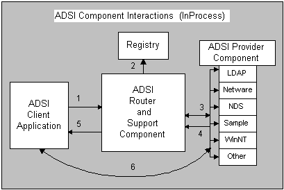

# ADSI Component Interaction

The Active Directory router component populates an ADSI provider table from the installed ADSI providers listed in the registry when it receives the first request from the client application. For more information about the Registry, see [Installing the Example Provider Component](installing-the-example-provider-component.md).

Operations that make a request from a directory for a pointer to an interface on an Active Directory object come through a function (**GetObject** in Visual Basic or [**ADsOpenObject**](/windows/desktop/api/Adshlp/nf-adshlp-adsopenobject) or [**ADsGetObject**](/windows/desktop/api/Adshlp/nf-adshlp-adsgetobject) in C or C++), or an interface method ( [**IADsContainer::GetObject**](/windows/desktop/api/Iads/nf-iads-iadscontainer-getobject)). In the following figure, the ADSI client application passes such a bind request to the ADSI router component (1). The router component identifies the ProgID for the provider from the first part of the ADsPath and uses [**CLSIDFromProgID**](https://www.bing.com/search?q=**CLSIDFromProgID**) to find the matching CLSID in the registry (2) and loads the proper provider component (3).

In the preceding figure, the provider component creates an Active Directory object representing the named directory element. The ADSI support component does a **QueryInterface** on the requested interface identifier. When a pointer to that interface is retrieved (4), as with all COM client/server implementations, it is then passed back to the client (5), and from then on the client application works directly with the provider component (6).

 

 

