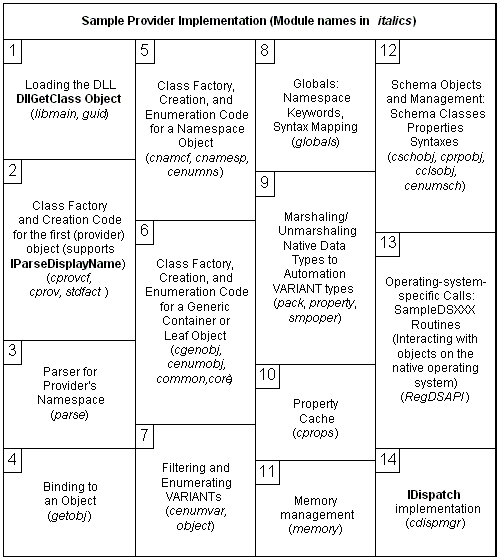

# Code Overview

The following figure is a conceptual representation of the blocks of code necessary to implement the ADSI example provider component. Each section is described in the following figure. Experienced COM programmers may find this is to be a suitable overview of the example provider component. For more information, see [Code Details](code-details.md).

The following numbered items correspond to block elements in the figure.

1.  Loading the DLL (Libmain.cpp, Guid.cpp). The entry point for the DLL. Class factory static object definitions for the two provider objects: Guid.cpp contains the CLSID definitions for the implementations of the various Example provider component objects.
2.  Provider object class factory and creation code (Cprovcf.cpp, Cprov.cpp, Stdfact.cpp). The provider object is the object that supports [**IParseDisplayName**](https://msdn.microsoft.com/en-us/library/ms680604(v=VS.85).aspx) during the moniker binding operations as discussed in Finding and Binding in the Example Provider Component.
3.  Binding to an object (Getobj.cpp). This code calls the parser to check that the given ADsPath is syntactically correct, and then performs any necessary mapping from the ADsPath to the native directory service path for the item being created as an Active Directory object. It looks up the schema definition for this type of object and fills in the mandatory properties. After creating the Active Directory object, an interface pointer to [**IUnknown**](https://msdn.microsoft.com/en-us/library/ms680509(v=VS.85).aspx) is retrieved for the caller.
4.  Parser for the provider namespace (Parse.cpp). This is the code invoked by item 3. The parser verifies that the ADsPath string passed in is syntactically correct for its own namespace.
5.  Class factory, creation, and enumeration for the namespace object (Cnamcf.cpp, Cnamesp.cpp, Cenumns.cpp). The namespace object is a container object that can be enumerated to find all the root node objects for this namespace.
6.  Class factory and creation code for a generic Active Directory object, and class factory, creation and enumeration code for a generic ADs container object (Cgenobj.cpp, Cenumobj.cpp, Common.cpp, Core.cpp). This code is executed when an Active Directory object is created.
7.  Filtering and enumerating VARIANTs (Cenumvar.cpp, Object.cpp). When a collection of VARIANT elements of a single type are managed in within ADSI, this code is used.
8.  Globals (Globals.cpp). Namespace keywords, syntax mapping structures from native data formats to the ADs Automation VARIANT type are all defined here.
9.  Marshaling/unmarshaling data (Pack.cpp, Property.cpp, Smpoper.cpp). Conversion from native data formats to the supported set of Automation VARIANT types occurs when properties of an object are loaded into the property cache. Other special handling for data must be performed when structures with pointers are copied, deleted, or moved in memory.
10. Property cache (Cprops.cpp). Caching properties is a feature of the ADSI environment. The [**IADs::GetInfo**](/windows/desktop/api/Iads/nf-iads-iads-getinfo), [**IADs::GetInfoEx**](/windows/desktop/api/Iads/nf-iads-iads-getinfoex), and [**IADs::SetInfo**](/windows/desktop/api/Iads/nf-iads-iads-setinfo) methods act on the property cache.
11. Memory management (Memory.cpp). Using one set of memory functions to allocate and free memory allows the example provider component to track memory use and stop memory leaks.
12. Schema objects and management (Cschobj.cpp, Cprpobj.cpp, Cclsobj.cpp, Cenumsch.cpp). This includes routines to create, manage, and enumerate the schema objects. This includes schema class objects, property objects, and syntax objects, in addition to being able to enumerate the schema class container object.
13. Operating-system specific calls (RegDSAPI.cpp). This includes all calls that reference the native operating system. Among other functions, they include functions opening, closing, reading, and modifying objects as well as those accessing the schema and property data. The example provider component happened to simulate a directory hierarchy by using the registry. Only function names should be of much interest to a provider writer.
14. [**IDispatch**](https://msdn.microsoft.com/en-us/library/ms221608(v=VS.71).aspx) implementation (Cdispmgr.cpp). This code accesses the type library data to allow interface methods to be invoked in an Automation-compatible way.

 

 

