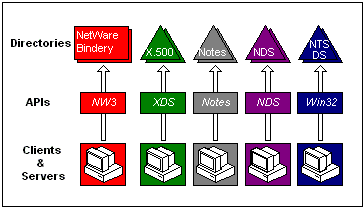

# Directory Services Today

It is common to find multiple administrative directories deployed within a single organization. These directories include network resource directories, such as LDAP-based directories like Microsoft Active Directory directory service, Windows operating system directory service, as well as application-specific directories, such as Microsoft Exchange.

## The Directory Challenge

Multiple directories in the organization pose complex challenges to users, administrators, and developers. These problems have limited wide-directory deployment. Users face multiple logons and a variety of interfaces to information across multiple directories. Administrators face the complexity of managing multiple directories. End users and administrators want application developers to use an existing administrative directory, but developers face a dilemma about which one to use. Each directory offers unique application interfaces. A developer must choose a specific directory implementation, or support multiple versions of their application. As a result, developers rarely use existing directory services.

 

 

