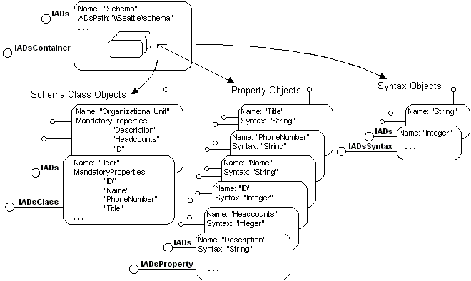

# Schema Management

The ADSI example provider component defines the schema classes "Organizational Unit" and "User" and manages these schema classes in the following way.

The "Organizational Unit" schema class is represented by an ADs container object and can contain other "Organizational Units" and "Users". The container object supports the interfaces [**IUnknown**](_com_iunknown), [**IDispatch**](ebbff4bc-36b2-4861-9efa-ffa45e013eb5), [**IADs**](/windows/win32/Iads/nn-iads-iads?branch=master), and [**IADsContainer**](/windows/win32/Iads/nn-iads-iadscontainer?branch=master). The "User" schema class is represented by a generic Active Directory object and does not contain other types of objects. In the example provider component, the User object is implemented as a generic Active Directory object that supports the interfaces **IUnknown**, **IDispatch**, and **IADs**. Be aware that the User object, in this case, does not support the [**IADsUser**](/windows/win32/Iads/nn-iads-iadsuser?branch=master) interface.

The example provider component must also implement the ADs namespace object, which supports the interfaces [**IUnknown**](_com_iunknown), [**IADs**](/windows/win32/Iads/nn-iads-iads?branch=master), [**IADsContainer**](/windows/win32/Iads/nn-iads-iadscontainer?branch=master), [**IADsOpenDSObject**](/windows/win32/Iads/nn-iads-iadsopendsobject?branch=master), and [**IDispatch**](ebbff4bc-36b2-4861-9efa-ffa45e013eb5).

The following figure shows the details of the schema that represents the two example provider component schema classes.

Be aware that in the preceding figure the "Organizational Unit" schema class defines three properties: "Description," "Headcounts," and "ID." The "User" schema class defines four properties: "ID," "Name," "PhoneNumber," and "Title." The "ID" property is shared by both schema classes. Each property is defined by either the "String" or the "Integer" syntax object.

> [!Note]  
> Syntax objects are not present in the first release of the example provider component. However, in most Microsoft ADSI schema implementations, the syntax objects are included in the schema container object, just as the schema class and property objects are. For this reason, they are shown here.

 

This provider component makes schema data accessible to the ADSI client application in the form of ADs class objects, ADs property objects, and ADs syntax objects, all within a schema class container object, so that schema data can be retrieved at run time.

The ADsPaths for the schema class container objects defined for the example provider component are "Sample://Seattle/schema" and "Sample://Toronto/schema". In this example, the contents of the schemas are identical.

 

 

