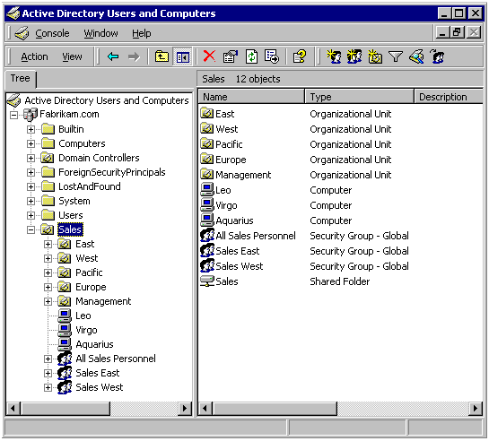

# Tutorial Overview: ADSI with Visual Basic

> [!Note]  
> The following documentation is part of an extended scenario description for Visual Basic developers. If you are looking for a general overview of Active Directory, see the [IT Pro docs on Technet](https://technet.microsoft.com/library/cc977985.aspx). For a more in-depth look at the development side of Active Directory, see [Active Directory Domain Services](https://msdn.microsoft.com/library/aa362244). For a larger introduction to Active Directory Service Interfaces, see this topic's parent topic: [Active Directory Service Interfaces](active-directory-service-interfaces-adsi.md), as well as the sibling topic: [About Active Directory Service Interfaces](about-adsi.md).

 

Active Directory is a special-purpose database — it is not a registry replacement. The directory is designed to handle a large number of read and search operations and a significantly smaller number of changes and updates. Active Directory data is hierarchical, replicated, and extensible. Because it is replicated, you do not want to store dynamic data, such as corporate stock prices or CPU performance. If your data is machine-specific, store the data in the registry. Typical examples of data stored in the directory include printer queue data, user contact data, and network/computer configuration data. The Active Directory database consists of objects and attributes. Objects and attribute definitions are stored in the Active Directory schema.

You may be wondering what objects are currently stored in Active Directory. Active Directory has three partitions. These are also known as naming contexts: domain, schema, and configuration. The domain partition contains users, groups, contacts, computers, organizational units, and many other object types. Because Active Directory is extensible, you can also add your own classes and/or attributes. The schema partition contains classes and attribute definitions. The configuration partition includes configuration data for services, partitions, and sites.

The following screen shot shows the Active Directory domain partition.

## Related topics

<dl> <dt>

[Accessing Active Directory Using Visual Basic](accessing-active-directory-using-visual-basic.md)
</dt> <dt>

[Scenario: The Fabrikam Corporation](scenario--the-fabrikam-corporation.md)
</dt> <dt>

[Advanced Topics](advanced-topics.md)
</dt> </dl>

 

 

