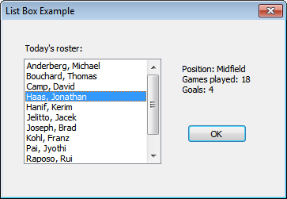

# How to Create a Simple List Box

This topic demonstrates how to initialize and retrieve items from a simple list box.

The C++ code example in this topic includes a dialog box procedure that fills a list box with information about players on a sports team. When the user selects the name of a player from the list, information about the player is displayed in the dialog box. The window style for the list box includes [**LBS\_SORT**](list-box-styles.md#lbs-sort), which results in a sorted list of items. The following screen shot shows the dialog box.



## What you need to know

### Technologies

-   [Windows Controls](window-controls.md)

### Prerequisites

-   C/C++
-   Windows User Interface Programming

## Instructions

### 

The application must perform the following list box–related tasks:

-   Initialize the list box
-   Retrieve the user's selection from the list box

In the following C++ code example, information about players is stored in an array of structures. During initialization, the dialog box procedure uses the [**LB\_ADDSTRING**](lb-addstring.md) message to add the names of team members to the list box (**IDC\_LISTBOX\_EXAMPLE**) one at a time. It also uses the [**LB\_SETITEMDATA**](lb-setitemdata.md) message to add the array index of the player to the list box as item data. Later, when the user selects a player from the list box, the dialog box procedure uses the [**LB\_GETITEMDATA**](lb-getitemdata.md) message to retrieve the corresponding array index. It then uses the array index to retrieve player information from the array.

## 


```C++
typedef struct 
{ 
    TCHAR achName[MAX_PATH]; 
    TCHAR achPosition[12]; 
    int nGamesPlayed; 
    int nGoalsScored; 
} Player; 

Player Roster[] = 
{ 
    {TEXT("Haas, Jonathan"), TEXT("Midfield"), 18, 4 }, 
    {TEXT("Pai, Jyothi"), TEXT("Forward"), 36, 12 }, 
    {TEXT("Hanif, Kerim"), TEXT("Back"), 26, 0 }, 
    {TEXT("Anderberg, Michael"), TEXT("Back"), 24, 2 }, 
    {TEXT("Jelitto, Jacek"), TEXT("Midfield"), 26, 3 }, 
    {TEXT("Raposo, Rui"), TEXT("Back"), 24, 3}, 
    {TEXT("Joseph, Brad"), TEXT("Forward"), 13, 3 }, 
    {TEXT("Bouchard, Thomas"), TEXT("Forward"), 28, 5 }, 
    {TEXT("Salmre, Ivo "), TEXT("Midfield"), 27, 7 }, 
    {TEXT("Camp, David"), TEXT("Midfield"), 22, 3 }, 
    {TEXT("Kohl, Franz"), TEXT("Goalkeeper"), 17, 0 }, 
}; 


INT_PTR CALLBACK ListBoxExampleProc(HWND hDlg, UINT message, 
        WPARAM wParam, LPARAM lParam)
{
    switch (message)
    {
    case WM_INITDIALOG:
        {
            // Add items to list. 
            HWND hwndList = GetDlgItem(hDlg, IDC_LISTBOX_EXAMPLE);  
            for (int i = 0; i < ARRAYSIZE(Roster); i++) 
            { 
                int pos = (int)SendMessage(hwndList, LB_ADDSTRING, 0, 
                    (LPARAM) Roster[i].achName); 
                // Set the array index of the player as item data.
                // This enables us to retrieve the item from the array
                // even after the items are sorted by the list box.
                SendMessage(hwndList, LB_SETITEMDATA, pos, (LPARAM) i); 
            } 
            // Set input focus to the list box.
            SetFocus(hwndList); 
            return TRUE;               
        } 

    case WM_COMMAND:
        switch (LOWORD(wParam))
        {
        case IDOK:
        case IDCANCEL:
            EndDialog(hDlg, LOWORD(wParam));
            return TRUE;

        case IDC_LISTBOX_EXAMPLE:
            {
                switch (HIWORD(wParam)) 
                { 
                case LBN_SELCHANGE:
                    {
                        HWND hwndList = GetDlgItem(hDlg, IDC_LISTBOX_EXAMPLE); 

                        // Get selected index.
                        int lbItem = (int)SendMessage(hwndList, LB_GETCURSEL, 0, 0); 

                        // Get item data.
                        int i = (int)SendMessage(hwndList, LB_GETITEMDATA, lbItem, 0);

                        // Do something with the data from Roster[i]
                        TCHAR buff[MAX_PATH];
                        StringCbPrintf (buff, ARRAYSIZE(buff),  
                            TEXT("Position: %s\nGames played: %d\nGoals: %d"), 
                            Roster[i].achPosition, Roster[i].nGamesPlayed, 
                            Roster[i].nGoalsScored);

                        SetDlgItemText(hDlg, IDC_STATISTICS, buff); 
                        return TRUE; 
                    } 
                }
            }
            return TRUE;
        }
    }
    return FALSE;
}
```


## Related topics

<dl> <dt>

[List Box Control Reference](bumper-list-box-list-box-control-reference.md)
</dt> <dt>

[About List Boxes](about-list-boxes.md)
</dt> <dt>

[Using List Boxes](using-list-boxes.md)
</dt> </dl>

 

 


