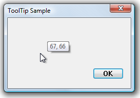

# How to Implement Tracking Tooltips

Tracking tooltips remain visible until they are explicitly closed by the application, and can change position on the screen dynamically. They are supported by [version 4.70](common-control-versions.md) and later of the common controls.

To create a tracking tooltip, include the TTF\_TRACK flag in the **uFlags** member of the [**TOOLINFO**](toolinfo.md) structure when sending the [**TTM\_ADDTOOL**](ttm-addtool.md) message.

Your application must manually activate (show) and deactivate (hide) a tracking tooltip by sending a [**TTM\_TRACKACTIVATE**](ttm-trackactivate.md) message. While a tracking tooltip is active, your application must specify the location of the tooltip by sending [**TTM\_TRACKPOSITION**](ttm-trackposition.md) messages to the tooltip control. Because the application handles tasks such as positioning the tooltip, tracking tooltips do not use the **TTF\_SUBCLASS** flag or the [**TTM\_RELAYEVENT**](ttm-relayevent.md) message.

The [**TTM\_TRACKPOSITION**](ttm-trackposition.md) message causes the tooltip control to display the window using one of two placement styles:

-   By default, the tooltip is displayed next to the corresponding tool in a position that the control chooses. The location chosen is relative to the coordinates that you provide by using this message.
-   If you include the **TTF\_ABSOLUTE** value in the member of the [**TOOLINFO**](toolinfo.md) structure, the tooltip is displayed at the pixel location specified in the message. In this case, the control does not attempt to change the tooltip window's location from the coordinates you provide.

## What you need to know

### Technologies

-   [Windows Controls](window-controls.md)

### Prerequisites

-   C/C++
-   Windows User Interface Programming

## Instructions

### Implement In-Place Tooltips

The **uFlags** member of the [**TOOLINFO**](toolinfo.md) structure that is used in the example includes the **TTF\_ABSOLUTE** flag. Without this flag, the tooltip control chooses where to display the tooltip, and its position relative to the dialog box may change suddenly as the mouse pointer moves.

> [!Note]  
> `g_toolItem` is a global [**TOOLINFO**](toolinfo.md) structure.

 

The following example demonstrates how to create a tracking tooltip control. The example specifies the main window's entire client area as the tool.


```C++
HWND CreateTrackingToolTip(int toolID, HWND hDlg, WCHAR* pText)
{
    // Create a tooltip.
    HWND hwndTT = CreateWindowEx(WS_EX_TOPMOST, TOOLTIPS_CLASS, NULL, 
                                 WS_POPUP | TTS_NOPREFIX | TTS_ALWAYSTIP, 
                                 CW_USEDEFAULT, CW_USEDEFAULT, CW_USEDEFAULT, CW_USEDEFAULT, 
                                 hDlg, NULL, g_hInst,NULL);

    if (!hwndTT)
    {
      return NULL;
    }

    // Set up the tool information. In this case, the "tool" is the entire parent window.
    
    g_toolItem.cbSize   = sizeof(TOOLINFO);
    g_toolItem.uFlags   = TTF_IDISHWND | TTF_TRACK | TTF_ABSOLUTE;
    g_toolItem.hwnd     = hDlg;
    g_toolItem.hinst    = g_hInst;
    g_toolItem.lpszText = pText;
    g_toolItem.uId      = (UINT_PTR)hDlg;
    
    GetClientRect (hDlg, &amp;g_toolItem.rect);

    // Associate the tooltip with the tool window.
    
    SendMessage(hwndTT, TTM_ADDTOOL, 0, (LPARAM) (LPTOOLINFO) &amp;g_toolItem); 
    
    return hwndTT;
}
            
```


### Window Procedure Implementation

When the mouse pointer is within the client area, the tooltip is active and displays the cursor coordinates, as shown in the following illustration.



The following example code is from the window procedure for a dialog box that displays the tracking tooltip created in the preceding example. The global Boolean variable *g\_TrackingMouse* is used to determine whether it is necessary to reactivate the tooltip and reset mouse tracking so that the application is notified when the mouse pointer leaves the client area of the dialog box.


```
//g_hwndTrackingTT is a global HWND variable

case WM_INITDIALOG:

        InitCommonControls();
        g_hwndTrackingTT = CreateTrackingToolTip(IDC_BUTTON1, hDlg, L"");
        return TRUE;

case WM_MOUSELEAVE: // The mouse pointer has left our window. Deactivate the tooltip.
    
    SendMessage(g_hwndTrackingTT, TTM_TRACKACTIVATE, (WPARAM)FALSE, (LPARAM)&amp;g_toolItem);
    g_TrackingMouse = FALSE;
    return FALSE;

case WM_MOUSEMOVE:

    static int oldX, oldY;
    int newX, newY;

    if (!g_TrackingMouse)   // The mouse has just entered the window.
    {                       // Request notification when the mouse leaves.
    
        TRACKMOUSEEVENT tme = { sizeof(TRACKMOUSEEVENT) };
        tme.hwndTrack       = hDlg;
        tme.dwFlags         = TME_LEAVE;
        
        TrackMouseEvent(&amp;tme);

        // Activate the tooltip.
        SendMessage(g_hwndTrackingTT, TTM_TRACKACTIVATE, (WPARAM)TRUE, (LPARAM)&amp;g_toolItem);
        
        g_TrackingMouse = TRUE;
    }

    newX = GET_X_LPARAM(lParam);
    newY = GET_Y_LPARAM(lParam);

    // Make sure the mouse has actually moved. The presence of the tooltip 
    // causes Windows to send the message continuously.
    
    if ((newX != oldX) || (newY != oldY))
    {
        oldX = newX;
        oldY = newY;
            
        // Update the text.
        WCHAR coords[12];
        swprintf_s(coords, ARRAYSIZE(coords), L"%d, %d", newX, newY);
        
        g_toolItem.lpszText = coords;
        SendMessage(g_hwndTrackingTT, TTM_SETTOOLINFO, 0, (LPARAM)&amp;g_toolItem);

        // Position the tooltip. The coordinates are adjusted so that the tooltip does not overlap the mouse pointer.
        
        POINT pt = { newX, newY }; 
        ClientToScreen(hDlg, &amp;pt);
        SendMessage(g_hwndTrackingTT, TTM_TRACKPOSITION, 0, (LPARAM)MAKELONG(pt.x + 10, pt.y - 20));
    }
    return FALSE;
```


## Related topics

<dl> <dt>

[Using Tooltip Controls](using-tooltip-contro.md)
</dt> </dl>

 

 


