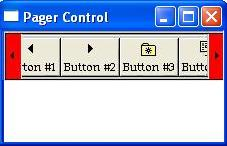

# About Pager Controls

A *pager control* is a window container that is used with a window that does not have enough display area to show all of its content. The pager control allows the user to scroll to the area of the window that is not currently in view.

-   [About Pager Controls](#about-pager-controls)

## About Pager Controls

Microsoft Internet Explorer Version 4.0 (commctrl.dll version 4.71) introduces the pager control. This control is useful in situations where a window does not have enough area to display a child window. For example, if your application has a toolbar that is not wide enough to show all of its items, you can assign the toolbar to a pager control and users will be able to scroll to the left or right to access all of the items. You can also create pager controls that scroll vertically.

A window assigned to the pager control is referred to as the *contained window*.

The following screen shot shows a toolbar contained inside a pager control. The pager control is displayed in red to show what areas of the control are visible.

> [!Note]  
> The pager control is implemented in version 4.71 and later of Comctl32.dll.

 

 

 

