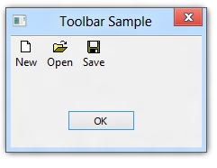

# Visual Styles Overview

This topic describes visual styles and identifies the Windows components that support them. It also explains the steps you must take to use visual styles in your applications. This topic includes the following sections:

-   [Themes and Visual Styles](#themes-and-visual-styles)
-   [Visual Styles Components](#visual-styles-components)
-   [Application Requirements for Supporting Visual Styles](#application-requirements-for-supporting-visual-styles)
-   [Related topics](#related-topics)

## Themes and Visual Styles

Windows includes several features that enable users to tailor the UI to accommodate their individual needs and preferences. These features include themes, which were introduced in Microsoft Plus! for Windows 95. A theme is a user-selectable collection of settings that includes wallpaper, cursors, fonts, sounds, and icons. The following are some characteristics of themes.

-   Theme settings are specified in .theme files that have a format similar to win.ini files.
-   An independent software vendor (ISV) can create and distribute a .theme file with a product.
-   In versions earlier than Windows Vista, theme files are displayed on the Theme tab of the Display control panel. In Windows Vista and later, themes are displayed in the Personalization control panel.

For more information about .theme files, see [Theme File Format](themesfileformat-overview.md).

A visual style is a specification that defines the appearance of the Windows common controls. Visual styles are associated with themes; that is, a .theme file contains a section that specifies the visual style to apply when the particular theme is active. The following are some characteristics of visual styles.

-   Users can change the visual style at any time by selecting a different theme.
-   You must use the visual styles API to apply the currently active visual style to your application's custom or owner-drawn controls, if any.
-   The information that defines a visual style is stored in a .msstyles file. Microsoft does not support the authoring of .msstyles files.

### 

The following illustration shows a simple dialog box with a taskbar, on a Windows 7 desktop that uses the Windows Aero theme without transparency. Because the application is not configured to use visual styles, the buttons appear the same regardless of the theme settings.

In contrast, the following illustration shows the same dialog box on the same desktop, but this time the application has been configured to work with visual styles. Note the different appearance of the buttons in the client area. The buttons look different because the system has applied the visual styles that are defined in the Aero theme.

The following example shows a similar dialog box on a Windows 8 desktop. In Windows 8, visual styles are always on, so Windows 8 apps get theming "for free".

## Visual Styles Components

Visual styles are supported by the following components:

-   Version 6 or later of the common control library (ComCtl32.dll)
-   The visual styles API implemented in UxTheme.dll
-   Themes service
-   One or more visual style definition files (.msstyles)

The visual styles API depends on a system service called Themes. The common control library queries the Themes service to get style-related information and, up through Windows 7, uses the service to render controls in the current visual style.

In Windows 8 and later, the visual styles API still works if the Themes service is off. This means that the common controls and the non-client area of windows will still have visual styles when the Themes service is off. The Windows 8 features that still require the Themes service include:

-   Changing the visual style, typically through the **Personalization** page of **PC Settings**.
-   Performance optimizations involved in switching users, logging off, shutting down, and sharing across user sessions.

The visual styles API gets style information from the .msstyles file associated with the currently selected theme. The .msstyles file contains a set of metrics, fonts, colors, and bitmaps that define a visual style

## Application Requirements for Supporting Visual Styles

To use visual styles, your application must be running on an operating system that contains ComCtl32.dll version 6 or later. If you want your application to use ComCtl32.dll version 6, you must add an application manifest or compiler directive to specify that version 6 should be used if it is available. For information on how to create an application manifest that enables your application to use visual styles, see [Enabling Visual Styles](cookbook-overview.md).

For common controls, no further action is necessary to ensure that the controls are displayed in the user's preferred visual style.

If your application contains custom or owner-drawn controls, you need to use the visual styles API to retrieve information about the currently active visual style, and to draw the controls in that style.

For Windows versions prior to Windows 8, applications typically need to provide two separate code paths for drawing custom and owner-drawn controls. One code path draws the controls when a theme that uses visual styles is active, and another code path draws the controls when the Windows Classic theme or a high contrast theme is active. In Windows 8, however, visual styles are always on, so separate theming code paths are not needed. Applications that are manifested for Windows 8 get high contrast theming "for free." For more information, see [Supporting High Contrast Themes](supporting-high-contrast-themes.md).

For more information about, see [Using Visual Styles with Custom and Owner-Drawn Controls](using-visual-styles.md) and [Visual Styles Reference](uxctl-ref.md).

## Related topics

<dl> <dt>

[Visual Styles](themes-overview.md)
</dt> </dl>

 

 

