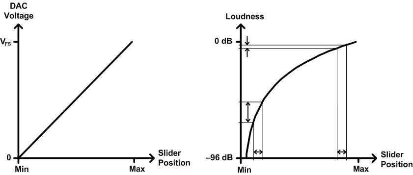

# Audio-Tapered Volume Controls

The [**IAudioEndpointVolume**](/windows/desktop/api/Endpointvolume/nn-endpointvolume-iaudioendpointvolume) interface manages volume controls that are audio tapered. These controls are well suited to Windows applications that display volume sliders. For a volume slider that is tied to an audio-tapered volume control, each change in the position of the slider produces a change in perceived loudness that is proportional to the distance traveled by the slider. For a particular travel distance, the amount by which the perceived loudness increases or decreases is approximately the same regardless of whether the slider movement occurs in the lower, upper, or middle portion of the slider's range of movement. Perceived loudness varies approximately linearly with the logarithm of the audio signal power.

The term *audio taper* originally referred to the tapered shape of the resistive element in a potentiometer that is used as a volume control in an audio electronics device. An audio-tapered resistive element is widest at the zero-volume position and narrowest at the maximum-volume position. The potentiometer controls the voltage level of the audio signal that the device plays through its speakers. The tapering is designed to produce an approximately linear relationship between the position of the potentiometer wiper and the perceived loudness at the speakers. The relationship between the wiper position and the voltage at the speakers is nonlinear.

In contrast, a resistive element with a linear taper has a uniform width over the potentiometer wiper's range of movement. As a result, the voltage at the speakers varies linearly with the wiper position. The relationship between the wiper position and loudness is nonlinear.

Similarly, a Windows application that displays a volume slider defines a relationship between the slider position and the output signal level at the speakers. The relationship can, in effect, be linear tapered or audio tapered.

The following diagram shows the mapping of slider position to output voltage and to perceived loudness for a linear-tapered volume control.

On the left side of the preceding diagram, the output voltage level of the audio digital-to-analog converter (DAC) increases linearly as the volume slider moves from its minimum position (labeled Min) to its maximum position (labeled Max). The label VFS on the vertical axis represents the full-scale DAC output voltage.

However, perceived loudness varies approximately as the logarithm of the power of the audio signal, as shown on the right side of the preceding diagram. Thus, movement of the slider over an interval near the minimum setting results in a relatively large change in perceived loudness, but slider movement over an interval of the same width near the maximum setting causes a relatively small change in perceived loudness.

On the right side of the preceding diagram, loudness on the vertical axis is measured in decibels (dB) relative to the full-scale power setting (at 0 decibels). The loudness curve intersects the vertical axis at minus infinity, but only the portion of the curve from 0 decibels to –96 decibels appears in the diagram. The decision to show only this portion of the curve is somewhat arbitrary, but –96 decibels conveniently represents the power at the next-to-lowest output level of a 16-bit DAC relative to the full-scale power. This value is calculated as 20.log₁₀(1/65535).

Because small changes in slider position near the minimum setting in the preceding diagram result in large changes in loudness, the user might find the volume difficult to control over this region. Relatively small slider movements can push the volume well above or below the desired level. An improved volume control would provide a more linear relationship between slider position and loudness.

The following diagram shows the mapping of slider position to output voltage and to perceived loudness for an audio-tapered volume control.

As shown on the right side of the preceding diagram, perceived loudness varies approximately linearly with changes in slider position. For this to occur, the DAC voltage must vary nonlinearly with position, as shown on the left side of the diagram. The curve asymptotically approaches 0 volts as the slider moves toward the left from the maximum setting. The voltage at the minimum slider position is very small, but it might not be exactly zero.

The following methods in the **IAudioEndpointVolume** interface use volume settings that are measured in decibels:

-   [**IAudioEndpointVolume::GetChannelVolumeLevel**](/windows/desktop/api/Endpointvolume/nf-endpointvolume-iaudioendpointvolume-getchannelvolumelevel)
-   [**IAudioEndpointVolume::GetMasterVolumeLevel**](/windows/desktop/api/Endpointvolume/nf-endpointvolume-iaudioendpointvolume-getmastervolumelevel)
-   [**IAudioEndpointVolume::SetChannelVolumeLevel**](/windows/desktop/api/Endpointvolume/nf-endpointvolume-iaudioendpointvolume-setchannelvolumelevel)
-   [**IAudioEndpointVolume::SetMasterVolumeLevel**](/windows/desktop/api/Endpointvolume/nf-endpointvolume-iaudioendpointvolume-setmastervolumelevel)

These methods produce an approximately linear relationship between volume setting and perceived loudness. The volume range in decibels of the volume controls that are managed by these methods depends on the audio endpoint device. To determine the volume range for a particular device, call the [**IAudioEndpointVolume::GetVolumeRange**](/windows/desktop/api/Endpointvolume/nf-endpointvolume-iaudioendpointvolume-getvolumerange) method.

In contrast, the volume settings for the following methods in the **IAudioEndpointVolume** interface follow a more gently tapered curve over the volume range:

-   [**IAudioEndpointVolume::GetChannelVolumeLevelScalar**](/windows/desktop/api/Endpointvolume/nf-endpointvolume-iaudioendpointvolume-getchannelvolumelevelscalar)
-   [**IAudioEndpointVolume::GetMasterVolumeLevelScalar**](/windows/desktop/api/Endpointvolume/nf-endpointvolume-iaudioendpointvolume-getmastervolumelevelscalar)
-   [**IAudioEndpointVolume::SetChannelVolumeLevelScalar**](/windows/desktop/api/Endpointvolume/nf-endpointvolume-iaudioendpointvolume-setchannelvolumelevelscalar)
-   [**IAudioEndpointVolume::SetMasterVolumeLevelScalar**](/windows/desktop/api/Endpointvolume/nf-endpointvolume-iaudioendpointvolume-setmastervolumelevelscalar)
-   [**IAudioEndpointVolume::VolumeStepDown**](/windows/desktop/api/Endpointvolume/nf-endpointvolume-iaudioendpointvolume-volumestepdown)
-   [**IAudioEndpointVolume::VolumeStepUp**](/windows/desktop/api/Endpointvolume/nf-endpointvolume-iaudioendpointvolume-volumestepup)

In Windows Vista, these methods use a curve that is intermediate between the audio-tapered curve shown in the preceding diagram and a linear-tapered curve. Note that the shape of the curve might change in future versions of Windows. The first four methods in the preceding list express volume levels as normalized values in the range from 0.0 (minimum volume) to 1.0 (maximum volume). For the last two methods in the list, call the [**IAudioEndpointVolume::GetVolumeStepInfo**](/windows/desktop/api/Endpointvolume/nf-endpointvolume-iaudioendpointvolume-getvolumestepinfo) method to obtain the number of steps in the volume range.

The following interfaces use linear-tapered curves for their volume settings:

-   [**ISimpleAudioVolume**](/windows/desktop/api/Audioclient/nn-audioclient-isimpleaudiovolume)
-   [**IChannelAudioVolume**](/windows/desktop/api/Audioclient/nn-audioclient-ichannelaudiovolume)
-   [**IAudioStreamVolume**](/windows/desktop/api/Audioclient/nn-audioclient-iaudiostreamvolume)

For more information about these interfaces, see [Session Volume Controls](session-volume-controls.md). And for information about the volume ranges and the default volume levels in the various versions of Windows, see [Default Audio Volume Settings](http://msdn.microsoft.com/en-us/library/windows/hardware/ff536251.aspx).

## Related topics

<dl> <dt>

[Volume Controls](volume-controls.md)
</dt> </dl>

 

 

