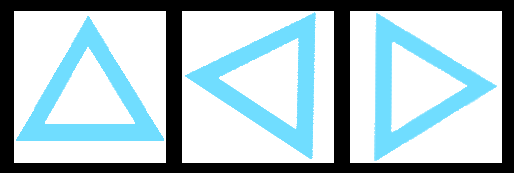

# Atlas effect

You can use this effect to output a portion of an image but retain the region outside of the portion for use in subsequent operations.

The CLSID for this effect is CLSID\_D2D1Atlas.

The atlas effect is useful if you want to load a large image made up of many smaller images, such as various frames of a sprite.

To create the output the effect:

1.  Crops the input to the given *InputRect* property.
2.  Translates the origin of the result to (0,0).

> [!Note]  
> The *InputPaddingRect* property should only be larger if and only if the pixels between the two rectangles are transparent black on the input. This may result in Direct2D executing the graph more optimally.

 

Here is an example of the effect. This image is small and simple for illustration purposes.



The preceding image is the input to the effect. The code here creates an atlas effect, sets the input, sets the input rectangle, and then draws the output.


```C++
ComPtr<ID2D1Effect> atlasEffect;

// Create the Atlas Effect.
DX::ThrowIfFailed(m_d2dContext->CreateEffect(CLSID_D2D1Atlas, &amp;atlasEffect));

// Set the input.
atlasEffect->SetInputEffect(0, inputImage.Get());

// The images here are 150 x 150 pixels.
float size = 150.0f;

// Compensate for the padding between images.
float padding = 10.0f;

// The input rectangle.  150 x 150 pixels with 10 pixel padding
D2D1_Vector_4F inputRect = D2D1::Vector4F(size + (padding * 2), padding, size, size);

DX::ThrowIfFailed(atlasEffect->SetValue(D2D1_ATLAS_PROP_INPUT_RECT, inputRect));

// Draw the image
m_d2dContext->DrawImage(atlasEffect.Get());
```


The preceding code selects a rectangle that is around the second triangle. The padding around it is ignored. Here is the resulting image.


> [!Note]  
> This is a situation where you may choose to specify a *InputPaddingRect* because the padding is transparent black. The rectangle would be `D2D1::Vector4F(size + (padding * 2), 0, size + padding, size + padding);`.

 

## Effect properties


| Display name and index enumeration                                             | Description                                                                                                                                                                  |
|--------------------------------------------------------------------------------|------------------------------------------------------------------------------------------------------------------------------------------------------------------------------|
| InputRect<br/> D2D1\_ATLAS\_PROP\_INPUT\_RECT<br/>                 | The portion of the image passed to the next effect.<br/> Type is D2D1\_VECTOR\_4F.<br/> Default value is (-FLT\_MAX, -FLT\_MAX, FLT\_MAX, FLT\_MAX). <br/> |
| InputPaddingRect<br/> D2D1\_ATLAS\_PROP\_INPUT\_PADDING\_RECT<br/> | The maximum size sampled for the output rectangle.<br/> Type is D2D1\_VECTOR\_4F.<br/> Default value is (-FLT\_MAX, -FLT\_MAX, FLT\_MAX, FLT\_MAX).<br/>   |


 

## Requirements


|                          |                                                                                    |
|--------------------------|------------------------------------------------------------------------------------|
| Minimum supported client | Windows 8 and Platform Update for Windows 7 \[desktop apps \| Windows Store apps\] |
| Minimum supported server | Windows 8 and Platform Update for Windows 7 \[desktop apps \| Windows Store apps\] |
| Header                   | d2d1effects.h                                                                      |
| Library                  | d2d1.lib, dxguid.lib                                                               |


 

## Related topics

<dl> <dt>

[**ID2D1Effect**](/windows/win32/D2d1_1/?branch=master)
</dt> </dl>

 

 


