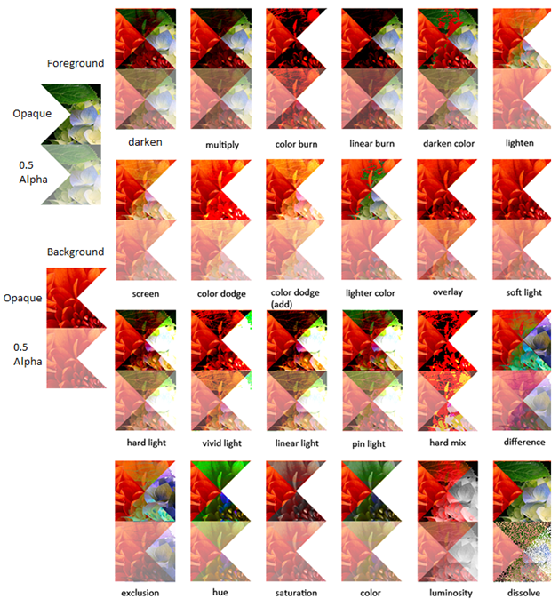
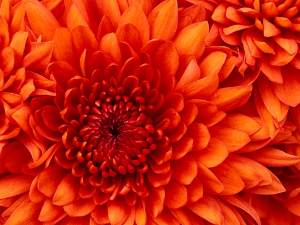
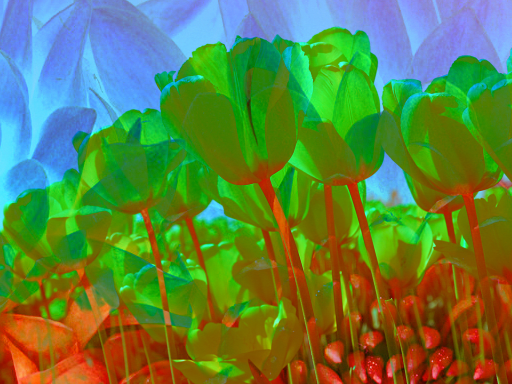
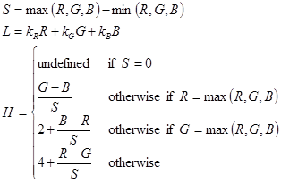
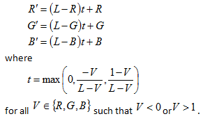

# Blend effect

Use the blend effect to combine 2 images. This effect has 26 blend modes.

The CLSID for this effect is CLSID\_D2D1Blend.

-   [Blending examples](#blending-examples)
-   [Effect properties](#effect-properties)
-   [Blend modes](#blend-modes)
-   [HSL color space conversions](#hsl-color-space-conversions)
    -   [Converting from RGB to HSL](#converting-from-rgb-to-hsl)
    -   [Converting from HSL to RGB](#converting-from-hsl-to-rgb)
-   [Output bitmap](#output-bitmap)
-   [Sample code](#sample-code)
-   [Requirements](#requirements)
-   [Related topics](#related-topics)

## Blending examples

Here is an example image of every blend mode of the blend effect. A full list of the blend modes and the corresponding mode properties are in the next section



Here is another example using the exclusion mode.


| Before image 1                                                             |
|----------------------------------------------------------------------------|
|     |
| Before image 2                                                             |
|  |
| After                                                                      |
|                       |


 


```C++
ComPtr<ID2D1Effect> blendEffect;
m_d2dContext->CreateEffect(CLSID_D2D1Blend, &blendEffect);

blendEffect->SetInput(0, bitmap);
blendEffect->SetInput(1, bitmapTwo);
blendEffect->SetValue(D2D1_BLEND_PROP_MODE, D2D1_BLEND_MODE_EXCLUSION);

m_d2dContext->BeginDraw();
m_d2dContext->DrawImage(blendEffect.Get());
m_d2dContext->EndDraw();
```


## Effect properties


| Display name and index enumeration                 | Description                                                                                                                                                                               |
|----------------------------------------------------|-------------------------------------------------------------------------------------------------------------------------------------------------------------------------------------------|
| Mode<br/> D2D1\_BLEND\_PROP\_MODE<br/> | The blend mode used for the effect. See [Blend modes](#blend-modes) for more info. The type is D2D1\_BLEND\_MODE.<br/> The default value is D2D1\_BLEND\_MODE\_MULTIPLY.<br/> |


 

## Blend modes

The table here shows all the blend modes of this effect. The helper functions necessary to compute the output of the effect are in the next section.

Color: O<sub>PRGB</sub> = *f*(F<sub>RGB</sub>, B<sub>RGB</sub>) \* F<sub>A</sub> \* B<sub>A</sub> + F<sub>RGB</sub> \* F<sub>A</sub> \* (1 - B<sub>A</sub>) + B<sub>RGB</sub> \* B<sub>A</sub> \* (1 - F<sub>A</sub>)

Alpha: O<sub>A</sub> = F<sub>A</sub> \* (1 - B<sub>A</sub>) + B<sub>A</sub>

Where:

-   O<sub>PRGB</sub> is the pre-multiplied output color
-   O<sub>A</sub> is Output Alpha
-   B<sub>RGB</sub> is the un-pre-multiplied destination color
-   B<sub>A</sub> is destination alpha
-   F<sub>RGB</sub> is the un-pre-multiplied source color
-   F<sub>A</sub> is source alpha
-   *f*(S<sub>RGB</sub>, D<sub>RGB</sub>) is a blend function that varies per-blend-mode

Some of the blend modes require conversion to and from the hue, saturation, luminosity (HSL) color space to RGB.


<table>
<colgroup>
<col style="width: 50%" />
<col style="width: 50%" />
</colgroup>
<thead>
<tr class="header">
<th>Enumeration</th>
<th>Equation</th>
</tr>
</thead>
<tbody>
<tr class="odd">
<td>D2D1_BLEND_MODE_DARKEN</td>
<td>Basic blend formula for alpha only. </td>
</tr>
<tr class="even">
<td>D2D1_BLEND_MODE_MULTIPLY</td>
<td>Basic blend formula for alpha only. </td>
</tr>
<tr class="odd">
<td>D2D1_BLEND_MODE_COLOR_BURN</td>
<td>Basic blend formulas with <em>f</em>(F<sub>RGB</sub>, B<sub>RGB</sub>) = </td>
</tr>
<tr class="even">
<td>D2D1_BLEND_MODE_LINEAR_BURN</td>
<td>Basic blend formulas with <em>f</em>(F<sub>RGB</sub>, B<sub>RGB</sub>) = </td>
</tr>
<tr class="odd">
<td>D2D1_BLEND_MODE_DARKER_COLOR</td>
<td>Basic blend formula for alpha only. </td>
</tr>
<tr class="even">
<td>D2D1_BLEND_MODE_LIGHTEN</td>
<td>Basic blend formula for alpha only. </td>
</tr>
<tr class="odd">
<td>D2D1_BLEND_MODE_SCREEN</td>
<td>Basic blend formula for alpha only. </td>
</tr>
<tr class="even">
<td>D2D1_BLEND_MODE_COLOR_DODGE</td>
<td>Basic blend formulas with <em>f</em>(F<sub>RGB</sub>, B<sub>RGB</sub>) = </td>
</tr>
<tr class="odd">
<td>D2D1_BLEND_MODE_LINEAR_DODGE</td>
<td>Basic blend formulas with <em>f</em>(F<sub>RGB</sub>, B<sub>RGB</sub>) = </td>
</tr>
<tr class="even">
<td>D2D1_BLEND_MODE_LIGHTER_COLOR</td>
<td>Basic blend formula for alpha only. </td>
</tr>
<tr class="odd">
<td>D2D1_BLEND_MODE_OVERLAY</td>
<td>Basic blend formulas with <em>f</em>(F<sub>RGB</sub>, B<sub>RGB</sub>) = </td>
</tr>
<tr class="even">
<td>D2D1_BLEND_MODE_SOFT_LIGHT</td>
<td>Basic blend formulas with <em>f</em>(F<sub>RGB</sub>, B<sub>RGB</sub>) = </td>
</tr>
<tr class="odd">
<td>D2D1_BLEND_MODE_HARD_LIGHT</td>
<td>Basic blend formulas with <em>f</em>(F<sub>RGB</sub>, B<sub>RGB</sub>) = </td>
</tr>
<tr class="even">
<td>D2D1_BLEND_MODE_VIVID_LIGHT</td>
<td>Basic blend formulas with <em>f</em>(F<sub>RGB</sub>, B<sub>RGB</sub>) = </td>
</tr>
<tr class="odd">
<td>D2D1_BLEND_MODE_LINEAR_LIGHT</td>
<td>Basic blend formulas with <em>f</em>(F<sub>RGB</sub>, B<sub>RGB</sub>) = </td>
</tr>
<tr class="even">
<td>D2D1_BLEND_MODE_PIN_LIGHT</td>
<td>Basic blend formulas with <em>f</em>(F<sub>RGB</sub>, B<sub>RGB</sub>) = </td>
</tr>
<tr class="odd">
<td>D2D1_BLEND_MODE_HARD_MIX</td>
<td>Basic blend formulas with <em>f</em>(F<sub>RGB</sub>, B<sub>RGB</sub>) = </td>
</tr>
<tr class="even">
<td>D2D1_BLEND_MODE_DIFFERENCE</td>
<td>Basic blend formulas with <em>f</em>(F<sub>RGB</sub>, B<sub>RGB</sub>) = abs(F<sub>RGB</sub> - B<sub>RGB</sub>)</td>
</tr>
<tr class="odd">
<td>D2D1_BLEND_MODE_EXCLUSION</td>
<td>Basic blend formulas with <em>f</em>(F<sub>RGB</sub>, B<sub>RGB</sub>) = F<sub>RGB</sub> + B<sub>RGB</sub>   2 * F<sub>RGB</sub> * B<sub>RGB</sub></td>
</tr>
<tr class="even">
<td>D2D1_BLEND_MODE_HUE</td>
<td>Basic blend formula for alpha only. </td>
</tr>
<tr class="odd">
<td>D2D1_BLEND_MODE_SATURATION</td>
<td>Basic blend formula for alpha only. </td>
</tr>
<tr class="even">
<td>D2D1_BLEND_MODE_COLOR</td>
<td>Basic blend formula for alpha only. </td>
</tr>
<tr class="odd">
<td>D2D1_BLEND_MODE_LUMINOSITY</td>
<td>Basic blend formula for alpha only. </td>
</tr>
<tr class="even">
<td>D2D1_BLEND_MODE_DISSOLVE</td>
<td>Given:
<ul>
<li>A scene coordinate XY for the current pixel</li>
<li>A deterministic pseudo-random number generator rand(XY) based on seed coordinate XY, with unbiased distribution of values from [0, 1]</li>
</ul>
<br/> <br/></td>
</tr>
<tr class="odd">
<td>D2D1_BLEND_MODE_SUBTRACT</td>
<td>Basic blend formula for alpha only. </td>
</tr>
<tr class="even">
<td>D2D1_BLEND_MODE_DIVISION</td>
<td>Basic blend formula for alpha only. </td>
</tr>
</tbody>
</table>


 

> [!Note]  
> For all Blend modes, the output value is premultiplied and clamped to the range \[0, 1\].

 

## HSL color space conversions

The luminosity component is computed using the RGB weights here:

-   *k*<sub>R</sub> = 0.30
-   *k*<sub>G</sub> = 0.59
-   *k*<sub>B</sub> = 0.11

### Converting from RGB to HSL



This places *S* and *L* in the range \[0.0, 1.0\] and *H* in the range \[-1.0, 5.0\].

### Converting from HSL to RGB

To convert the other way we use the inverse of the previous calculations.

If *S* = 0 then *R* = *G* = *B* = *L*

Otherwise there are six hue-dependant cases:

If *H* is greater than 0, the values are in the red/magenta sector where *R* > *B* > *G*.


If *H* is greater than or equal to 0 and less than 1, the values are in the red/yellow sector where *R* > *G* > *B*.


If *H* is greater than or equal to 1 and less than 2, the values are in the yellow/green sector where *G* > *R* > *B*.


If *H* is greater than or equal to 2 and less than 3, the values are in the green/cyan sector where *G* > *B* > *R*.


If *H* is greater than or equal to 3 and less than 4, the values are in the cyan/blue sector where *B* > *G* > *R*.


If *H* is greater than or equal to 4, the values are in the blue/magenta sector where *B* > *R* > *G*.


Because the blending modes make arbitrary combinations of HSL components from two different colors, it is common for the converted RGB value to be out-of-gamut, that is, one or more channel components may be outside the legal range of \[0.0, 1.0\]. These colors are brought back into gamut by minimally reducing the saturation, while preserving both hue and luminosity:



## Output bitmap

The output bitmap for this effect is always the size of the union of the two input images.

## Sample code

For an example of this effect, download the [Direct2D composite effect modes sample](http://go.microsoft.com/fwlink/p/?linkid=231580).

## Requirements


|                          |                                                                                    |
|--------------------------|------------------------------------------------------------------------------------|
| Minimum supported client | Windows 8 and Platform Update for Windows 7 \[desktop apps \| Windows Store apps\] |
| Minimum supported server | Windows 8 and Platform Update for Windows 7 \[desktop apps \| Windows Store apps\] |
| Header                   | d2d1effects.h                                                                      |
| Library                  | d2d1.lib, dxguid.lib                                                               |


 

## Related topics

<dl> <dt>

[**ID2D1Effect**](https://msdn.microsoft.com/en-us/library/Hh404566(v=VS.85).aspx)
</dt> </dl>

 

 


