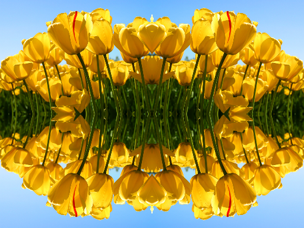
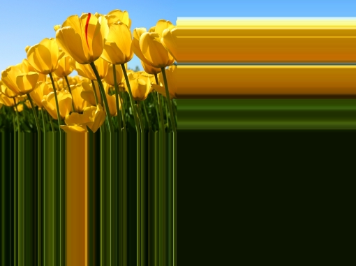
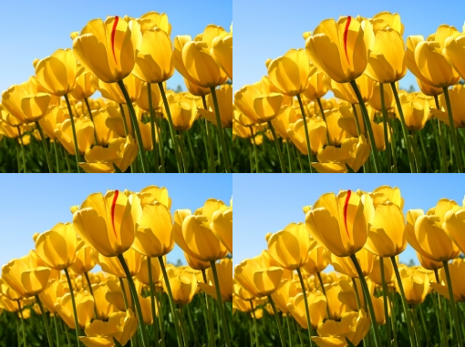

# Border effect

Use the border effect to extend an image from the edges. You can use this effect to repeat the pixels from the edges of the image, wrap the pixels from the opposite end of the image, or mirror the pixels across the bitmap border to extend the bitmap region.

The CLSID for this effect is CLSID\_D2D1Border.

## Example images

The examples here show the output of the border effect using each mode. The output size is infinite, but these example images are cropped to twice the size.

### Mirror


| Before                                                    |
|-----------------------------------------------------------|
|  |
| After                                                     |
|    |


 

### Clamp


| Before                                                        |
|---------------------------------------------------------------|
|      |
| After                                                         |
|  |


 

### Wrap


| Before                                                       |
|--------------------------------------------------------------|
|     |
| After                                                        |
|  |


 


```C++
ComPtr<ID2D1Effect> borderEffect;
m_d2dContext->CreateEffect(CLSID_D2D1Border, &amp;borderEffect);

borderEffect->SetInput(0, bitmap);
borderEffect->SetValue(D2D1_BORDER_PROP_EDGE_MODE_X, D2D1_BORDER_EDGE_MODE_MIRROR);
borderEffect->SetValue(D2D1_BORDER_PROP_EDGE_MODE_Y, D2D1_BORDER_EDGE_MODE_MIRROR);

m_d2dContext->BeginDraw();
m_d2dContext->DrawImage(borderEffect.Get());
m_d2dContext->EndDraw(); 
```


## Effect properties


| Display name and index enumeration                                  | Description                                                                                                                                                                                                                                                            |
|---------------------------------------------------------------------|------------------------------------------------------------------------------------------------------------------------------------------------------------------------------------------------------------------------------------------------------------------------|
| Edge Mode X<br/> D2D1\_BORDER\_PROP\_EDGE\_MODE\_X<br/> | The edge mode in the X direction for the effect. You can set this to clamp, wrap, or mirror. See [Edge modes](#edge-modes) for more info.<br/> The type is D2D1\_BORDER\_EDGE\_MODE.<br/> The default value is D2D1\_BORDER\_EDGE\_MODE\_CLAMP.<br/> |
| Edge Mode Y<br/> D2D1\_BORDER\_PROP\_EDGE\_MODE\_Y<br/> | The edge mode in the Y direction for the effect. You can set this to clamp, wrap, or mirror. See [Edge modes](#edge-modes) for more info.<br/> The type is D2D1\_BORDER\_EDGE\_MODE.<br/> The default value is D2D1\_BORDER\_EDGE\_MODE\_CLAMP.<br/> |


 

## Edge modes


| Display name and index enumeration                            | Description                                          |
|---------------------------------------------------------------|------------------------------------------------------|
| Clamp<br/> D2D1\_BORDER\_EDGE\_MODE\_CLAMP<br/>   | Repeats the pixels from the edges of the image.      |
| Wrap<br/> D2D1\_BORDER\_EDGE\_MODE\_WRAP<br/>     | Uses pixels from the opposite end edge of the image. |
| Mirror<br/> D2D1\_BORDER\_EDGE\_MODE\_MIRROR<br/> | Reflects pixels about the edge of the image.         |


 

## Output bitmap

The output bitmap size is infinite for all inputs, except a 0 sized input image. If the height or the width of an input image is 0, the output size is 0.

## Requirements


|                          |                                                                                    |
|--------------------------|------------------------------------------------------------------------------------|
| Minimum supported client | Windows 8 and Platform Update for Windows 7 \[desktop apps \| Windows Store apps\] |
| Minimum supported server | Windows 8 and Platform Update for Windows 7 \[desktop apps \| Windows Store apps\] |
| Header                   | d2d1effects.h                                                                      |
| Library                  | d2d1.lib, dxguid.lib                                                               |


 

## Related topics

<dl> <dt>

[**ID2D1Effect**](https://msdn.microsoft.com/en-us/library/Hh404566(v=VS.85).aspx)
</dt> </dl>

 

 


