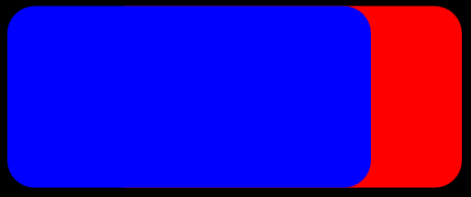
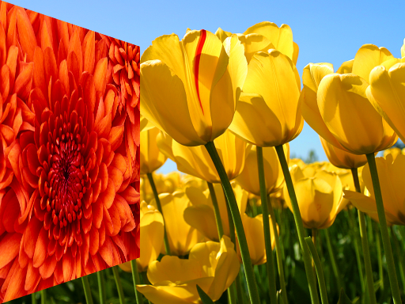

# Composite effect

Use the composite effect to combine 2 or more images. This effect has 13 different composite modes. T

The composite effect accepts 2 or more inputs. When you specify 2 images, destination is the first input (index 0) and the source is the second input (index 1). If you specify more than 2 inputs the images are composited starting with the first input and the second and so on.

This effect implements all of the modes using the blending unit of the graphics processing unit (GPU).

The CLSID for this effect is CLSID\_D2D1Composite.

-   [Example image](#example-image)
-   [Effect properties](#effect-properties)
-   [Mode types](#mode-types)
-   [Sample code](#sample-code)
-   [Requirements](#requirements)
-   [Related topics](#related-topics)

## Example image

The image here shows 2 rounded rectangles of the same size that overlap. The blue rectangle is the source and the red rectangle is the destination. The images were composited with the Source Over mode.



Here's another example using the default mode.


| Before image 1                                                          |
|-------------------------------------------------------------------------|
|  |
| Before image 2                                                          |
| .png)    |
| After                                                                   |
|                |


 


```C++
ComPtr<ID2D1Effect> compositeEffect;
m_d2dContext->CreateEffect(CLSID_D2D1Composite, &amp;compositeEffect);

compositeEffect->SetInput(0, bitmap);
compositeEffect->SetInput(1, bitmapTwo);

m_d2dContext->BeginDraw();
m_d2dContext->DrawImage(compositeEffect.Get());
m_d2dContext->EndDraw();
```


## Effect properties


| Display name and index enumeration                     | Type and default value                                                          | Description                   |
|--------------------------------------------------------|---------------------------------------------------------------------------------|-------------------------------|
| Mode<br/> D2D1\_COMPOSITE\_PROP\_MODE<br/> | D2D1\_COMPOSITE\_MODE<br/> D2D1\_COMPOSITE\_MODE\_SOURCE\_OVER<br/> | The mode used for the effect. |


 

## Mode types

The table here shows the modes of this effect. The equations listed in the table use these elements:

-   O = Output
-   S = Source
-   SA = Source Alpha
-   D = Destination
-   DA = Destination Alpha


| Enumeration                                  | Equation                          | Output Bitmap Size                                                                                      |
|----------------------------------------------|-----------------------------------|---------------------------------------------------------------------------------------------------------|
| D2D1\_COMPOSITE\_MODE\_SOURCE\_OVER          | O = S + (1   SA) \* D             | Union of source and destination bitmaps                                                                 |
| D2D1\_COMPOSITE\_MODE\_DESTINATION\_OVER     | O = (1   DA) \* S + D             | Union of source and destination bitmaps                                                                 |
| D2D1\_COMPOSITE\_MODE\_SOURCE\_IN            | O = DA \* S                       | Intersection of source and destination bitmaps                                                          |
| D2D1\_COMPOSITE\_MODE\_DESTINATION\_IN       | O = SA \* D                       | Intersection of source and destination bitmaps                                                          |
| D2D1\_COMPOSITE\_MODE\_SOURCE\_OUT           | O = (1 - DA) \* S                 | Region of the source bitmap                                                                             |
| D2D1\_COMPOSITE\_MODE\_DESTINATION\_OUT      | O = (1 - SA) \* D                 | Region of the destination bitmap                                                                        |
| D2D1\_COMPOSITE\_MODE\_SOURCE\_ATOP          | O = DA \* S + (1 - SA) \* D       | Region of the destination bitmap                                                                        |
| D2D1\_COMPOSITE\_MODE\_DESTINATION\_ATOP     | O = (1 - DA) \* S + SA \* D       | Region of the source bitmap                                                                             |
| D2D1\_COMPOSITE\_MODE\_XOR                   | O = (1 - DA) \* S + (1 - SA) \* D | Union of source and destination bitmaps                                                                 |
| D2D1\_COMPOSITE\_MODE\_PLUS                  | O = S + D                         | Union of source and destination bitmaps                                                                 |
| D2D1\_COMPOSITE\_MODE\_SOURCE\_COPY          | O = S                             | Region of the source bitmap                                                                             |
| D2D1\_COMPOSITE\_MODE\_BOUNDED\_SOURCE\_COPY | O = S (only where source exists)  | Union of source and destination bitmaps. Destination is not overwritten where the source doesn't exist. |
| D2D1\_COMPOSITE\_MODE\_MASK\_INVERT          | O = (1   D) \* S + (1   SA) \* D  | Union of source and destination bitmaps.The alpha values are unchanged.                                 |


 

The figure here shows an example of each of the modes with images that have an opacity of 1.0 or 0.5.


## Sample code

For an example of this effect, download the [Direct2D composite effect modes sample](http://go.microsoft.com/fwlink/p/?linkid=231580).

## Requirements


|                          |                                                                                    |
|--------------------------|------------------------------------------------------------------------------------|
| Minimum supported client | Windows 8 and Platform Update for Windows 7 \[desktop apps \| Windows Store apps\] |
| Minimum supported server | Windows 8 and Platform Update for Windows 7 \[desktop apps \| Windows Store apps\] |
| Header                   | d2d1effects.h                                                                      |
| Library                  | d2d1.lib, dxguid.lib                                                               |


 

## Related topics

<dl> <dt>

[**ID2D1Effect**](https://msdn.microsoft.com/en-us/library/Hh404566(v=VS.85).aspx)
</dt> </dl>

 

 


