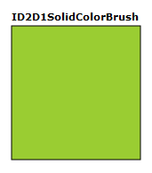
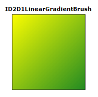
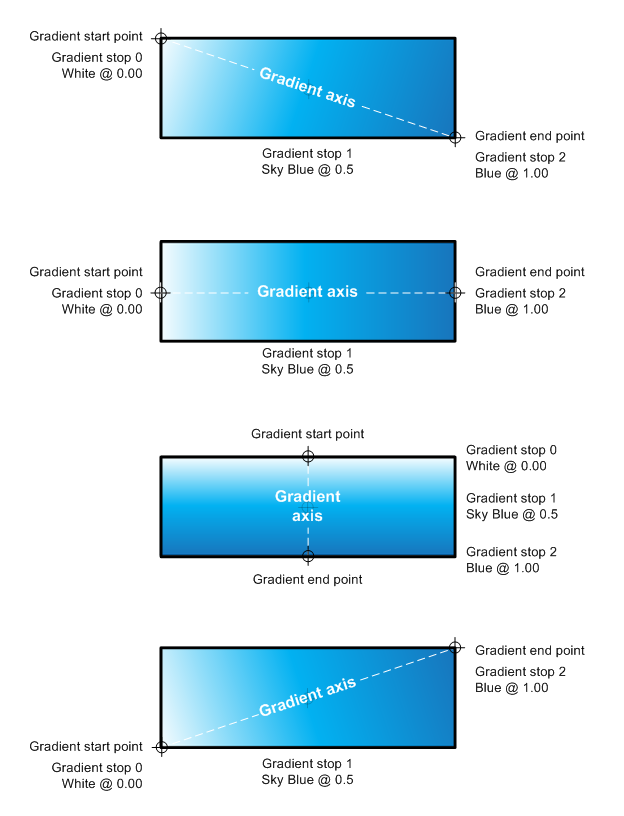
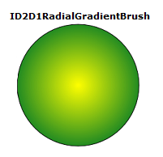
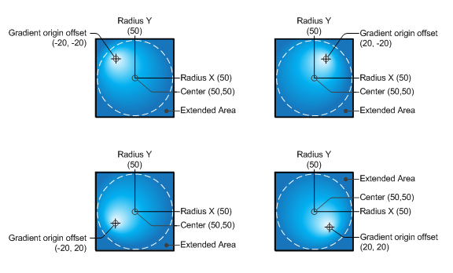
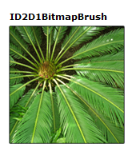
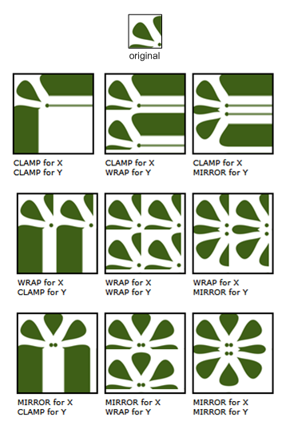
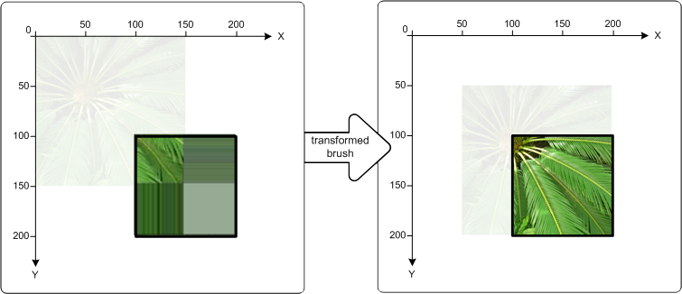

# Brushes Overview

This overview describes how to create and use [**ID2D1SolidColorBrush**](https://msdn.microsoft.com/en-us/library/Dd372207(v=VS.85).aspx), [**ID2D1LinearGradientBrush**](https://msdn.microsoft.com/en-us/library/Dd371488(v=VS.85).aspx), [**ID2D1RadialGradientBrush**](https://msdn.microsoft.com/en-us/library/Dd371529(v=VS.85).aspx), and [**ID2D1BitmapBrush**](https://msdn.microsoft.com/en-us/library/Dd371122(v=VS.85).aspx) objects to paint areas with solid colors, gradients, and bitmaps. It contains the following sections.

-   [Prerequisites](#prerequisites)
-   [Brush Types](#brush-types)
-   [Color Basics](#color-basics)
    -   [Alpha Modes](#alpha-modes)
-   [Using Solid Color Brushes](#using-solid-color-brushes)
-   [Using Linear Gradient Brushes](#using-linear-gradient-brushes)
-   [More About Gradient Stops](#more-about-gradient-stops)
-   [The Gradient Axis](#the-gradient-axis)
-   [Using Radial Gradient Brushes](#using-radial-gradient-brushes)
    -   [Configuring a Radial Gradient](#configuring-a-radial-gradient)
-   [Using Bitmap Brushes](#using-bitmap-brushes)
-   [Configuring Extend Modes](#configuring-extend-modes)
-   [Transforming Brushes](#transforming-brushes)
-   [Related topics](#related-topics)

## Prerequisites

This overview assumes that you are familiar with the structure of a basic Direct2D application, as described in [Creating a Simple Direct2D Application](direct2d-quickstart.md).

## Brush Types

A brush "paints" an area with its output. Different brushes have different types of output. Direct2D provides four brush types: [**ID2D1SolidColorBrush**](https://msdn.microsoft.com/en-us/library/Dd372207(v=VS.85).aspx) paints an area with a solid color, [**ID2D1LinearGradientBrush**](https://msdn.microsoft.com/en-us/library/Dd371488(v=VS.85).aspx) with a linear gradient, [**ID2D1RadialGradientBrush**](https://msdn.microsoft.com/en-us/library/Dd371529(v=VS.85).aspx) with a radial gradient, and [**ID2D1BitmapBrush**](https://msdn.microsoft.com/en-us/library/Dd371122(v=VS.85).aspx) with a bitmap.

> [!Note]  
> Starting with Windows 8, you can also use [**ID2D1ImageBrush**](https://msdn.microsoft.com/en-us/library/Hh446804(v=VS.85).aspx), which is similar to a bitmap brush, but you can use primitives, too.

 

All brushes inherit from [**ID2D1Brush**](https://msdn.microsoft.com/library/windows/desktop/dd371173) and share a set of common features (setting and getting opacity, and transforming brushes); they are created by [**ID2D1RenderTarget**](https://msdn.microsoft.com/en-us/library/Dd371766(v=VS.85).aspx) and are device-dependent resources: your application should create brushes after it initializes the render target with which the brushes will be used, and recreate the brushes whenever the render target needs recreated. (For more information about resources, see [Resources Overview](resources-and-resource-domains.md).)

The following illustration shows examples of each of the different brush types.


## Color Basics

Before you paint with an [**ID2D1SolidColorBrush**](https://msdn.microsoft.com/en-us/library/Dd372207(v=VS.85).aspx) or a gradient brush, you need to choose colors. In Direct2D, colors are represented by the [**D2D1\_COLOR\_F**](d2d1-color-f.md) structure (which is actually just a new name for the structure that is used by Direct3D, [D3DCOLORVALUE](http://msdn.microsoft.com/library/bb172520(VS.85).aspx)).

Prior to Windows 8, [**D2D1\_COLOR\_F**](d2d1-color-f.md) uses sRGB encoding. sRGB encoding divides colors into four components: red, green, blue, and alpha. Each component is represented by a floating point value with a normal range of 0.0 to 1.0. A value of 0.0 indicates the complete absence of that color, while a value of 1.0 indicates that the color is fully present. For the alpha component, 0.0 represents a fully transparent color and 1.0 represents a fully opaque color.

Starting in Windows 8, [**D2D1\_COLOR\_F**](d2d1-color-f.md) also accepts scRGB encoding. scRGB is a superset of that allows color values above 1.0 and below 0.0.

To define a color, you can use the [**D2D1\_COLOR\_F**](d2d1-color-f.md) structure and initialize its fields yourself, or you can use the [**D2D1::ColorF**](https://msdn.microsoft.com/en-us/library/Dd370907(v=VS.85).aspx) class to help you create the color. The **ColorF** class provides several constructors for defining colors. If the alpha value is not specified in the constructors, it defaults to 1.0.

-   Use the [**ColorF(Enum, FLOAT)**](https://msdn.microsoft.com/en-us/library/Dd370909(v=VS.85).aspx) constructor to specify a predefined color and an alpha channel value. An alpha channel value ranges from 0.0 to 1.0, where 0.0 represents a fully transparent color and 1.0 represents a fully opaque color. The following illustration shows several predefined colors and their hexadecimal equivalents. For a complete list of predefined colors, see the Color constants section of the [**ColorF**](https://msdn.microsoft.com/en-us/library/Dd370907(v=VS.85).aspx) class.

    

    The following example creates a predefined color and uses it to specify the color of an [**ID2D1SolidColorBrush**](https://msdn.microsoft.com/en-us/library/Dd372207(v=VS.85).aspx).

    ```C++
    hr = m_pRenderTarget->CreateSolidColorBrush(
        D2D1::ColorF(D2D1::ColorF::Black, 1.0f),
        &amp;m_pBlackBrush
        );
    ```

    

-   Use the [**ColorF(FLOAT, FLOAT, FLOAT, FLOAT)**](/windows/desktop/api/d2d1helper/nf-d2d1helper-colorf-colorf(float,float,float,float)) constructor to specify a color in the sequence of a red, green, blue, and alpha, where each element has a value between 0.0 and 1.0.

    The following example specifies the red, green, blue, and alpha values for a color.

    ```C++
    ID2D1SolidColorBrush *pGridBrush = NULL;
    hr = pCompatibleRenderTarget->CreateSolidColorBrush(
        D2D1::ColorF(D2D1::ColorF(0.93f, 0.94f, 0.96f, 1.0f)),
        &amp;pGridBrush
        );
    ```

    

-   Use the [**ColorF(UINT32, FLOAT)**](/windows/desktop/api/d2d1helper/nf-d2d1helper-colorf-colorf(uint32,float)) constructor to specify the hexadecimal value of a color and an alpha value, as shown in the following example.
    ```C++
    hr = m_pRenderTarget->CreateSolidColorBrush(
        D2D1::ColorF(D2D1::ColorF(0x9ACD32, 1.0f)),  
        &amp;m_pYellowGreenBrush
        );
    ```

    

### Alpha Modes

Regardless of the alpha mode of the render target with which you use a brush, [**D2D1\_COLOR\_F**](d2d1-color-f.md) values are always interpreted as straight alpha.

## Using Solid Color Brushes

To create a solid color brush, call the [**ID2D1RenderTarget::CreateSolidColorBrush**](https://msdn.microsoft.com/en-us/library/Dd371871(v=VS.85).aspx) method, which returns an HRESULT and an [**ID2D1SolidColorBrush**](https://msdn.microsoft.com/en-us/library/Dd372207(v=VS.85).aspx) object. The following illustration shows a square that is stroked with a black color brush and painted with a solid color brush that has the color value of 0x9ACD32.



The following code shows how to create and use a black color brush and a brush with a color value of 0x9ACD32 to fill and draw this square.


```C++
    ID2D1SolidColorBrush *m_pBlackBrush;
    ID2D1SolidColorBrush *m_pYellowGreenBrush;
```


```C++
if (SUCCEEDED(hr))
{
    hr = m_pRenderTarget->CreateSolidColorBrush(
        D2D1::ColorF(D2D1::ColorF::Black, 1.0f),
        &amp;m_pBlackBrush
        );
}

// Create a solid color brush with its rgb value 0x9ACD32.
if (SUCCEEDED(hr))
{
    hr = m_pRenderTarget->CreateSolidColorBrush(
        D2D1::ColorF(D2D1::ColorF(0x9ACD32, 1.0f)),  
        &amp;m_pYellowGreenBrush
        );
}
```


```C++
m_pRenderTarget->FillRectangle(&amp;rcBrushRect, m_pYellowGreenBrush);
m_pRenderTarget->DrawRectangle(&amp;rcBrushRect, m_pBlackBrush, 1, NULL);
```


Unlike other brushes, creating an [**ID2D1SolidColorBrush**](https://msdn.microsoft.com/en-us/library/Dd372207(v=VS.85).aspx) is a relatively inexpensive operation. You may create **ID2D1SolidColorBrush** objects each time you render with little to no performance impact. This approach is not recommended for gradient or bitmap brushes.

## Using Linear Gradient Brushes

An [**ID2D1LinearGradientBrush**](https://msdn.microsoft.com/en-us/library/Dd371488(v=VS.85).aspx) paints an area with a linear gradient defined along a line, the gradient axis. You specify the gradient's colors and their location along the gradient axis using [**ID2D1GradientStop**](https://msdn.microsoft.com/en-us/library/Dd316783(v=VS.85).aspx) objects. You may also modify the gradient axis, which enables you to create horizontal and vertical gradient and to reverse the gradient direction. To create a linear gradient brush, call the [**ID2D1RenderTarget::CreateLinearGradientBrush**](/windows/desktop/api/d2d1/nf-d2d1-createlineargradientbrush) method.

The following illustration shows a square that is painted with an [**ID2D1LinearGradientBrush**](https://msdn.microsoft.com/en-us/library/Dd371488(v=VS.85).aspx) that has two predefined colors, "Yellow" and "ForestGreen".



To create the gradient shown in the preceding illustration, complete these steps:

1.  Declare two [**D2D1\_GRADIENT\_STOP**](/windows/desktop/api/d2d1/ns-d2d1-d2d1_gradient_stop) objects. Each gradient stop specifies a color and a position. A position of 0.0 indicates the beginning of the gradient, while a position of 1.0 indicates the end of the gradient.

    The following code creates an array of two [**D2D1\_GRADIENT\_STOP**](/windows/desktop/api/d2d1/ns-d2d1-d2d1_gradient_stop) objects. The first stop specifies the color "Yellow" at a position 0, and the second stop specifies the color "ForestGreen" at position 1.

    ```C++
    // Create an array of gradient stops to put in the gradient stop
    // collection that will be used in the gradient brush.
    ID2D1GradientStopCollection *pGradientStops = NULL;

    D2D1_GRADIENT_STOP gradientStops[2];
    gradientStops[0].color = D2D1::ColorF(D2D1::ColorF::Yellow, 1);
    gradientStops[0].position = 0.0f;
    gradientStops[1].color = D2D1::ColorF(D2D1::ColorF::ForestGreen, 1);
    gradientStops[1].position = 1.0f;
    ```

    

2.  Create an [**ID2D1GradientStopCollection**](https://msdn.microsoft.com/en-us/library/Dd316783(v=VS.85).aspx). The following example calls [**CreateGradientStopCollection**](/windows/desktop/api/d2d1_1/nf-d2d1-creategradientstopcollection), passing in the array of [**D2D1\_GRADIENT\_STOP**](/windows/desktop/api/d2d1/ns-d2d1-d2d1_gradient_stop) objects, the number of gradient stops (2), [**D2D1\_GAMMA\_2\_2**](/windows/desktop/api/d2d1/ne-d2d1-d2d1_gamma) for interpolation, and [**D2D1\_EXTEND\_MODE\_CLAMP**](/windows/desktop/api/d2d1/ne-d2d1-d2d1_extend_mode) for the extend mode.

    ```C++
    // Create the ID2D1GradientStopCollection from a previously
    // declared array of D2D1_GRADIENT_STOP structs.
    hr = m_pRenderTarget->CreateGradientStopCollection(
        gradientStops,
        2,
        D2D1_GAMMA_2_2,
        D2D1_EXTEND_MODE_CLAMP,
        &amp;pGradientStops
        );
    ```

    

3.  Create the [**ID2D1LinearGradientBrush**](https://msdn.microsoft.com/en-us/library/Dd371488(v=VS.85).aspx). The next example calls the [**CreateLinearGradientBrush**](/windows/desktop/api/d2d1/nf-d2d1-createlineargradientbrush) method and passes it the linear gradient brush properties that contain the start point at (0, 0) and the end point at (150, 150), and the gradient stops created in the previous step.
    ```C++
    // The line that determines the direction of the gradient starts at
    // the upper-left corner of the square and ends at the lower-right corner.

    if (SUCCEEDED(hr))
    {
        hr = m_pRenderTarget->CreateLinearGradientBrush(
            D2D1::LinearGradientBrushProperties(
                D2D1::Point2F(0, 0),
                D2D1::Point2F(150, 150)),
            pGradientStops,
            &amp;m_pLinearGradientBrush
            );
    }
    ```

    

4.  Use the [**ID2D1LinearGradientBrush**](https://msdn.microsoft.com/en-us/library/Dd371488(v=VS.85).aspx). The next code example uses the brush to fille a rectangle.
    ```C++
    m_pRenderTarget->FillRectangle(&amp;rcBrushRect, m_pLinearGradientBrush);
    ```

    

## More About Gradient Stops

The [**D2D1\_GRADIENT\_STOP**](/windows/desktop/api/d2d1/ns-d2d1-d2d1_gradient_stop) is the basic building block of a gradient brush. A gradient stop specifies the color and the position along the gradient axis. The value of the gradient position ranges between 0.0 and 1.0. The closer it is to 0.0, the closer the color is to the start of the gradient; the closer it is to 1.0, the closer the color is to the end of the gradient.

The following illustration highlights the gradient stops. The circle marks the position of gradient stops and a dashed line shows the gradient axis.


The first gradient stop specifies the color yellow at a position of 0.0. The second gradient stop specifies red color at a position of 0.25. From left to right along the gradient axis, the colors between these two stops gradually change from yellow to red. The third gradient stop specifies blue color at a position of 0.75. The colors between the second and third gradient stops gradually change from red to blue. The fourth gradient stop specifies lime green at a position of 1.0. The colors between the third and fourth gradient stops gradually change from blue to lime green.

## The Gradient Axis

As mentioned previously, gradient stops of a linear gradient brush are positioned along a line, the gradient axis. You can specify the orientation and size of the line using the **startPoint** and **endPoint** fields of the [**D2D1\_LINEAR\_GRADIENT\_BRUSH\_PROPERTIES**](/windows/desktop/api/d2d1/ns-d2d1-d2d1_linear_gradient_brush_properties) structure when you create a linear gradient brush. After you've created a brush, you can adjust the gradient axis by calling the brush's [**SetStartPoint**](https://msdn.microsoft.com/en-us/library/Dd371505(v=VS.85).aspx) and [**SetEndPoint**](https://msdn.microsoft.com/en-us/library/Dd371501(v=VS.85).aspx) methods. By manipulating the brush's start point and end point, you can create horizontal and vertical gradients, reverse the gradient direction, and more.

For example, in the following illustration, the start point is set to (0,0) and the end point to (150, 50); this creates a diagonal gradient that starts at the upper-left corner and extends to the lower-right corner of the area being painted. When you set the start point to (0, 25) and the end point to (150, 25), a horizontal gradient is created. Similarly, setting the start point to (75, 0) and the end point to (75, 50) creates a vertical gradient. Setting the start point to (0, 50) and the end point to (150, 0) creates a diagonal gradient that starts at the lower-left corner and extends to the upper-right corner of the area being painted.



## Using Radial Gradient Brushes

Unlike an [**ID2D1LinearGradientBrush**](https://msdn.microsoft.com/en-us/library/Dd371488(v=VS.85).aspx), which blends two or more colors along a gradient axis, an [**ID2D1RadialGradientBrush**](https://msdn.microsoft.com/en-us/library/Dd371529(v=VS.85).aspx) paints an area with a radial gradient that blends two or more colors across an ellipse. While a **ID2D1LinearGradientBrush** defines its gradient axis with a start point and an end point, a **ID2D1RadialGradientBrush** defines its gradient ellipse by specifying a center, horizontal and vertical radii, and a gradient origin offset.

Like an [**ID2D1LinearGradientBrush**](https://msdn.microsoft.com/en-us/library/Dd371488(v=VS.85).aspx), an [**ID2D1RadialGradientBrush**](https://msdn.microsoft.com/en-us/library/Dd371529(v=VS.85).aspx) uses an [**ID2D1GradientStopCollection**](https://msdn.microsoft.com/en-us/library/Dd316783(v=VS.85).aspx) to specify the colors and positions in the gradient.

The following illustration shows a circle painted with an [**ID2D1RadialGradientBrush**](https://msdn.microsoft.com/en-us/library/Dd371529(v=VS.85).aspx). The circle has two gradient stops: the first specifies a predefined color "Yellow" at a position of 0.0, and the second specifies a predefined color "ForestGreen" at a position of 1.0. The gradient has a center of (75, 75), a gradient origin offset of (0, 0), and an x- and y-radius of 75.



The following code examples shows how to paint this circle with an [**ID2D1RadialGradientBrush**](https://msdn.microsoft.com/en-us/library/Dd371529(v=VS.85).aspx) that has two color stops: "Yellow" at a position of 0.0, and "ForestGreen" at a position of 1.0. Similar to creating an [**ID2D1LinearGradientBrush**](https://msdn.microsoft.com/en-us/library/Dd371488(v=VS.85).aspx), the example calls [**CreateGradientStopCollection**](/windows/desktop/api/d2d1_1/nf-d2d1-creategradientstopcollection) to create an [**ID2D1GradientStopCollection**](https://msdn.microsoft.com/en-us/library/Dd316783(v=VS.85).aspx) from an array of gradient stops.


```C++
// Create an array of gradient stops to put in the gradient stop
// collection that will be used in the gradient brush.
ID2D1GradientStopCollection *pGradientStops = NULL;

D2D1_GRADIENT_STOP gradientStops[2];
gradientStops[0].color = D2D1::ColorF(D2D1::ColorF::Yellow, 1);
gradientStops[0].position = 0.0f;
gradientStops[1].color = D2D1::ColorF(D2D1::ColorF::ForestGreen, 1);
gradientStops[1].position = 1.0f;
// Create the ID2D1GradientStopCollection from a previously
// declared array of D2D1_GRADIENT_STOP structs.
hr = m_pRenderTarget->CreateGradientStopCollection(
    gradientStops,
    2,
    D2D1_GAMMA_2_2,
    D2D1_EXTEND_MODE_CLAMP,
    &amp;pGradientStops
    );
```


To create an [**ID2D1RadialGradientBrush**](https://msdn.microsoft.com/en-us/library/Dd371529(v=VS.85).aspx), use the [**ID2D1RenderTarget::CreateRadialGradientBrush**](/windows/desktop/api/d2d1/nf-d2d1-createradialgradientbrush) method. The **CreateRadialGradientBrush** takes three parameters. The first parameter, a [**D2D1\_RADIAL\_GRADIENT\_BRUSH\_PROPERTIES**](/windows/desktop/api/d2d1/ns-d2d1-d2d1_radial_gradient_brush_properties) specifies the center, gradient origin offset, and the horizontal and vertical radii of the gradient. The second parameter is an [**ID2D1GradientStopCollection**](https://msdn.microsoft.com/en-us/library/Dd316783(v=VS.85).aspx) that describes the colors and their positions in the gradient, and the third parameter is the address of the pointer that receive the new **ID2D1RadialGradientBrush** reference. Some overloads take an additional parameter, a [**D2D1\_BRUSH\_PROPERTIES**](/windows/desktop/api/d2d1/ns-d2d1-d2d1_brush_properties) structure that specifies an opacity value and a transform to apply to the new brush.

The next example calls [**CreateRadialGradientBrush**](/windows/desktop/api/d2d1/nf-d2d1-createradialgradientbrush), passing in the array of gradient stops, and the radial gradient brush properties that have the *center* value set to (75, 75), the *gradientOriginOffset* set to (0, 0), and *radiusX* and *radiusY* both set to 75.


```C++
// The center of the gradient is in the center of the box.
// The gradient origin offset was set to zero(0, 0) or center in this case.
if (SUCCEEDED(hr))
{
    hr = m_pRenderTarget->CreateRadialGradientBrush(
        D2D1::RadialGradientBrushProperties(
            D2D1::Point2F(75, 75),
            D2D1::Point2F(0, 0),
            75,
            75),
        pGradientStops,
        &amp;m_pRadialGradientBrush
        );
}
```


The final example uses the brush to fill an ellipse.


```C++
m_pRenderTarget->FillEllipse(ellipse, m_pRadialGradientBrush);
m_pRenderTarget->DrawEllipse(ellipse, m_pBlackBrush, 1, NULL);
```


### Configuring a Radial Gradient

Different values for *center*, *gradientOriginOffset*, *radiusX* and/or *radiusY* produce different gradients. The following illustration shows several radial gradients that have different gradient origin offsets, creating the appearance of the light illuminating the circles from different angles.



## Using Bitmap Brushes

An [**ID2D1BitmapBrush**](https://msdn.microsoft.com/en-us/library/Dd371122(v=VS.85).aspx) paints an area with a bitmap (represented by an [**ID2D1Bitmap**](https://msdn.microsoft.com/en-us/library/Dd371109(v=VS.85).aspx) object).

The following illustration shows a square painted with a bitmap of a plant.



The examples that follow shows how to paint this square with an [**ID2D1BitmapBrush**](https://msdn.microsoft.com/en-us/library/Dd371122(v=VS.85).aspx).

The first example initializes an [**ID2D1Bitmap**](https://msdn.microsoft.com/en-us/library/Dd371109(v=VS.85).aspx) for use with the brush. The **ID2D1Bitmap** is provided by a helper method, LoadResourceBitmap, defined elsewhere in the sample.


```C++
// Create the bitmap to be used by the bitmap brush.
if (SUCCEEDED(hr))
{
    hr = LoadResourceBitmap(
        m_pRenderTarget,
        m_pWICFactory,
        L"FERN",
        L"Image",
        &amp;m_pBitmap
        );
}
```


To create the bitmap brush, call the [**ID2D1RenderTarget::CreateBitmapBrush**](id2d1rendertarget-createbitmapbrush.md) method and specify the [**ID2D1Bitmap**](https://msdn.microsoft.com/en-us/library/Dd371109(v=VS.85).aspx) with which to paint. The method returns an **HRESULT** and an [**ID2D1BitmapBrush**](https://msdn.microsoft.com/en-us/library/Dd371122(v=VS.85).aspx) object. Some **CreateBitmapBrush** overloads enable you to specify additional options by accepting a [**D2D1\_BRUSH\_PROPERTIES**](/windows/desktop/api/d2d1/ns-d2d1-d2d1_brush_properties) and a [**D2D1\_BITMAP\_BRUSH\_PROPERTIES**](/windows/desktop/api/d2d1/ns-d2d1-d2d1_bitmap_brush_properties) structure.


```C++
if (SUCCEEDED(hr))
{
    hr = m_pRenderTarget->CreateBitmapBrush(
        m_pBitmap,
        &amp;m_pBitmapBrush
        );
}
```


The next example uses the brush to fill a rectangle.


```C++
m_pRenderTarget->FillRectangle(&amp;rcBrushRect, m_pBitmapBrush);
```


## Configuring Extend Modes

Sometimes, the gradient of a gradient brush or the bitmap for a bitmap brush doesn't completely fill the area being painted.

-   When this happens for an [**ID2D1BitmapBrush**](https://msdn.microsoft.com/en-us/library/Dd371122(v=VS.85).aspx), Direct2D uses the brush's horizontal ([**SetExtendModeX**](https://msdn.microsoft.com/en-us/library/Dd371139(v=VS.85).aspx)) and vertical ([**SetExtendModeY**](https://msdn.microsoft.com/en-us/library/Dd371142(v=VS.85).aspx)) extend mode settings to determine how to fill the remaining area.

-   When this happens for a gradient brush, Direct2D determines how to fill the remaining area by using the value of the [**D2D1\_EXTEND\_MODE**](/windows/desktop/api/d2d1/ne-d2d1-d2d1_extend_mode) parameter that you specified when you called the [**CreateGradientStopCollection**](/windows/desktop/api/d2d1_1/nf-d2d1-creategradientstopcollection) to create the gradient brush's [**ID2D1GradientStopCollection**](https://msdn.microsoft.com/en-us/library/Dd316783(v=VS.85).aspx).

The following illustration shows the results from every possible combination of the extend modes for an [**ID2D1BitmapBrush**](https://msdn.microsoft.com/en-us/library/Dd371122(v=VS.85).aspx): [**D2D1\_EXTEND\_MODE\_CLAMP**](/windows/desktop/api/d2d1/ne-d2d1-d2d1_extend_mode) (CLAMP), **D2D1\_EXTEND\_MODE\_WRAP** (WRAP), and **D2D1\_EXTEND\_MIRROR** (MIRROR).



The following example shows how to set the bitmap brush's x- and y-extend modes to [**D2D1\_EXTEND\_MIRROR**](/windows/desktop/api/d2d1/ne-d2d1-d2d1_extend_mode). It then paints the rectangle with the [**ID2D1BitmapBrush**](https://msdn.microsoft.com/en-us/library/Dd371122(v=VS.85).aspx).


```C++
m_pBitmapBrush->SetExtendModeX(D2D1_EXTEND_MODE_MIRROR);
m_pBitmapBrush->SetExtendModeY(D2D1_EXTEND_MODE_MIRROR);

m_pRenderTarget->FillRectangle(exampleRectangle, m_pBitmapBrush);
```


It produces output as shown in the following illustration.


## Transforming Brushes

When you paint with a brush, it paints in the coordinate space of the render target. Brushes do not automatically position themselves to align with the object being painted; by default, they begin painting at the origin (0, 0) of the render target.

You can "move" the gradient defined by an [**ID2D1LinearGradientBrush**](https://msdn.microsoft.com/en-us/library/Dd371488(v=VS.85).aspx) to a target area by setting its start point and end point. Likewise, you can move the gradient defined by an [**ID2D1RadialGradientBrush**](https://msdn.microsoft.com/en-us/library/Dd371529(v=VS.85).aspx) by changing its center and radii.

To align the content of an [**ID2D1BitmapBrush**](https://msdn.microsoft.com/en-us/library/Dd371122(v=VS.85).aspx) to the area being painted, you can use the [**SetTransform**](/windows/desktop/api/d2d1_1/nf-d2d1-settransform) method to translate the bitmap to the desired location. This transform only affects the brush; it does not affect any other content drawn by the render target.

The following illustrations shows the effect of using an [**ID2D1BitmapBrush**](https://msdn.microsoft.com/en-us/library/Dd371122(v=VS.85).aspx) to fill a rectangle located at (100, 100). The illustration on the left illustration shows the result of filling the rectangle without transforming the brush: the bitmap is drawn at the render target's origin. As a result, only a portion of the bitmap appears in the rectangle. The illustration on the right shows the result of transforming the **ID2D1BitmapBrush** so that its content is shifted 50 pixels to the right and 50 pixels down. The bitmap now fills the rectangle.



The following code shows how to accomplish this. First apply a translation to the [**ID2D1BitmapBrush**](https://msdn.microsoft.com/en-us/library/Dd371122(v=VS.85).aspx), moving the brush 50 pixels right along the x-axis and 50 pixels down along the y-axis. Then use the **ID2D1BitmapBrush** to fill the rectangle that has the upper-left corner at (100, 100) and the lower-right corner at (200, 200).


```C++
// Create the bitmap to be used by the bitmap brush.
if (SUCCEEDED(hr))
{
    hr = LoadResourceBitmap(
        m_pRenderTarget,
        m_pWICFactory,
        L"FERN",
        L"Image",
        &amp;m_pBitmap
        );
   
}
```


```C++
if (SUCCEEDED(hr))
{
    hr = m_pRenderTarget->CreateBitmapBrush(
        m_pBitmap,
        &amp;m_pBitmapBrush
        );
}
```


```C++
D2D1_RECT_F rcTransformedBrushRect = D2D1::RectF(100, 100, 200, 200);

```

<span codelanguage="ManagedCPlusPlus"></span>

<table>
<colgroup>
<col style="width: 100%" />
</colgroup>
<thead>
<tr class="header">
<th>C++</th>
</tr>
</thead>
<tbody>
<tr class="odd">
<td><pre><code> // Demonstrate the effect of transforming a bitmap brush.
 m_pBitmapBrush-&gt;SetTransform(
     D2D1::Matrix3x2F::Translation(D2D1::SizeF(50,50))
     );

 // To see the content of the rcTransformedBrushRect, comment
 // out this statement.
 m_pRenderTarget-&gt;FillRectangle(
     &amp;rcTransformedBrushRect, 
     m_pBitmapBrush
     );

 m_pRenderTarget-&gt;DrawRectangle(rcTransformedBrushRect, m_pBlackBrush, 1, NULL);</code></pre></td>
</tr>
</tbody>
</table>


## Related topics

<dl> <dt>

[Direct2D Reference](reference.md)
</dt> <dt>

[How to Create a Solid Color Brush](how-to-create-a-solid-color-brush.md)
</dt> <dt>

[How to Create a Linear Gradient Brush](how-to-create-a-linear-gradient-brush.md)
</dt> <dt>

[How to Create a Radial Gradient Brush](how-to-create-a-radial-gradient-brush.md)
</dt> <dt>

[How to Create a Bitmap Brush](how-to-create-a-bitmap-brush.md)
</dt> </dl>

 

 


