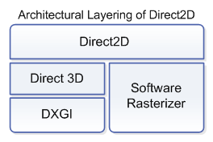
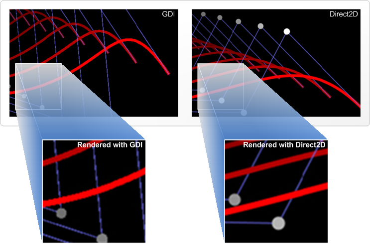

# About Direct2D

This topic introduces Direct2D, an API that provides Win32 developers with the ability to perform 2-D graphics rendering tasks with superior performance and visual quality.

## What is Direct2D?

Direct2D is a hardware-accelerated, immediate-mode 2-D graphics API that provides high performance and high-quality rendering for 2-D geometry, bitmaps, and text. The Direct2D API is designed to interoperate with existing code that uses GDI, GDI+, or Direct3D.

Direct2D is designed primarily for use by the following classes of developers:

-   Developers of large, enterprise-scale, native applications.
-   Developers who create control toolkits and libraries for consumption by downstream developers.
-   Developers who require server-side rendering of 2-D graphics.
-   Developers who use Direct3D graphics and need simple, high-performance 2-D and text rendering for menus, user interface (UI) elements, and Heads-up Displays (HUDs).

## Why Direct2D?

The primary motivations for creating a new 2-D graphics API in Microsoft Windows include the following:

-   To keep pace with the increasing level of visual richness that Windows users are accustomed to.
-   To enable developers to write 2-D rendering code that scales directly with the graphics processing hardware of the PC it is running on.
-   To enable developers to write code for rendering 2-D graphics that can run in the context of a service.

In recent years, end users have begun to expect greater visual fidelity in digital experiences. This trend is reflected in consumer electronics. GPS devices, media playback devices, mobile phones, and digital cameras deliver consistently richer experiences year after year. This trend can also be seen in the diversity of graphical content in film, television, video games, and on the Web. To keep pace with these changes, developers are consistently asked to take their existing Windows applications to the next level of visual richness.

Graphics processors in modern Windows PCs have also been evolving steadily, driven by advances in video game graphics and parts of the Windows experience like Windows Media Center and Aero. Some Windows applications can take advantage of modern GPUs by using Microsoft Direct3D and Windows Presentation Foundation (WPF). While Direct3D serves high-end 3-D graphics applications and WPF addresses the needs of .NET developers, there are gaps for developers who have large existing codebases of rendering code based on GDI and GDI+ or who want to incorporate high-quality 2-D graphics in their Direct3D-based applications.

Finally, the need for a graphics API that can be used in a service has become an emerging requirement for developers working in enterprise and Web-development scenarios. Existing rendering APIs focus on client-side rendering in a single user session. As such, they can fall short in areas of robustness and scalability when used in a service context. A new API is required to address this.

## High Performance with Maximum Availability

Direct2D is a user-mode library that is built using the Direct3D 10.1 API. This means that Direct2D applications benefit from hardware-accelerated rendering on modern mainstream GPUs. Hardware acceleration is also achieved on earlier Direct3D 9 hardware by using Direct3D 10-level-9 rendering. This combination provides excellent performance on graphics hardware on existing Windows PCs.

> [!Note]  
> Starting with Windows 8, Direct2D is built using the Direct3D 11.1 API.

 

The following diagram shows the layered architecture of Direct2D.

For scenarios where the use of hardware acceleration is not feasible, Direct2D includes a high-performance software rasterizer. When rendering in software, applications that use Direct2D experience substantially better rendering performance than with GDI+ and with similar visual quality. The software rasterizer is also designed for use in a service context.

Content that is rendered by using Direct2D can also be displayed remotely by using the Remote Desktop Protocol (RDP) infrastructure in the Windows 7 operating system. Developers can select whether rendering is handled by the GPU on the display computer or rendered locally and transmitted as bitmaps. This choice can be made based on the required fill-rate and the quantity of graphics primitives that are rendered. When the display computer is running an operating system earlier than Windows 7, remote display rendering is performed by transmitting bitmaps over the network.

By providing a single API that combines the performance of Direct3D and high availability by providing software fallback, remote desktop, and service rendering, Direct2D enables developers to have a single implementation for high-performance rendering in many different scenarios.

## Visual Quality

Applications that use Direct2D for graphics can deliver higher visual quality than what can be achieved using GDI. Direct2D uses per-primitive antialiasing to deliver smoother looking curves and lines in rendered content. There is also full support for transparency and alpha blending when rendering 2-D primitives. The following images compare aliased content rendered by using GDI (on the left) with antialiased content rendered by Direct2D (on the right).

Developers can specify aliased rendering of vector graphics. This is used in scenarios where snapping to hard pixel boundaries is required, such as UI elements like pointers or rulers, if the GDI style of output must be matched, or if antialiasing will be performed downstream in the rendering process via Multisample Antialiasing or some other mechanism.

## Interoperability

Integrating Direct2D-based rendering is made easier for developers through surface-level interoperability with GDI and Direct3D. Applications that render content primarily with GDI, GDI+, or Direct3D, can begin by using Direct2D to render specific areas of their application, and over time move to a model where rendering is performed primarily via Direct2D, using GDI primarily for plug-ins or legacy extensibility.

Direct2D also makes it easy to use [DirectWrite](https://msdn.microsoft.com/library/windows/desktop/dd368038) for high quality text and the advanced imaging features of the [Microsoft Windows Imaging Component (WIC)](http://msdn.microsoft.com/library/ms737408.aspx).

For more information about Direct2D interoperability, see the [Interoperability section of the Direct2D SDK.](interoperability.md)

## Summary

Microsoft Direct2D enables developers to build 2-D graphics features in their applications that deliver improved visual quality over GDI, and performance characteristics that scale with modern GPUs. The Direct2D interoperability model enables developers to selectively migrate portions of their application at a time alongside GDI, GDI+, or Direct3D-based rendering.

## Related topics

<dl> <dt>

[Direct2D Quickstart for Windows 8](direct2d-quickstart-with-device-context.md)
</dt> <dt>

[Direct2D API Overview](the-direct2d-api.md)
</dt> </dl>

 

 

