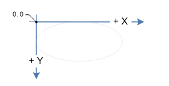
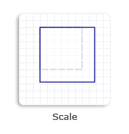
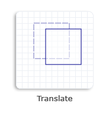
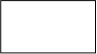
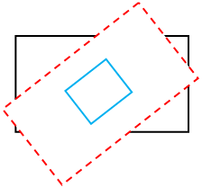
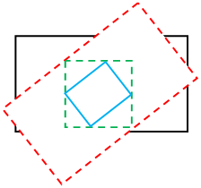

# Transforms Overview

This topic discusses the basics of Direct2D transforms and includes examples of various transforms. It contains the following parts:

-   [What Is a Direct2D Transform?](#what-is-a-direct2d-transform)
-   [The Direct2D Coordinate Space](#the-direct2d-coordinate-space)
-   [Creating Transformation Matrices](#creating-transformation-matrices)
-   [Rendering Target Transforms](#rendering-target-transforms)
-   [Brush Transforms](#brush-transforms)
-   [Geometry Transforms](#geometry-transforms)
-   [How a Render Target Transform Affects Clips](#how-a-render-target-transform-affects-clips)
-   [Summary](#summary)
-   [Related topics](#related-topics)

## What Is a Direct2D Transform?

A transform specifies how to map the points of an object from one coordinate space to another or from one position to another within the same coordinate space. This mapping is described by a transformation matrix, defined as a collection of three rows with three columns of FLOAT values as shown in the following table.

|                 |                 |     |
|-----------------|-----------------|-----|
| M11Default: 1.0 | M12Default: 0.0 | 0.0 |
| M21Default: 0.0 | M22Default: 1.0 | 0.0 |
| M31OffsetX: 0.0 | M32OffsetY: 0.0 | 1.0 |

 

In this matrix, the M11, M12, M21, and M22 members define a linear transformation that can scale, rotate, or skew an object; the OffsetX and OffsetY members define the translation to be applied after the linear transformation has been made. For affine transformations, the values in the third column are always 0.0, 0.0, and 1.0.

Because Direct2D supports only affine (linear) transformations, its transformation matrix is defined as a 3-by-2 matrix, omitting the third column from the previous transformation matrix. The following table shows the layout of the Direct2D transformation matrix.

|                 |                 |
|-----------------|-----------------|
| M11Default: 1.0 | M12Default: 0.0 |
| M21Default: 0.0 | M22Default: 1.0 |
| M31OffsetX: 0.0 | M32OffsetY: 0.0 |

 

In Direct2D, this 3-by-2 matrix is represented by the [**D2D1\_MATRIX\_3X2**](/windows/desktop/api/dcommon/ns-dcommon-d2d_matrix_3x2_f) structure. To simplify common matrix operations, Direct2D also provides a class named [**Matrix3x2F**](/windows/desktop/api/d2d1/nl-d2d1helper-matrix3x2f), which is derived from the **D2D1\_MATRIX\_3X2** structure.

The default constructor for [**Matrix3x2F**](/windows/desktop/api/d2d1/nl-d2d1helper-matrix3x2f) leaves the object uninitialized. To retrieve an identity matrix, use [**Matrix3x2F::Identity**](/windows/desktop/api/d2d1helper/nf-d2d1helper-identitymatrix).

When an identity transform is applied to an object, it does not change the position, shape, or size of the object. It is similar to the way that multiplying a number by 1 does not change the number. In other words, the identity transform leaves the coordinates of points alone and does not shift the points to a new position. Any transform other than the identity transform will modify the position, shape, and/or size of objects.

Transforms are all about coordinates, and understanding the Direct2D coordinate space is important for understanding the use of transformations.

## The Direct2D Coordinate Space

Direct2D uses a left-handed coordinate space; that is, positive x-axis values increase to the right and positive y-axis values increase downward. Everything on the screen is positioned relative to the origin, which is the point where the x-axis and y-axis intersect (0, 0), as shown in the following illustration. Direct2D render targets use this coordinate space.

By manipulating values in a transformation matrix, you can rotate, scale, skew, and move (translate) an object. For example, if you set OffsetX to 100 and OffsetY to 200, you move the object to the right 100 pixels and down 200 pixels.

To show the effect of the object move, you need to apply the translation transformation to render targets, brushes, or geometries. Applying a transform to render targets affects the entire screen, while applying a transform to a brush or a geometry only affects that specific brush or geometry. To create a transformation matrix, use the [**Matrix3x2F**](https://msdn.microsoft.com/library/windows/desktop/dd372275) class.

## Creating Transformation Matrices

For creating rotation, scale, skew, and translation transformations, the [**Matrix3x2F**](https://msdn.microsoft.com/library/windows/desktop/dd372275) class provides the static methods shown in the following table. The Example column of the table contains links to the how-to topics that demonstrate how to use each transformation method.

| Method                                                                   | Description                                                                                                     | Example                                            | Illustration                                                                                                                            |
|--------------------------------------------------------------------------|-----------------------------------------------------------------------------------------------------------------|----------------------------------------------------|-----------------------------------------------------------------------------------------------------------------------------------------|
| [**matrix3x2f::rotate**](/windows/desktop/api/d2d1helper/nf-d2d1helper-matrix3x2f-rotation)                          | creates a rotation transformation that has the specified angle and center point.                                | [how to rotate an object](how-to-rotate.md)       |                  |
| [**matrix3x2f::scale**](/windows/desktop/api/d2d1helper/nf-d2d1helper-matrix3x2f-scale) | creates a scale transformation that has the specified scale factors and center point.                           | [how to scale an object](how-to-scale.md)         |                                                                            |
| [**matrix3x2f::skew**](/windows/desktop/api/d2d1helper/nf-d2d1helper-matrix3x2f-skew)                              | creates a skew transformation that has the specified x-axis and y-axis values and center point.                 | [how to skew an object](how-to-skew.md)           |                                      |
| [**matrix3x2f::translation**](/windows/desktop/api/d2d1helper/nf-d2d1helper-matrix3x2f-translation(float,float))                | creates a translation transformation and specifies the displacements in the direction of the x-axis and y-axis. | [how to translate an object](how-to-translate.md) |  |

 

## Rendering Target Transforms

A render target is a resource that inherits from the [**ID2D1RenderTarget**](/windows/desktop/api/d2d1/) interface. It creates resources for drawing and performs actual drawing operations. It also provides methods for transforming the coordinate space. You can call the [**ID2D1RenderTarget::SetTransform**](id2d1rendertarget-settransform.md) method to apply the specified transform to the render target. All subsequent drawing operations occur in the transformed space.

To render content, use the render target's drawing methods. Before you begin drawing, call the [**BeginDraw**](/windows/desktop/api/d2d1/) method. To finish rendering content, call the [**EndDraw**](/windows/desktop/api/d2d1/) method. For an example, see [How to Apply Multiple Transforms to an Object](how-to-apply-multiple-transforms.md).

## Brush Transforms

You can adjust the transform on the brush by calling [**SetTransform**](/windows/desktop/api/d2d1_1/nf-d2d1-settransform). For this transform, you can think of the brush as a large piece of paper and of the different rendering primitives (text, geometry, rectangle and so on) as stencils. When you adjust the brush transform, it is as if you were sliding the large piece of paper underneath the stencil, without changing the position of the stencil itself. You can use this technique to make the text fade from yellow to black away into 3D space.

When the brush transform is the identity transform, brushes appear in the same coordinate space as the render target in which they are drawn. The brush transform enables a caller to alter how brush coordinates map to this space.

The brush space is specified differently in Direct2D than in Windows Presentation Foundation (WPF). In Direct2D, the brush space is not relative to the object being drawn, but rather is the current coordinate system of the render target, transformed by the brush transform, if there is one. To have the brush fill an object as was done in WPF, you must translate the brush space origin to the top-left corner of the object's bounding box, and then scale the brush space so that the base tile fills the bounding box of the object.

For more information about brush transforms, see [Direct2D Brushes Overview](direct2d-brushes-overview.md).

## Geometry Transforms

When you scale, move, translate, or skew geometries, you can directly apply a transform to a specific geometry, not to a render target transform that would affect the entire screen. A render target transform generally affects the stroke and fill of a geometry. By contrast, a geometry transform only affects the fill of a geometry, because the transform is applied to a geometry before it is stroked.

> [!Note]  
> Starting with Windows 8, the world transform doesn't affect the stroke if you set the stroke type to [**D2D1\_STROKE\_TRANSFORM\_TYPE\_FIXED**](/windows/desktop/api/D2d1_1/ne-d2d1_1-d2d1_stroke_transform_type) or [**D2D1\_STROKE\_TRANSFORM\_TYPE\_HAIRLINE**](/windows/desktop/api/D2d1_1/ne-d2d1_1-d2d1_stroke_transform_type).

 

You can adjust the transform on a geometry by calling [**ID2D1Factory::CreateTransformedGeometry**](/windows/desktop/api/d2d1/) to create an [**ID2D1TransformedGeometry**](/windows/desktop/api/d2d1/) object. For more information about geometry transforms, see [Direct2D Geometries Overview](direct2d-geometries-overview.md).

## How a Render Target Transform Affects Clips

The transform on a render target affects how the bounding box of an axis-aligned clip is computed. When the [**PushAxisAlignedClip**](/windows/desktop/api/d2d1/) is called, the *clipRect* parameter is transformed by the current world transform that is set on the render target. After the transform is applied to the *clipRect*, the axis-aligned bounding box for the *clipRect* is computed. For efficiency, the contents are clipped to this axis-aligned bounding box and not to the original *clipRect* that is passed in. The following diagrams show how a rotation transform is applied to the render target, the resulting *clipRect*, and a calculated axis-aligned bounding box.

1.  Assume that the rectangle in the following illustration is a render target that is aligned to the screen pixels.

    

2.  Apply a rotation transform to the render target. In the following illustration, the black rectangle represents the original render target and the red dashed rectangle represents the transformed render target.

    

3.  After [**PushAxisAlignedClip**](/windows/desktop/api/d2d1/) is called, the rotation transform is applied to the *clipRect*. In the following illustration, the blue rectangle represents the transformed *clipRect*.

    

4.  The axis-aligned bounding box is calculated. In the following illustration, the green dashed rectangle represents the bounding box. All contents are clipped to this axis-aligned bounding box.

    

## Summary

Direct2D makes it easy to transform two-dimensional objects with simplified coordinate spaces and related classes. By using various types of transforms, you can translate, rotate, skew, and scale your objects to achieve many impressive visual effects.

## Related topics

<dl> <dt>

[Direct2D Reference](reference.md)
</dt> </dl>

 

 

