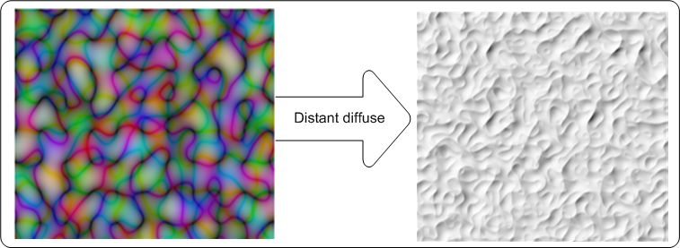

# Distant-diffuse lighting effect

Use the distant-diffuse lighting effect to create an image that appears to be a non-reflective surface with where the light source appears to be coming from a long distance (like the sun or overhead lights) and the light is scattered in all directions. This effect uses the alpha channel as a height map and lights the image with a distant light source.

The color of the output bitmap is a result of light color, light position, and the surface geometry of the image. The alpha channel output for each pixel with diffuse lighting is always 1.0.

The CLSID for this effect is CLSID\_D2D1DistantDiffuse.

-   [Example image](#example-image)
-   [Effect properties](#effect-properties)
-   [Scale modes](#scale-modes)
-   [Sample code](#sample-code)
-   [Requirements](#requirements)
-   [Related topics](#related-topics)

## Example image

The example here shows the input and output images of the distant-diffuse lighting effect.

## Effect properties

| Display name and index enumeration                                                      | Description                                                                                                                                                                                                                                                                                                                                                                                                                                                                                                                   |
|-----------------------------------------------------------------------------------------|-------------------------------------------------------------------------------------------------------------------------------------------------------------------------------------------------------------------------------------------------------------------------------------------------------------------------------------------------------------------------------------------------------------------------------------------------------------------------------------------------------------------------------|
| Azimuth  D2D1\_DISTANTDIFFUSE\_PROP\_AZIMUTH                        | The direction angle of the light source in the XY plane relative to the X-axis in the counter clock wise direction. The units are in degrees and must be between 0 and 360 degrees.  The type is FLOAT.  The default value is 0.0f.                                                                                                                                                                                                                                                             |
| Elevation  D2D1\_DISTANTDIFFUSE\_PROP\_ELEVATION                    | The direction angle of the light source in the YZ plane relative to the Y-axis in the counter clock wise direction. The units are in degrees and must be between 0 and 360 degrees.   The type is FLOAT.  The default value is 0.0f.                                                                                                                                                                                                                                                            |
| DiffuseConstant  D2D1\_DISTANTDIFFUSE\_PROP\_DIFFUSE\_CONSTANT      | The ratio of diffuse reflection to amount of incoming light. This property must be between 0 and 10,000 and is unitless.   The type is FLOAT.  The default value is 1.0f.                                                                                                                                                                                                                                                                                                                       |
| SurfaceScale  D2D1\_DISTANTDIFFUSE\_PROP\_SURFACE\_SCALE            | The scale factor in the Z direction. The surface scale is unitless and must be between 0 and 10,000.  The type is FLOAT.  The default value is 1.0f.                                                                                                                                                                                                                                                                                                                                            |
| Color  D2D1\_DISTANTDIFFUSE\_PROP\_COLOR                            | The color of the incoming light. This property is exposed as a D2D1\_VECTOR\_3F   (R, G, B) and used to compute LR, LG, LB.   The type is D2D1\_VECTOR\_3F.  The default value is {1.0f, 1.0f, 1.0f}.                                                                                                                                                                                                                                                          |
| KernelUnitLength  D2D1\_DISTANTDIFFUSE\_PROP\_KERNEL\_UNIT\_LENGTH  | The size of an element in the Sobel kernel used to generate the surface normal in the X and Y direction. This property maps to the dx and dy values in the Sobel gradient. This property is a D2D1\_VECTOR\_2F (Kernel Unit Length X, Kernel Unit Length Y) and is defined in (device-independent pixels (DIPs)/Kernel Unit). The effect uses bilinear interpolation to scale the bitmap to match size of kernel elements.   The type is D2D1\_VECTOR\_2F.  The default value is {1.0f, 1.0f}.  |
| ScaleMode  D2D1\_DISTANTDIFFUSE\_PROP\_SCALE\_MODE                  | The interpolation mode the effect uses to scale the image to the corresponding kernel unit length. There are six scale modes that range in quality and speed.  The type is D2D1\_DISTANTDIFFUSE\_SCALE\_MODE.  The default value is D2D1\_DISTANTDIFFUSE\_SCALE\_MODE\_LINEAR.                                                                                                                                                                                                                  |

 

## Scale modes

| Enumeration                                              | Description                                                                                                                                                                                          |
|----------------------------------------------------------|------------------------------------------------------------------------------------------------------------------------------------------------------------------------------------------------------|
| D2D1\_DISTANTDIFFUSE\_SCALE\_MODE\_NEAREST\_NEIGHBOR     | Samples the nearest single point and uses that. This mode uses less processing time, but outputs the lowest quality image.                                                                           |
| D2D1\_DISTANTDIFFUSE\_SCALE\_MODE\_LINEAR                | Uses a four point sample and linear interpolation. This mode outputs a higher quality image than nearest neighbor.                                                                                   |
| D2D1\_DISTANTDIFFUSE\_SCALE\_MODE\_CUBIC                 | Uses a 16 sample cubic kernel for interpolation. This mode uses the most processing time, but outputs a higher quality image.                                                                        |
| D2D1\_DISTANTDIFFUSE\_SCALE\_MODE\_MULTI\_SAMPLE\_LINEAR | Uses 4 linear samples within a single pixel for good edge anti-aliasing. This mode is good for scaling down by small amounts on images with few pixels.                                              |
| D2D1\_DISTANTDIFFUSE\_SCALE\_MODE\_ANISOTROPIC           | Uses anisotropic filtering to sample a pattern according to the transformed shape of the bitmap.                                                                                                     |
| D2D1\_DISTANTDIFFUSE\_SCALE\_MODE\_HIGH\_QUALITY\_CUBIC  | Uses a variable size high quality cubic kernel to perform a pre-downscale the image if downscaling is involved in the transform matrix. Then uses the cubic interpolation mode for the final output. |

 

> [!Note]  
> If you don't select a mode, the effect defaults to D2D1\_DISTANTDIFFUSE\_SCALE\_MODE\_LINEAR.

 

## Sample code

For an example of this effect, download the [Direct2D lighting effects sample](http://go.microsoft.com/fwlink/p/?linkid=254010).

## Requirements

|                          |                                                                                    |
|--------------------------|------------------------------------------------------------------------------------|
| Minimum supported client | Windows 8 and Platform Update for Windows 7 \[desktop apps \| Windows Store apps\] |
| Minimum supported server | Windows 8 and Platform Update for Windows 7 \[desktop apps \| Windows Store apps\] |
| Header                   | d2d1effects.h                                                                      |
| Library                  | d2d1.lib, dxguid.lib                                                               |

 

## Related topics

<dl> <dt>

[**ID2D1Effect**](/windows/desktop/api/D2d1_1/)
</dt> </dl>

 

 

