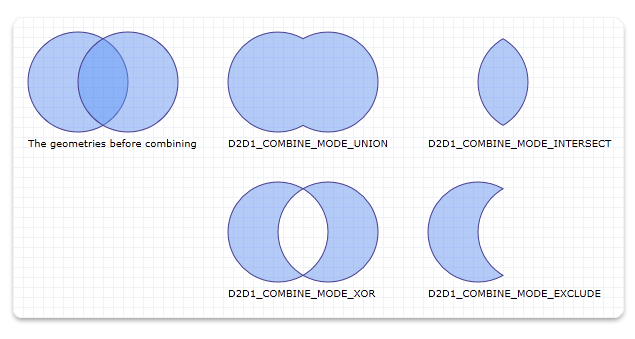

# How to Combine Geometries

This topic describes how to combine two geometries. Direct2D supports four modes for combining geometries: Union, Intersect, XOR, and Exclude. These modes are specified in the [**D2D1\_COMBINE\_MODE**](d2d1-combine-mode.md) enum type.

**To combine two geometries by using any of the four modes**

1.  Declare a path geometry: a variable of type [**ID2D1PathGeometry**](id2d1pathgeometry.md) that will store the result of geometry combination.
2.  Declare a geometry sink: a variable of type [**ID2D1GeometrySink**](id2d1geometrysink.md) that will store the path geometry.
3.  Create the path geometry object by calling the [**ID2D1Factory::CreatePathGeometry**](id2d1factory-createpathgeometry.md) method.
4.  Open the geometry sink object by calling the [**ID2D1PathGeometry::Open**](id2d1pathgeometry-open.md) method.
5.  Use one of the four modes to combine the two geometries by calling the [**ID2D1EllipseGeometry::CombineWithGeometry**](id2d1geometry-combinewithgeometry-ptr-id2d1geometry-d2d1-combine-mode-ref-d2d-matrix-3x2-f-ptr-id2d1simplifiedgeometrysink.md) method.
6.  Close the geometry sink object.

The following code declares the variables of type [**ID2D1PathGeometry**](id2d1pathgeometry.md) and **ID2D1GeometrySink**.


```C++
    ID2D1PathGeometry *m_pPathGeometryUnion;
    ID2D1PathGeometry *m_pPathGeometryIntersect;
    ID2D1PathGeometry *m_pPathGeometryXOR;
    ID2D1PathGeometry *m_pPathGeometryExclude;
```


The following code uses each of the four modes to combine the two [**ID2D1EllipseGeometry**](id2d1ellipsegeometry.md) objects and performs the following actions:

-   Creates two ellipses, m\_spEllipseGeometryOne and m\_spEllipseGeometryTwo.
-   Creates a path geometry object.
-   Opens a geometry sink object.
-   Combines the two ellipses.
-   Closes the geometry sink object.


```C++
HRESULT DemoApp::CreateGeometryResources()
{
    HRESULT hr = S_OK;
    ID2D1GeometrySink *pGeometrySink = NULL;

    // Create the first ellipse geometry to merge.
    const D2D1_ELLIPSE circle1 = D2D1::Ellipse(
        D2D1::Point2F(75.0f, 75.0f),
        50.0f,
        50.0f
        );

    hr = m_pD2DFactory->CreateEllipseGeometry(
        circle1,
        &amp;m_pCircleGeometry1
        );

    if (SUCCEEDED(hr))
    {
        // Create the second ellipse geometry to merge.
        const D2D1_ELLIPSE circle2 = D2D1::Ellipse(
            D2D1::Point2F(125.0f, 75.0f),
            50.0f,
            50.0f
            );

        hr = m_pD2DFactory->CreateEllipseGeometry(circle2, &amp;m_pCircleGeometry2);
    }


    if (SUCCEEDED(hr))
    {
        //
        // Use D2D1_COMBINE_MODE_UNION to combine the geometries.
        //
        hr = m_pD2DFactory->CreatePathGeometry(&amp;m_pPathGeometryUnion);

        if (SUCCEEDED(hr))
        {
            hr = m_pPathGeometryUnion->Open(&amp;pGeometrySink);

            if (SUCCEEDED(hr))
            {
                hr = m_pCircleGeometry1->CombineWithGeometry(
                    m_pCircleGeometry2,
                    D2D1_COMBINE_MODE_UNION,
                    NULL,
                    NULL,
                    pGeometrySink
                    );
            }

            if (SUCCEEDED(hr))
            {
                hr = pGeometrySink->Close();
            }

            SafeRelease(&amp;pGeometrySink);
        }
    }

    if (SUCCEEDED(hr))
    {
        //
        // Use D2D1_COMBINE_MODE_INTERSECT to combine the geometries.
        //
        hr = m_pD2DFactory->CreatePathGeometry(&amp;m_pPathGeometryIntersect);

        if (SUCCEEDED(hr))
        {
            hr = m_pPathGeometryIntersect->Open(&amp;pGeometrySink);

            if (SUCCEEDED(hr))
            {
                hr = m_pCircleGeometry1->CombineWithGeometry(
                    m_pCircleGeometry2,
                    D2D1_COMBINE_MODE_INTERSECT,
                    NULL,
                    NULL,
                    pGeometrySink
                    );
            }

            if (SUCCEEDED(hr))
            {
                hr = pGeometrySink->Close();
            }

            SafeRelease(&amp;pGeometrySink);
        }
    }

    if (SUCCEEDED(hr))
    {
        //
        // Use D2D1_COMBINE_MODE_XOR to combine the geometries.
        //
        hr = m_pD2DFactory->CreatePathGeometry(&amp;m_pPathGeometryXOR);

        if (SUCCEEDED(hr))
        {
            hr = m_pPathGeometryXOR->Open(&amp;pGeometrySink);

            if (SUCCEEDED(hr))
            {
                hr = m_pCircleGeometry1->CombineWithGeometry(
                    m_pCircleGeometry2,
                    D2D1_COMBINE_MODE_XOR,
                    NULL,
                    NULL,
                    pGeometrySink
                    );
            }

            if (SUCCEEDED(hr))
            {
                hr = pGeometrySink->Close();
            }

            SafeRelease(&amp;pGeometrySink);
        }
    }

    if (SUCCEEDED(hr))
    {
        //
        // Use D2D1_COMBINE_MODE_EXCLUDE to combine the geometries.
        //
        hr = m_pD2DFactory->CreatePathGeometry(&amp;m_pPathGeometryExclude);

        if (SUCCEEDED(hr))
        {
            hr = m_pPathGeometryExclude->Open(&amp;pGeometrySink);

            if (SUCCEEDED(hr))
            {
                hr = m_pCircleGeometry1->CombineWithGeometry(
                    m_pCircleGeometry2,
                    D2D1_COMBINE_MODE_EXCLUDE,
                    NULL,
                    NULL,
                    pGeometrySink
                    );
            }

            if (SUCCEEDED(hr))
            {
                hr = pGeometrySink->Close();
            }

            SafeRelease(&amp;pGeometrySink);
        }
    }

    return hr;
}
```


This code produces the output shown in the following illustration.



## Related topics

<dl> <dt>

[**D2D1\_COMBINE\_MODE**](d2d1-combine-mode.md)
</dt> <dt>

[**ID2D1EllipseGeometry**](id2d1ellipsegeometry.md)
</dt> <dt>

[**ID2D1PathGeometry**](id2d1pathgeometry.md)
</dt> <dt>

**ID2D1GeometrySink**
</dt> </dl>

 

 


