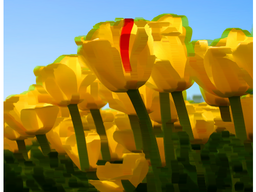

# Morphology effect

Use the morphology effect to thin or thicken edge boundaries in an image. This effect creates a kernel that is 2 times the Width and Height values you specify. This effect centers the kernel on the pixel it is calculating and returns the maximum value in the kernel (if dilating) or minimum value in the kernel (if eroding).

The CLSID for this effect is CLSID\_D2D1Morphology.

## Example images

This example shows the output of the effect when using the erode mode.


| Before                                                     |
|------------------------------------------------------------|
|  |
| After                                                      |
|  |


 


```C++
ComPtr<ID2D1Effect> morphologyEffect;
m_d2dContext->CreateEffect(CLSID_D2D1Morphology, &amp;morphologyEffect);

morphologyEffect->SetInput(0, bitmap);

morphologyEffect->SetValue(D2D1_MORPHOLOGY_PROP_MODE, D2D1_MORPHOLOGY_MODE_ERODE);
morphologyEffect->SetValue(D2D1_MORPHOLOGY_PROP_WIDTH, 14);

m_d2dContext->BeginDraw();
m_d2dContext->DrawImage(morphologyEffect.Get());
m_d2dContext->EndDraw(); 
```


## Effect properties


| Display name and index enumeration                          | Type and default value                                                     | Description                                                                                                                                                       |
|-------------------------------------------------------------|----------------------------------------------------------------------------|-------------------------------------------------------------------------------------------------------------------------------------------------------------------|
| Mode<br/> D2D1\_MORPHOLOGY\_PROP\_MODE<br/>     | D2D1\_MORPHOLOGY\_MODE<br/> D2D1\_MORPHOLOGY\_MODE\_ERODE<br/> | The morphology mode. The available modes are erode (flatten) and dilate (thicken).<br/> See [Morphology modes](#morphology-modes) for more info.<br/> |
| Width<br/> D2D1\_MORPHOLOGY\_PROP\_WIDTH<br/>   | UINT<br/> 1<br/>                                               | Size of the kernel in the X direction. The units are in DIPs. Values must be between 1 and 100 inclusive.                                                         |
| Height<br/> D2D1\_MORPHOLOGY\_PROP\_HEIGHT<br/> | UINT<br/> 1<br/>                                               | Size of the kernel in the Y direction. The units are in DIPs. Values must be between 1 and 100 inclusive.                                                         |


 

## Morphology modes


| Name                           | Description                                                    |
|--------------------------------|----------------------------------------------------------------|
| D2D1\_MORPHOLOGY\_MODE\_ERODE  | The maximum value from each RGB channel in the kernel is used. |
| D2D1\_MORPHOLOGY\_MODE\_DILATE | The minimum value from each RGB channel in the kernel is used. |


 

## Output bitmap

For DILATE mode, the Output Bitmap size grows: 

|                          |                                         |
|--------------------------|-----------------------------------------|
| Output Bitmap Growth X = | INT(FLOAT(Width) \* ((User DPI) / 96))  |
| Output Bitmap Growth Y = | INT(FLOAT(Height) \* ((User DPI) / 96)) |


 

For ERODE mode, the Output Bitmap size shrinks:

|                          |                                          |
|--------------------------|------------------------------------------|
| Output Bitmap Growth X = | INT(FLOAT(-Width) \* ((User DPI) / 96))  |
| Output Bitmap Growth Y = | INT(FLOAT(-Height) \* ((User DPI) / 96)) |


 

## Requirements


|                          |                                                                                    |
|--------------------------|------------------------------------------------------------------------------------|
| Minimum supported client | Windows 8 and Platform Update for Windows 7 \[desktop apps \| Windows Store apps\] |
| Minimum supported server | Windows 8 and Platform Update for Windows 7 \[desktop apps \| Windows Store apps\] |
| Header                   | d2d1effects.h                                                                      |
| Library                  | d2d1.lib, dxguid.lib                                                               |


 

## Related topics

<dl> <dt>

[**ID2D1Effect**](/windows/desktop/api/D2d1_1/)
</dt> </dl>

 

 


