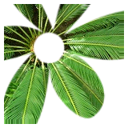

# Opacity Masks Overview

This topic describes how to use bitmaps and brushes to define opacity masks. It contains the following sections.

-   [Prerequisites](#prerequisites)
-   [What Is an Opacity Mask?](#what-is-an-opacity-mask)
-   [Use a Bitmap as an Opacity Mask with the FillOpacityMask Method](#use-a-bitmap-as-an-opacity-mask-with-the-fillopacitymask-method)
-   [Use a Brush as an Opacity Mask with the FillGeometry Method](#use-a-brush-as-an-opacity-mask-with-the-fillgeometry-method)
    -   [Use an Linear Gradient Brush as an Opacity Mask](#use-an-linear-gradient-brush-as-an-opacity-mask)
    -   [Use a Radial Gradient Brush as an Opacity Mask](#use-a-radial-gradient-brush-as-an-opacity-mask)
-   [Apply an Opacity Mask to a Layer](#apply-an-opacity-mask-to-a-layer)
-   [Related topics](#related-topics)

## Prerequisites

This overview assumes that you are familiar with basic Direct2D drawing operations, as described in the [Creating a Simple Direct2D Application](direct2d-quickstart.md) walkthrough. You should also be familiar with the different types of brushes, as described in the [Brushes Overview](direct2d-brushes-overview.md).

## What Is an Opacity Mask?

An opacity mask is a mask, described by a brush or bitmap, that is applied to another object to make that object partially or completely transparent. An opacity mask uses alpha channel information to specify how the source pixels of the object are blended into the final destination target. The transparent portions of the mask indicate the areas where the underlying image is hidden, whereas the opaque portions of the mask indicate where the masked object is visible.

There are several ways to apply an opacity mask:

-   Use the [**ID2D1RenderTarget::FillOpacityMask**](id2d1rendertarget-fillopacitymask.md) method. The **FillOpacityMask** method paints a rectangular region of a render target and then applies an opacity mask, defined by a bitmap. Use this method when your opacity mask is a bitmap and you want to fill a rectangular region.
-   Use the [**ID2D1RenderTarget::FillGeometry**](id2d1rendertarget-fillgeometry.md) method. The **FillGeometry** method paints the interior of geometry with the specified [**ID2D1BitmapBrush**](id2d1bitmapbrush.md), then applies an opacity mask, defined by a brush. Use this method when you want to apply an opacity mask to a geometry or you want to use a brush as an opacity mask.
-   Use an [**ID2D1Layer**](id2d1layer.md) to apply an opacity mask. Use this approach when you want to apply an opacity mask to a group of drawing content, not just a single shape or image. For details, see the [Layers Overview](direct2d-layers-overview.md).

## Use a Bitmap as an Opacity Mask with the FillOpacityMask Method

The [**FillOpacityMask**](id2d1rendertarget-fillopacitymask.md) method paints a rectangular region of a render target and then applies an opacity mask, defined by an [**ID2D1Bitmap**](id2d1bitmap.md). Use this method when you have a bitmap that you want to use as an opacity mask for a rectangular region.

The following diagram shows an effect of applying the opacity mask (an [**ID2D1Bitmap**](id2d1bitmap.md) with an image of a flower) to an [**ID2D1BitmapBrush**](id2d1bitmapbrush.md) with an image of a fern plant. The resulting image is a bitmap of a plant clipped to the flower shape.


The following code examples shows how this is accomplished.

The first example loads the following bitmap, *m\_pBitmapMask*, for use as a bitmap mask. The following illustration shows the output that is produced. Note that, although the opaque portion of the bitmap appears black, the color information in the bitmap has no effect on the opacity mask; only the opacity information of each pixel in the bitmap is used. The fully opaque pixels in this bitmap have been colored black for illustrative purposes only.


In this example, the [**ID2D1Bitmap**](id2d1bitmap.md) is loaded by a helper method, LoadResourceBitmap, defined elsewhere in the sample.


```C++
            if (SUCCEEDED(hr))
            {
                hr = LoadResourceBitmap(
                    m_pRenderTarget,
                    m_pWICFactory,
                    L"BitmapMask",
                    L"Image",
                    &amp;m_pBitmapMask
                    );
            }
```


The next example defines the brush, *m\_pFernBitmapBrush*, to which the opacity mask is applied. This example uses an [**ID2D1BitmapBrush**](id2d1bitmapbrush.md) that contains an image of a fern, but you could use an [**ID2D1SolidColorBrush**](id2d1solidcolorbrush.md), [**ID2D1LinearGradientBrush**](id2d1lineargradientbrush.md), or [**ID2D1RadialGradientBrush**](id2d1radialgradientbrush.md) instead. The following illustration shows the output that is produced.


```C++
            if (SUCCEEDED(hr))
            {
                D2D1_BITMAP_BRUSH_PROPERTIES propertiesXClampYClamp = 
                    D2D1::BitmapBrushProperties(
                    D2D1_EXTEND_MODE_CLAMP,
                    D2D1_EXTEND_MODE_CLAMP,
                    D2D1_BITMAP_INTERPOLATION_MODE_NEAREST_NEIGHBOR
                    );
                hr = m_pRenderTarget->CreateBitmapBrush(
                    m_pFernBitmap,
                    propertiesXClampYClamp,
                    &amp;m_pFernBitmapBrush
                    );
```

<span codelanguage="ManagedCPlusPlus"></span>

<table>
<colgroup>
<col style="width: 100%" />
</colgroup>
<thead>
<tr class="header">
<th>C++</th>
</tr>
</thead>
<tbody>
<tr class="odd">
<td><pre><code>            }</code></pre></td>
</tr>
</tbody>
</table>


Now that opacity mask and the brush are defined, you can use the [**FillOpacityMask**](id2d1rendertarget-fillopacitymask.md) method in your application's rendering method. When you call the **FillOpacityMask** method, you must specify the type of opacity mask you are using: **D2D1\_OPACITY\_MASK\_CONTENT\_GRAPHICS**, **D2D1\_OPACITY\_MASK\_CONTENT\_TEXT\_NATURAL**, and **D2D1\_OPACITY\_MASK\_CONTENT\_TEXT\_GDI\_COMPATIBLE**. For the meanings of these three types, see [**D2D1\_OPACITY\_MASK\_CONTENT**](d2d1-opacity-mask-content.md).

> [!Note]  
> Starting with Windows 8, the [**D2D1\_OPACITY\_MASK\_CONTENT**](d2d1-opacity-mask-content.md) is not required. See the [**ID2D1DeviceContext::FillOpacityMask**](id2d1devicecontext-fillopacitymask.md) method, which has no **D2D1\_OPACITY\_MASK\_CONTENT** parameter.

 

The next example sets the render target's antialiasing mode to [**D2D1\_ANTIALIAS\_MODE\_ALIASED**](d2d1-antialias-mode.md) so that the opacity mask will work properly. It then calls the [**FillOpacityMask**](id2d1rendertarget-fillopacitymask.md) method and passes it the opacity mask (*m\_pBitmapMask*), the brush to which the opacity mask is applied (*m\_pFernBitmapBrush*), the type of content inside the opacity mask ([**D2D1\_OPACITY\_MASK\_CONTENT\_GRAPHICS**](d2d1-opacity-mask-content.md)), and the area to paint. The following illustration shows the output that is produced.




```C++
        D2D1_RECT_F rcBrushRect = D2D1::RectF(5, 5, 155, 155);
```

<span codelanguage="ManagedCPlusPlus"></span>

<table>
<colgroup>
<col style="width: 100%" />
</colgroup>
<thead>
<tr class="header">
<th>C++</th>
</tr>
</thead>
<tbody>
<tr class="odd">
<td><pre><code>        // D2D1_ANTIALIAS_MODE_ALIASED must be set for FillOpacityMask to function properly
        m_pRenderTarget-&gt;SetAntialiasMode(D2D1_ANTIALIAS_MODE_ALIASED);
        m_pRenderTarget-&gt;FillOpacityMask(
            m_pBitmapMask,
            m_pFernBitmapBrush,
            D2D1_OPACITY_MASK_CONTENT_GRAPHICS,
            &amp;rcBrushRect
            );
        m_pRenderTarget-&gt;SetAntialiasMode(D2D1_ANTIALIAS_MODE_PER_PRIMITIVE);</code></pre></td>
</tr>
</tbody>
</table>


Code has been omitted from this example.

## Use a Brush as an Opacity Mask with the FillGeometry Method

The preceding section described how to use an [**ID2D1Bitmap**](id2d1bitmap.md) as an opacity mask. Direct2D also provides the [**ID2D1RenderTarget::FillGeometry**](id2d1rendertarget-fillgeometry.md) method, which enables you to optionally specify brush as an opacity mask when you fill an [**ID2D1Geometry**](id2d1geometry.md). This enables you to create opacity masks from gradients (using [**ID2D1LinearGradientBrush**](id2d1lineargradientbrush.md) or [**ID2D1RadialGradientBrush**](id2d1radialgradientbrush.md)) and bitmaps (using **ID2D1Bitmap**).

The [**FillGeometry**](id2d1rendertarget-fillgeometry.md) method takes three parameters:

-   The first parameter, an [**ID2D1Geometry**](id2d1geometry.md), defines the shape to paint.
-   The second parameter, an [**ID2D1Brush**](id2d1brush.md), specifies the brush used to paint the geometry. This parameter must be an [**ID2D1BitmapBrush**](id2d1bitmapbrush.md) that has its x- and y-extend modes set to [**D2D1\_EXTEND\_MODE\_CLAMP**](d2d1-extend-mode.md).
-   The third parameter, an [**ID2D1Brush**](id2d1brush.md), specifies a brush to use as the opacity mask. This brush may be an [**ID2D1LinearGradientBrush**](id2d1lineargradientbrush.md), [**ID2D1RadialGradientBrush**](id2d1radialgradientbrush.md), or an [**ID2D1BitmapBrush**](id2d1bitmapbrush.md). (Technically, you may use an [**ID2D1SolidColorBrush**](id2d1solidcolorbrush.md), but using a solid color brush as an opacity mask doesn't produce interesting results.)

The following sections describe how to use [**ID2D1LinearGradientBrush**](id2d1lineargradientbrush.md) and [**ID2D1RadialGradientBrush**](id2d1radialgradientbrush.md) objects as opacity masks.

### Use an Linear Gradient Brush as an Opacity Mask

The following diagram shows the effect of applying a linear gradient brush to a rectangle that is filled with a bitmap of flowers.


The steps that follow describe how to re-create this effect.

1.  Define the content to be masked. The following example creates an [**ID2D1BitmapBrush**](id2d1bitmapbrush.md), *m\_pLinearFadeFlowersBitmap*. The extend mode x- and y- for *m\_pLinearFadeFlowersBitmap* are set to [**D2D1\_EXTEND\_MODE\_CLAMP**](d2d1-extend-mode.md) so that it can be used with an opacity mask by the [**FillGeometry**](id2d1rendertarget-fillgeometry.md) method.
    ```C++
                if (SUCCEEDED(hr))
                {
                    // Create the bitmap to be used by the bitmap brush.
                    hr = LoadResourceBitmap(
                        m_pRenderTarget,
                        m_pWICFactory,
                        L"LinearFadeFlowers",
                        L"Image",
                        &amp;m_pLinearFadeFlowersBitmap
                        );
                }
    ```

    <span codelanguage="ManagedCPlusPlus"></span>
    <table>
    <colgroup>
    <col style="width: 100%" />
    </colgroup>
    <thead>
    <tr class="header">
    <th>C++</th>
    </tr>
    </thead>
    <tbody>
    <tr class="odd">
    <td><pre><code>            if (SUCCEEDED(hr))
                {
                    D2D1_BITMAP_BRUSH_PROPERTIES propertiesXClampYClamp = 
                        D2D1::BitmapBrushProperties(
                        D2D1_EXTEND_MODE_CLAMP,
                        D2D1_EXTEND_MODE_CLAMP,
                        D2D1_BITMAP_INTERPOLATION_MODE_NEAREST_NEIGHBOR
                        );</code></pre></td>
    </tr>
    </tbody>
    </table>

    <span codelanguage="ManagedCPlusPlus"></span>
    <table>
    <colgroup>
    <col style="width: 100%" />
    </colgroup>
    <thead>
    <tr class="header">
    <th>C++</th>
    </tr>
    </thead>
    <tbody>
    <tr class="odd">
    <td><pre><code>                if (SUCCEEDED(hr))
                    {
                        hr = m_pRenderTarget-&gt;CreateBitmapBrush(
                            m_pLinearFadeFlowersBitmap,
                            propertiesXClampYClamp,
                            &amp;m_pLinearFadeFlowersBitmapBrush
                            );
                    }</code></pre></td>
    </tr>
    </tbody>
    </table>

    <span codelanguage="ManagedCPlusPlus"></span>
    <table>
    <colgroup>
    <col style="width: 100%" />
    </colgroup>
    <thead>
    <tr class="header">
    <th>C++</th>
    </tr>
    </thead>
    <tbody>
    <tr class="odd">
    <td><pre><code>            }</code></pre></td>
    </tr>
    </tbody>
    </table>

    

2.  Define the opacity mask. The next code example creates a diagonal linear gradient brush (*m\_pLinearGradientBrush*) that fades from fully opaque black at position 0 to completely transparent white at position 1.
    ```C++
                if (SUCCEEDED(hr))
                {
                    ID2D1GradientStopCollection *pGradientStops = NULL;

                    static const D2D1_GRADIENT_STOP gradientStops[] =
                    {
                        {   0.f,  D2D1::ColorF(D2D1::ColorF::Black, 1.0f)  },
                        {   1.f,  D2D1::ColorF(D2D1::ColorF::White, 0.0f)  },
                    };

                    hr = m_pRenderTarget->CreateGradientStopCollection(
                        gradientStops,
                        2,
                        &amp;pGradientStops);


                    if (SUCCEEDED(hr))
                    {
                        hr = m_pRenderTarget->CreateLinearGradientBrush(
                            D2D1::LinearGradientBrushProperties(
                                D2D1::Point2F(0, 0),
                                D2D1::Point2F(150, 150)),
                            pGradientStops,
                            &amp;m_pLinearGradientBrush);
                    }
    ```

    <span codelanguage="ManagedCPlusPlus"></span>
    <table>
    <colgroup>
    <col style="width: 100%" />
    </colgroup>
    <thead>
    <tr class="header">
    <th>C++</th>
    </tr>
    </thead>
    <tbody>
    <tr class="odd">
    <td><pre><code>                pGradientStops-&gt;Release();
                }</code></pre></td>
    </tr>
    </tbody>
    </table>

    

3.  Use the [**FillGeometry**](id2d1rendertarget-fillgeometry.md) method. The final example uses the **FillGeometry** method to the content brush to fill a [**ID2D1RectangleGeometry**](id2d1rectanglegeometry.md) (*m\_pRectGeo*) with an [**ID2D1BitmapBrush**](id2d1bitmapbrush.md) (*m\_pLinearFadeFlowersBitmap*) and applies an opacity mask (*m\_pLinearGradientBrush*).
    ```C++
            m_pRenderTarget->FillGeometry(
                m_pRectGeo, 
                m_pLinearFadeFlowersBitmapBrush, 
                m_pLinearGradientBrush
                );
    ```

    

Code has been omitted from this example.

### Use a Radial Gradient Brush as an Opacity Mask

The following diagram shows the visual effect of applying a radial gradient brush to a rectangle that is filled with a bitmap of foliage.


The first example creates an [**ID2D1BitmapBrush**](id2d1bitmapbrush.md), *m\_pRadialFadeFlowersBitmapBrush*. So that it can be used with an opacity mask by the [**FillGeometry**](id2d1rendertarget-fillgeometry.md) method, the extend mode x- and y- for *m\_pRadialFadeFlowersBitmapBrush* are set to [**D2D1\_EXTEND\_MODE\_CLAMP**](d2d1-extend-mode.md).


```C++
            if (SUCCEEDED(hr))
            {
                // Create the bitmap to be used by the bitmap brush.
                hr = LoadResourceBitmap(
                    m_pRenderTarget,
                    m_pWICFactory,
                    L"RadialFadeFlowers",
                    L"Image",
                    &amp;m_pRadialFadeFlowersBitmap
                    );
            }
```

<span codelanguage="ManagedCPlusPlus"></span>

<table>
<colgroup>
<col style="width: 100%" />
</colgroup>
<thead>
<tr class="header">
<th>C++</th>
</tr>
</thead>
<tbody>
<tr class="odd">
<td><pre><code>            if (SUCCEEDED(hr))
            {
                D2D1_BITMAP_BRUSH_PROPERTIES propertiesXClampYClamp = 
                    D2D1::BitmapBrushProperties(
                    D2D1_EXTEND_MODE_CLAMP,
                    D2D1_EXTEND_MODE_CLAMP,
                    D2D1_BITMAP_INTERPOLATION_MODE_NEAREST_NEIGHBOR
                    );</code></pre></td>
</tr>
</tbody>
</table>

<span codelanguage="ManagedCPlusPlus"></span>

<table>
<colgroup>
<col style="width: 100%" />
</colgroup>
<thead>
<tr class="header">
<th>C++</th>
</tr>
</thead>
<tbody>
<tr class="odd">
<td><pre><code>                if (SUCCEEDED(hr))
                {
                    hr = m_pRenderTarget-&gt;CreateBitmapBrush(
                        m_pLinearFadeFlowersBitmap,
                        propertiesXClampYClamp,
                        &amp;m_pLinearFadeFlowersBitmapBrush
                        );
                }</code></pre></td>
</tr>
</tbody>
</table>

<span codelanguage="ManagedCPlusPlus"></span>

<table>
<colgroup>
<col style="width: 100%" />
</colgroup>
<thead>
<tr class="header">
<th>C++</th>
</tr>
</thead>
<tbody>
<tr class="odd">
<td><pre><code>            }</code></pre></td>
</tr>
</tbody>
</table>


The next example defines the radial gradient brush that will be used as the opacity mask.


```C++
            if (SUCCEEDED(hr))
            {
                ID2D1GradientStopCollection *pGradientStops = NULL;

                static const D2D1_GRADIENT_STOP gradientStops[] =
                {
                    {   0.f,  D2D1::ColorF(D2D1::ColorF::Black, 1.0f)  },
                    {   1.f,  D2D1::ColorF(D2D1::ColorF::White, 0.0f)  },
                };

                hr = m_pRenderTarget->CreateGradientStopCollection(
                    gradientStops,
                    2,
                    &amp;pGradientStops);


```

<span codelanguage="ManagedCPlusPlus"></span>

<table>
<colgroup>
<col style="width: 100%" />
</colgroup>
<thead>
<tr class="header">
<th>C++</th>
</tr>
</thead>
<tbody>
<tr class="odd">
<td><pre><code>                if (SUCCEEDED(hr))
                {
                    hr = m_pRenderTarget-&gt;CreateRadialGradientBrush(
                        D2D1::RadialGradientBrushProperties(
                            D2D1::Point2F(75, 75),
                            D2D1::Point2F(0, 0),
                            75,
                            75),
                        pGradientStops,
                        &amp;m_pRadialGradientBrush);
                }
                pGradientStops-&gt;Release();
            }</code></pre></td>
</tr>
</tbody>
</table>


The final code example uses the [**ID2D1BitmapBrush**](id2d1bitmapbrush.md) (*m\_pRadialFadeFlowersBitmapBrush*) and the opacity mask (*m\_pRadialGradientBrush*) to fill an [**ID2D1RectangleGeometry**](id2d1rectanglegeometry.md) (*m\_pRectGeo*).


```C++
        m_pRenderTarget->FillGeometry(
            m_pRectGeo,
            m_pRadialFadeFlowersBitmapBrush, 
            m_pRadialGradientBrush
            );
```


Code has been omitted from this example.

## Apply an Opacity Mask to a Layer

When you call [**PushLayer**](id2d1rendertarget-push-layer.md) to push an [**ID2D1Layer**](id2d1layer.md) onto an render target, you can use the [**D2D1\_LAYER\_PARAMETERS**](d2d1-layer-parameters.md) structure to apply a brush as an opacity mask. The following code example uses an [**ID2D1RadialGradientBrush**](id2d1radialgradientbrush.md) as an opacity mask.


```C++
HRESULT DemoApp::RenderWithLayerWithOpacityMask(ID2D1RenderTarget *pRT)
{   

    HRESULT hr = S_OK;

    // Create a layer.
    ID2D1Layer *pLayer = NULL;
    hr = pRT->CreateLayer(NULL, &amp;pLayer);

    if (SUCCEEDED(hr))
    {
        pRT->SetTransform(D2D1::Matrix3x2F::Translation(300, 250));

        // Push the layer with the content bounds.
        pRT->PushLayer(
            D2D1::LayerParameters(
                D2D1::InfiniteRect(),
                NULL,
                D2D1_ANTIALIAS_MODE_PER_PRIMITIVE,
                D2D1::IdentityMatrix(),
                1.0,
                m_pRadialGradientBrush,
                D2D1_LAYER_OPTIONS_NONE),
            pLayer
            );

        pRT->DrawBitmap(m_pBambooBitmap, D2D1::RectF(0, 0, 190, 127));

        pRT->FillRectangle(
            D2D1::RectF(25.f, 25.f, 50.f, 50.f), 
            m_pSolidColorBrush
            );
        pRT->FillRectangle(
            D2D1::RectF(50.f, 50.f, 75.f, 75.f),
            m_pSolidColorBrush
            ); 
        pRT->FillRectangle(
            D2D1::RectF(75.f, 75.f, 100.f, 100.f),
            m_pSolidColorBrush
            );    
 
        pRT->PopLayer();
    }
    SafeRelease(&amp;pLayer);
   
    return hr;
    
}
```


For more information about using layers, see the [Layers Overview](direct2d-layers-overview.md).

## Related topics

<dl> <dt>

[Brushes Overview](direct2d-brushes-overview.md)
</dt> <dt>

[Layers Overview](direct2d-layers-overview.md)
</dt> </dl>

 

 


