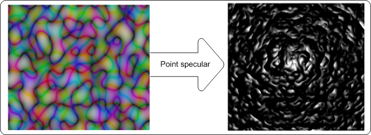
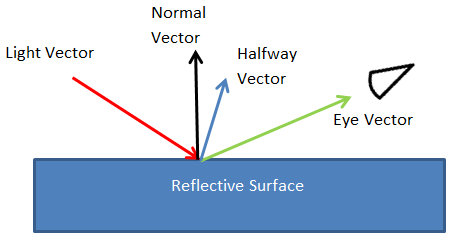
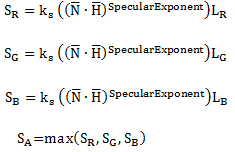
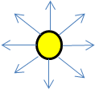
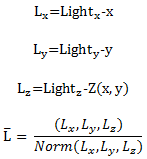

# Point-specular lighting effect

Use the point-specular lighting effect to create an image that appears to be a reflective surface. The effect uses the alpha channel of the image as a height map and a point light source that you position, and calculates the reflection and light according to the specular portion of the Phong lighting model.

The color of the output bitmap is a result of light color, light position, and the surface geometry. The alpha channel output for each pixel with specular lighting is the maximum of the red, green, and blue channel outputs for that pixel.

The CLSID for this effect is CLSID\_D2D1PointSpecular.

-   [Example image](#example-image)
-   [Point light source](#point-light-source)
-   [Height map and normal vector](#height-map-and-normal-vector)
-   [Specular lighting constant and exponent](#specular-lighting-constant-and-exponent)
-   [Effect properties](#effect-properties)
-   [Scales modes](#scales-modes)
-   [Sample code](#sample-code)
-   [Requirements](#requirements)
-   [Related topics](#related-topics)

## Example image

The example here shows the input and output images of the point-specular lighting effect.

Specular light refers to light that is reflected in a specific direction according to the Phong lighting model.

The effect calculates the final output pixel values using the equations here:

where<dl> k? = specular lighting constant.  
= surface normal unit vector which is a function of x and y. See [Height map and normal vector](#height-map-and-normal-vector) for the calculations.  
= "halfway" unit vector between eye unit vector and light unit vector. See [Point light source](#point-light-source) for the calculations.  
Lr, Lg, Lb = the light color in RGB components.  
</dl>

You set the specular lighting constant as the *SpecularConstant* property and the light color as the *Color* property.

## Point light source

A point light source emits light in all directions like in the image here.

You set the position of the light source using the *LightPosition* property. The effect calculates the light vector, L ¯ , for a point light source using the equations here:

where Light?, Lighty, and Lightz are the input light position. The effect calculates the halfway vector,  as defined in the Phong lighting model, using the equation here. The lighting model assumes that the eye vector, , is located at (0,0,1).

Both L and H are normalized to unit-length vectors.

## Height map and normal vector

The effect generates a height map for the input image based on its alpha channel.

The height (Z) component is calculated using the equation:

The effect calculates the surface normal, , for the input bitmap using a Sobel gradient.

## Specular lighting constant and exponent

Specular light represents the light that is reflected from the surface of the of the image height map. You specify the *SpecularExponent* property that determines the amount of specular reflection from the bitmap.

Larger exponents represent shinier objects and reflect light in a more focused shape.

The *SpecularConstant* property K? defines the amount of reflected light as a ratio of the incoming light.

## Effect properties

| Display name and index enumeration                                                     | Description                                                                                                                                                                                                                                                                                                                                                                                                                                                                           |
|----------------------------------------------------------------------------------------|---------------------------------------------------------------------------------------------------------------------------------------------------------------------------------------------------------------------------------------------------------------------------------------------------------------------------------------------------------------------------------------------------------------------------------------------------------------------------------------|
| LightPosition  D2D1\_POINTSPECULAR\_PROP\_LIGHT\_POSITION          | The light position of the point light source. The property is a D2D1\_VECTOR\_3F defined as (x, y, z). The units are in device-independent pixels (DIPs) and the values are unitless and unbounded. The type is D2D1\_VECTOR\_3F.  The default value is {0.0f, 0.0f, 0.0f}.                                                                                                                                                                                       |
| SpecularExponent  D2D1\_POINTSPECULAR\_PROP\_SPECULAR\_EXPONENT    | The exponent for the specular term in the Phong lighting equation. A larger value corresponds to a more reflective surface. This value is unitless and must be between 1.0 and 128. The type is FLOAT.  The default value is 1.0f.                                                                                                                                                                                                                                |
| SpecularConstant  D2D1\_POINTSPECULAR\_PROP\_SPECULAR\_CONSTANT    | The ratio of specular reflection to the incoming light. The value is unitless and must be between 0 and 10,000. The type is FLOAT.  The default value is 1.0f.                                                                                                                                                                                                                                                                                                    |
| SurfaceScale  D2D1\_POINTSPECULAR\_PROP\_SURFACE\_SCALE            | The scale factor in the Z direction for generating a height map. The value is unitless and must be between 0 and 10,000. The type is FLOAT.  The default value is 1.0f.                                                                                                                                                                                                                                                                                           |
| Color  D2D1\_POINTSPECULAR\_PROP\_COLOR                            | The color of the incoming light. This property is exposed as a D2D1\_VECTOR\_3F – (R, G, B) and used to compute LR, LG, LB. The type is D2D1\_VECTOR\_3F.  The default value is {1.0f, 1.0f, 1.0f}.                                                                                                                                                                                                                              |
| KernelUnitLength  D2D1\_POINTSPECULAR\_PROP\_KERNEL\_UNIT\_LENGTH  | The size of an element in the Sobel kernel used to generate the surface normal in the X and Y directions. This property maps to the dx and dy values in the Sobel gradient. This property is a D2D1\_VECTOR\_2F(Kernel Unit Length X, Kernel Unit Length Y) and is defined in (DIPs/Kernel Unit). The effect uses bilinear interpolation to scale the bitmap to match size of kernel elements. The type is D2D1\_VECTOR\_2F.  The default value is {1.0f, 1.0f}.  |
| ScaleMode  D2D1\_POINTSPECULAR\_PROP\_SCALE\_MODE                  | The interpolation mode the effect uses to scale the image to the corresponding kernel unit length. There are six scale modes that range in quality and speed. See [Scale modes](#scales-modes) for more info.   The type is D2D1\_POINTSPECULAR\_SCALE\_MODE.  The default value is D2D1\_POINTSPECULAR\_SCALE\_MODE\_LINEAR.                                                                                                                           |

 

## Scales modes

| Enumeration                                             | Description                                                                                                                                                                                          |
|---------------------------------------------------------|------------------------------------------------------------------------------------------------------------------------------------------------------------------------------------------------------|
| D2D1\_POINTSPECULAR\_SCALE\_MODE\_NEAREST\_NEIGHBOR     | Samples the nearest single point and uses that. This mode uses less processing time, but outputs the lowest quality image.                                                                           |
| D2D1\_POINTSPECULAR\_SCALE\_MODE\_LINEAR                | Uses a four point sample and linear interpolation. This mode outputs a higher quality image than nearest neighbor.                                                                                   |
| D2D1\_POINTSPECULAR\_SCALE\_MODE\_CUBIC                 | Uses a 16 sample cubic kernel for interpolation. This mode uses the most processing time, but outputs a higher quality image.                                                                        |
| D2D1\_POINTSPECULAR\_SCALE\_MODE\_MULTI\_SAMPLE\_LINEAR | Uses 4 linear samples within a single pixel for good edge anti-aliasing. This mode is good for scaling down by small amounts on images with few pixels.                                              |
| D2D1\_POINTSPECULAR\_SCALE\_MODE\_ANISOTROPIC           | Uses anisotropic filtering to sample a pattern according to the transformed shape of the bitmap.                                                                                                     |
| D2D1\_POINTSPECULAR\_SCALE\_MODE\_HIGH\_QUALITY\_CUBIC  | Uses a variable size high quality cubic kernel to perform a pre-downscale the image if downscaling is involved in the transform matrix. Then uses the cubic interpolation mode for the final output. |

 

> [!Note]  
> If you don't select a mode, the effect defaults to D2D1\_POINTSPECULAR\_SCALE\_MODE\_LINEAR.

 

## Sample code

For an example of this effect, download the [Direct2D lighting effects sample](http://go.microsoft.com/fwlink/p/?linkid=254010).

## Requirements

|                          |                                                                                    |
|--------------------------|------------------------------------------------------------------------------------|
| Minimum supported client | Windows 8 and Platform Update for Windows 7 \[desktop apps \| Windows Store apps\] |
| Minimum supported server | Windows 8 and Platform Update for Windows 7 \[desktop apps \| Windows Store apps\] |
| Header                   | d2d1effects.h                                                                      |
| Library                  | d2d1.lib, dxguid.lib                                                               |

 

## Related topics

<dl> <dt>

[**ID2D1Effect**](id2d1effect.md)
</dt> </dl>

 

 

