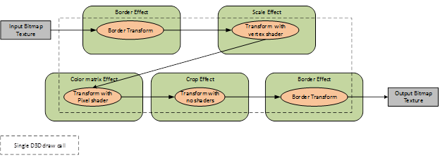
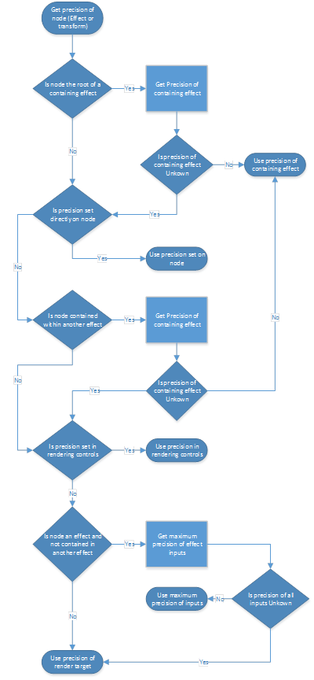

# Controlling Precision and Numerical Clipping in Effect Graphs

Applications that render effects using Direct2D must take care to achieve the desired level of quality and predictability with respect to numerical precision. This topic describes best practices and relevant settings in Direct2D which are useful if:

-   Your effect graph relies on high numerical precision or colors outside of the \[0, 1\] range, and you want to make sure these will always be available
-   Or, your effect graph relies on the rendering implementation to clamp intermediate colors to the \[0, 1\] range, and you want to ensure this clamping always occurs

Direct2D often divides an effect graph into sections, and renders each section in a separate step. The output of some steps may be stored in intermediate Direct3D textures which by default have limited numerical range and precision. Direct2D makes no guarantees about if or where these intermediate textures are used. This behavior may vary according to GPU capabilities as well as between Windows versions.

In Windows 10, Direct2D uses fewer intermediate textures due to its use of shader linking. Direct2D may therefore produce different results with default settings than in prior Windows releases. This primarily affects scenarios where shader linking is possible in an effect graph, and that graph also contains effects that produce extended-range output colors.

## Overview of effect rendering and intermediates

To render an effect graph, Direct2D first finds the underlying graph of “transforms,” where a transform is a graph node used within an effect. There are different types of transforms, including those which provide Direct3D shaders for Direct2D to use.

For example, Direct2D may render an effect graph as follows:


Direct2D looks for opportunities to reduce the number intermediate textures used to render the effect graph; this logic is opaque to applications. For example, the following graph can be rendered by Direct2D using one Direct3D draw call and no intermediate textures:



Prior to Windows 10, Direct2D would always use intermediate textures if multiple pixels shaders were used within the same effect graph. Most built-in effects that simply adjust color values (for example, Brightness or Saturation) do so using pixel shaders.

In Windows 10, Direct2D may now avoid using intermediate textures in such cases. It does this by internally linking adjacent pixel shaders. For example:


Note that not all adjacent pixel shaders in a graph may be linked together, and therefore only certain graphs will produce different output on Windows 10. For full details see [Effect Shader Linking](effect-shader-linking.md). The primary restrictions are:

-   An effect will not be linked with effects consuming its output, if the first effect is connected as an input to multiple effects.
-   An effect will not be linked with an effect set as its input, if the first effect samples its input at a different logical position than its output. For example, a Color Matrix effect might be linked with its input, but a Convolution effect will not be.

## Built-in effect behavior

Many built-in effects may produce colors outside of the \[0, 1\] range in the unpremultiplied color space, even when their input colors are within that range. When this happens, such colors may be subject to numerical clipping. Note that it’s important to consider the color range in unpremultiplied space, even though built-in effects typically produce colors in premultiplied space. This ensures that colors stay within range, even if other effects subsequently unpremultiply them.

Some of the effects which may emit these out-of-range colors offer a “ClampOutput” property. These include:

-   [Color Matrix](color-matrix.md)
-   [Arithmetic Composite](arithmetic-composite.md)
-   [Convolve](convolve-matrix.md)
-   [Transfer effects](built-in-effects.md)

Setting the ClampOutput property to TRUE on these effects ensures a consistent result will be achieved regardless of factors such as shader linking. Note that clamping occurs in unpremultiplied space.

Other built-in effects may also produce output colors beyond the \[0, 1\] range in unpremultiplied space, even when their colors pixels (and “Color” properties if any) are within that range. These include:

-   [Transforming and Scaling effects](built-in-effects.md) (When the Interpolation Mode property is Cubic or High Quality Cubic)
-   [Lighting effects](built-in-effects.md)
-   [Edge detection](edge-detection-effect.md) (When the Overlay Edges property is TRUE)
-   [Exposure](exposure-effect.md)
-   [Composite](composite.md) (When the Mode property is Plus)
-   [Temperature and Tint](temperature-and-tint-effect.md)
-   [Sepia](sepia-effect.md)
-   [Saturation](saturation.md)

## Forcing numerical clipping within an effect graph

While using effects listed above which do not have a ClampOutput property, applications should consider forcing numerical clamping. This can be done by inserting an additional effect into the graph that clamps its pixels. A Color Matrix effect may be used, with its ‘ClampOutput’ property set to TRUE and leaving the ‘ColorMatrix’ property as the default (pass-through) value.

A second option to achieve consistent results is to request that Direct2D use intermediate textures which have greater precision. This is described below.

## Controlling precision of intermediate textures

Direct2D provides a few ways to control the precision of a graph. Before using high precision formats in Direct2D, applications must ensure they are supported sufficiently by the GPU. To check this, use [**ID2D1DeviceContext::IsBufferPrecisionSupported**](https://msdn.microsoft.com/en-us/library/Dn441541(v=VS.85).aspx).

Applications may create a Direct3D device using WARP (software emulation) to guarantee that all buffer precisions are supported independent of the actual GPU hardware on the device. This is recommended in scenarios such as applying effects to a photo while saving to disk. Even if Direct2D supports high precision buffer formats on the GPU, using WARP is recommended in this scenario on feature level 9.X GPUs, due to the limited precision of shader arithmetic and sampling on some low-power mobile GPUs.

In each case below, the requested precision is actually the minimum precision Direct2D will use. Higher precision may be used if intermediates are not required. Direct2D may also share intermediate textures for different parts of the same graph or different graphs entirely. In this case Direct2D uses the maximum precision requested for all involved operations.

### Precision selection from ID2D1DeviceContext::SetRenderingControls

The simplest way to control the precision of Direct2D’s intermediate textures is to use [**ID2D1DeviceContext::SetRenderingControls**](https://msdn.microsoft.com/en-us/library/Hh404530(v=VS.85).aspx). This controls the precision of all intermediate textures, as long as a precision is not also set manually on effects or transforms directly.


```
if (Device->IsBufferPrecisionSupported(D2D1_BUFFER_PRECISION_32BPC_FLOAT))
{
  // Get the current rendering controls
  D2D1_RENDERING_CONTROLS renderingControls = {};
  Context->GetRenderingControls(&amp;renderingControls);

  // Switch the precision within the rendering controls and set it
  renderingControls.bufferPrecision = D2D1_BUFFER_PRECISION_32BPC_FLOAT;
  Context->SetRenderingControls(&amp;renderingControls);
}
              
```


### Precision selection from inputs and render targets

Applications may also rely on the precision of the inputs to an effect graph to control the precision of intermediate textures. This is true as long as a buffer precision is not specified using [**ID2D1DeviceContext::SetRenderingControls**](https://msdn.microsoft.com/en-us/library/Hh404530(v=VS.85).aspx), and is not set manually on effects and transform directly.

The precisions of inputs to effects are propagated through the graph to select the precision of downstream intermediates. Where different branches in the effect graph meet, the greatest precision of any input is used.

The precision selected based on a Direct2D bitmap is determined from its pixel format. The precision selected for an [**ID2D1ImageSource**](https://msdn.microsoft.com/en-us/library/Dn900413(v=VS.85).aspx) is determined from the WIC pixel format of the underlying IWICBitmapSource used to create the **ID2D1ImageSource**. Note that Direct2D doesn’t allow image sources to be created with WIC sources using precisions unsupported by Direct2D and the GPU.

It is possible that Direct2D cannot assign an effect a precision based on its inputs. This happens when an effect has no inputs, or when an [**ID2D1CommandList**](https://msdn.microsoft.com/en-us/library/Hh404392(v=VS.85).aspx) is used, which has no specific precision. In this case, the precision of intermediate textures is determined from the bitmap set as the context’s current render target.

### Precision selection directly on the effect and transforms

The minimum precision for intermediate textures may also be set at explicit locations within an effect graph. This is only recommended for advanced scenarios.

The minimum precision may be set using a property on an effect as follows:


```
if (Device->IsBufferPrecisionSupported(D2D1_BUFFER_PRECISION_32BPC_FLOAT))
{
  hr = Effect->SetValue(D2D1_PROPERTY_PRECISION, D2D1_BUFFER_PRECISION_32BPC_FLOAT);
}
              
```


Within an effect implementation, the minimum precision may be set using ID2D1RenderInfo::SetOutputPrecision as follows:


```
if (EffectContext->IsBufferPrecisionSupported(D2D1_BUFFER_PRECISION_32BPC_FLOAT))
{
  hr = RenderInfo->SetOutputBuffer(
  D2D1_BUFFER_PRECISION_32BPC_FLOAT,
  D2D1_CHANNEL_DEPTH_4);
}
              
```


Note that the precision set on an effect will propagate to downstream effects in the same effect graph, unless a different precision is set on those downstream effects. The precision set on a transform within an effect does not affect the precision for downstream transform nodes.

Below is the full recursive logic used to determine the minimum precision for an intermediate buffer storing the output of a given transform node:



 

 


