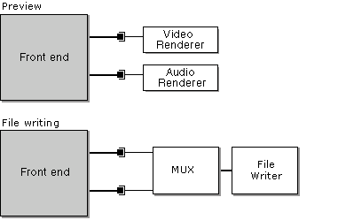

# About the Render Engines

\[This API is not supported and may be altered or unavailable in the future.\]

This article describes how [DirectShow Editing Services](directshow-editing-services.md) (DES) renders a video editing project.

In DES, a project is represented as a timeline. The timeline is useful because it simplifies the most common tasks in video editing, such as rearranging source clips and adding video effects. The DirectShow stream architecture, on the other hand, requires a filter graph. Thus, to render your project, you must translate a timeline into a filter graph. The component that does this is called a *render engine*. DirectShow provides two render engines:

-   Basic render engine: Builds a filter graph that delivers uncompressed output.
-   Smart render engine: Builds a filter graph that delivers compressed output.

The smart render engine uses smart recompression to improve performance. With smart recompression, source files are recompressed only when the original file format differs from the final output format. If the formats match, the source is never decompressed. Smart recompression is supported only for video compression, not for audio compression.

For preview, use the basic render engine. The smart render engine can also preview, but less efficiently because it has to decompress the compressed stream. For writing files, use the smart render engine if you want smart recompression. Otherwise, use the basic render engine. Smart recompression can greatly reduce the time it takes to write the file.

> \[!Important\]  
> Do not use the smart render engine to read or write Windows Media files.

 

> \[!Important\]  
> Both render engines create an invisible window that processes messages. The thread that creates the render engine must have a message loop, to dispatch messages. Also, that thread must not exit until the Render Engine and the Filter Graph Manager are released. Otherwise, the application might deadlock.

 

Constructing the Filter Graph

The filter graph is built in two stages. In the first stage, the render engine constructs a "front end," which is a partial filter graph. The following diagram illustrates a typical front end:

The subsystems contain various specialized filters, which the render engine assembles automatically. The front end contains one output pin for each group in the timeline. The output pins deliver uncompressed data if you use the basic render engine, or compressed data if you use the smart render engine.

In the second step, the output pins are connected to rendering filters. For preview, the rendering filters are video and audio renderers. For file writing, the rendering filters are multiplexer (mux) filters and file-writer filters.

## Related topics

<dl> <dt>

[Previewing a Project](previewing-a-project.md)
</dt> <dt>

[Writing a Project to a File](writing-a-project-to-a-file.md)
</dt> </dl>

 

 

