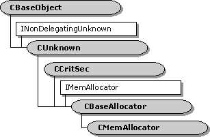

# CBaseAllocator class

The **CBaseAllocator** class is an abstract base class that implements an allocator. Allocators expose the [**IMemAllocator**](/windows/desktop/api/Strmif/nn-strmif-imemallocator) interface.

An *allocator* is an object that allocates memory buffers. The allocator maintains a list of available buffers. When a client (generally a filter) requests a buffer, the allocator retrieves one from the list. The client fills the buffer with data, and might pass the buffer to another object. Eventually the buffer is released and the allocator returns it to the list of available buffers.

Each buffer is encapsulated by an object called a *media sample*. Media samples are a way to package pointers to memory blocks within the Component Object Model (COM) framework. Media samples expose the [**IMediaSample**](/windows/desktop/api/Strmif/nn-strmif-imediasample) interface, and are implemented using the [**CMediaSample**](cmediasample.md) class. A media sample contains a pointer to the associated buffer, which can be accessed by calling the [**IMediaSample::GetPointer**](/windows/desktop/api/Strmif/nf-strmif-imediasample-getpointer) method. For more information, see [Samples and Allocators](samples-and-allocators.md).

To use this class, perform the following steps:

1.  Call the [**CBaseAllocator::SetProperties**](cbaseallocator-setproperties.md) method to specify the buffer requirements, including the number of buffers and the size of each buffer.
2.  Call the [**CBaseAllocator::Commit**](cbaseallocator-commit.md) method to allocate the buffers.
3.  Call the [**CBaseAllocator::GetBuffer**](cbaseallocator-getbuffer.md) method to retrieve media samples. This method blocks until the next sample becomes available.
4.  When you are done with each sample, call the **IUnknown::Release** method on the sample. The sample is not deleted when its reference count reaches zero. Instead, the sample returns to the allocator's free list.
5.  When you are done using the allocator, call the [**CBaseAllocator::Decommit**](cbaseallocator-decommit.md) method to free the memory for the buffers.

The [**Commit**](cbaseallocator-commit.md) method calls the virtual method [**CBaseAllocator::Alloc**](cbaseallocator-alloc.md), which allocates the memory for the buffers. The [**Decommit**](cbaseallocator-decommit.md) method calls the pure virtual method [**CBaseAllocator::Free**](cbaseallocator-free.md), which frees the memory. Derived classes must override these two methods.

The [**CMemAllocator**](cmemallocator.md) base class derives from **CBaseAllocator**. The filter base classes use the **CMemAllocator** class.

| Protected Member Variables                                                   | Description                                                                                |
|------------------------------------------------------------------------------|--------------------------------------------------------------------------------------------|
| [**m\_lFree**](cbaseallocator-m-lfree.md)                                   | Pointer to a list of available (free) media samples.                                       |
| [**m\_hSem**](cbaseallocator-m-hsem.md)                                     | Semaphore that is signaled when a sample becomes available.                                |
| [**m\_lWaiting**](cbaseallocator-m-lwaiting.md)                             | Count of threads waiting for samples.                                                      |
| [**m\_lCount**](cbaseallocator-m-lcount.md)                                 | Number of buffers to provide.                                                              |
| [**m\_lAllocated**](cbaseallocator-m-lallocated.md)                         | Number of buffers currently allocated.                                                     |
| [**m\_lSize**](cbaseallocator-m-lsize.md)                                   | Size of each buffer.                                                                       |
| [**m\_lAlignment**](cbaseallocator-m-lalignment.md)                         | Alignment of each buffer.                                                                  |
| [**m\_lPrefix**](cbaseallocator-m-lprefix.md)                               | Prefix of each buffer.                                                                     |
| [**m\_bChanged**](cbaseallocator-m-bchanged.md)                             | Flag indicating whether the buffer requirements have changed.                              |
| [**m\_bCommitted**](cbaseallocator-m-bcommitted.md)                         | Flag indicating whether the allocator has been committed.                                  |
| [**m\_bDecommitInProgress**](cbaseallocator-m-bdecommitinprogress.md)       | Flag indicating whether a decommit operation is in progress.                               |
| [**m\_pNotify**](cbaseallocator-m-pnotify.md)                               | Pointer to a callback interface, which is called when samples are released.                |
| [**m\_fEnableReleaseCallback**](cbaseallocator-m-fenablereleasecallback.md) | Flag indicating whether the release callback is enabled.                                   |
| Protected Methods                                                            | Description                                                                                |
| [**Alloc**](cbaseallocator-alloc.md)                                        | Allocates memory for the buffers. Virtual.                                                 |
| Public Methods                                                               | Description                                                                                |
| [**CBaseAllocator**](cbaseallocator-cbaseallocator.md)                      | Constructor method.                                                                        |
| [**~ CBaseAllocator**](cbaseallocator--cbaseallocator.md)                   | Destructor method.                                                                         |
| [**SetNotify**](cbaseallocator-setnotify.md)                                | Obsolete.                                                                                  |
| [**GetFreeCount**](cbaseallocator-getfreecount.md)                          | Retrieves the number of media samples that are not in use.                                 |
| [**NotifySample**](cbaseallocator-notifysample.md)                          | Releases any threads that are waiting for samples.                                         |
| [**SetWaiting**](cbaseallocator-setwaiting.md)                              | Increments the count of waiting threads.                                                   |
| Pure Virtual Methods                                                         | Description                                                                                |
| [**Free**](cbaseallocator-free.md)                                          | Releases all of the buffer memory.                                                         |
| IMemAllocator Methods                                                        | Description                                                                                |
| [**SetProperties**](cbaseallocator-setproperties.md)                        | Specifies the number of buffers to allocate and the size of each buffer.                   |
| [**GetProperties**](cbaseallocator-getproperties.md)                        | Retrieves the number of buffers that the allocator will create, and the buffer properties. |
| [**Commit**](cbaseallocator-commit.md)                                      | Allocates the memory for the buffers.                                                      |
| [**Decommit**](cbaseallocator-decommit.md)                                  | Decommits the buffers.                                                                     |
| [**GetBuffer**](cbaseallocator-getbuffer.md)                                | Retrieves a media sample that contains a buffer.                                           |
| [**ReleaseBuffer**](cbaseallocator-releasebuffer.md)                        | Returns a media sample to the list of free media samples.                                  |

 

## Requirements

|                    |                                                                                                                                                                                            |
|--------------------|--------------------------------------------------------------------------------------------------------------------------------------------------------------------------------------------|
| Header   | <dl> <dt>Amfilter.h (include Streams.h)</dt> </dl>                                                                                  |
| Library  | <dl> <dt>Strmbase.lib (retail builds); </dt> <dt>Strmbasd.lib (debug builds)</dt> </dl> |

## See also

<dl> <dt>

[Providing a Custom Allocator](providing-a-custom-allocator.md)
</dt> </dl>

 

 

