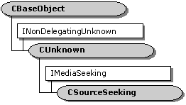

# CSourceSeeking class



The **CSourceSeeking** class is an abstract class for implementing seeking in source filters with one output pin.

This class supports the [**IMediaSeeking**](/windows/desktop/api/Strmif/nn-strmif-imediaseeking) interface. It provides default implementations for all of the **IMediaSeeking** methods. Protected member variables store the start time, stop time, and current rate. By default, the only time format supported by the class is **TIME\_FORMAT\_MEDIA\_TIME** (100-nanosecond units). See Remarks for more information.


| Protected Member Variables                                          | Description                                                                                 |
|---------------------------------------------------------------------|---------------------------------------------------------------------------------------------|
| [**m\_rtDuration**](csourceseeking-m-rtduration.md)                | Duration of the stream.                                                                     |
| [**m\_rtStart**](csourceseeking-m-rtstart.md)                      | Start time.                                                                                 |
| [**m\_rtStop**](csourceseeking-m-rtstop.md)                        | Stop time.                                                                                  |
| [**m\_dRateSeeking**](csourceseeking-m-drateseeking.md)            | Playback rate.                                                                              |
| [**m\_dwSeekingCaps**](csourceseeking-m-dwseekingcaps.md)          | Seeking capabilities.                                                                       |
| [**m\_pLock**](csourceseeking-m-plock.md)                          | Pointer to a critical section object for locking.                                           |
| Protected Methods                                                   | Description                                                                                 |
| [**CSourceSeeking**](csourceseeking-csourceseeking.md)             | Constructor method.                                                                         |
| Pure Virtual Methods                                                | Description                                                                                 |
| [**ChangeRate**](csourceseeking-changerate.md)                     | Called when the playback rate changes.                                                      |
| [**ChangeStart**](csourceseeking-changestart.md)                   | Called when the start position changes.                                                     |
| [**ChangeStop**](csourceseeking-changestop.md)                     | Called when the stop position changes.                                                      |
| IMediaSeeking Methods                                               | Description                                                                                 |
| [**IsFormatSupported**](csourceseeking-isformatsupported.md)       | Determines whether a specified time format is supported.                                    |
| [**QueryPreferredFormat**](csourceseeking-querypreferredformat.md) | Retrieves the object's preferred time format.                                               |
| [**SetTimeFormat**](csourceseeking-settimeformat.md)               | Sets the time format.                                                                       |
| [**IsUsingTimeFormat**](csourceseeking-isusingtimeformat.md)       | Determines whether a specified time format is the format currently in use.                  |
| [**GetTimeFormat**](csourceseeking-gettimeformat.md)               | Retrieves the current time format.                                                          |
| [**GetDuration**](csourceseeking-getduration.md)                   | Retrieves the duration of the stream.                                                       |
| [**GetStopPosition**](csourceseeking-getstopposition.md)           | Retrieves the time at which the playback will stop, relative to the duration of the stream. |
| [**GetCurrentPosition**](csourceseeking-getcurrentposition.md)     | Retrieves the current position, relative to the total duration of the stream.               |
| [**GetCapabilities**](csourceseeking-getcapabilities.md)           | Retrieves all the seeking capabilities of the stream.                                       |
| [**CheckCapabilities**](csourceseeking-checkcapabilities.md)       | Queries whether the stream has specified seeking capabilities.                              |
| [**ConvertTimeFormat**](csourceseeking-converttimeformat.md)       | Converts from one time format to another.                                                   |
| [**SetPositions**](csourceseeking-setpositions.md)                 | Sets the current position and the stop position.                                            |
| [**GetPositions**](csourceseeking-getpositions.md)                 | Retrieves the current position and the stop position.                                       |
| [**GetAvailable**](csourceseeking-getavailable.md)                 | Retrieves the range of times in which seeking is efficient.                                 |
| [**SetRate**](csourceseeking-setrate.md)                           | Sets the playback rate.                                                                     |
| [**GetRate**](csourceseeking-getrate.md)                           | Retrieves the playback rate.                                                                |
| [**GetPreroll**](csourceseeking-getpreroll.md)                     | Retrieves the preroll time.                                                                 |


 

## Remarks

Whenever the start position, stop position, or playback rate changes, the **CSourceSeeking** object calls a corresponding pure virtual method:

-   Start position: [**CSourceSeeking::ChangeStart**](csourceseeking-changestart.md)
-   Stop position: [**CSourceSeeking::ChangeStop**](csourceseeking-changestop.md)
-   Playback rate: [**CSourceSeeking::ChangeRate**](csourceseeking-changerate.md)

The derived class must implement these methods. After any seek operation, a filter must do the following:

1.  Call the [**IPin::BeginFlush**](/windows/desktop/api/Strmif/nf-strmif-ipin-beginflush) method on the downstream input pin.
2.  Halt the worker thread that is delivering data.
3.  Call the [**IPin::EndFlush**](/windows/desktop/api/Strmif/nf-strmif-ipin-endflush) method on the input pin.
4.  Restart the worker thread.
5.  Call the [**IPin::NewSegment**](/windows/desktop/api/Strmif/nf-strmif-ipin-newsegment) method on the input pin.
6.  Set the discontinuity property on the first sample. Call the [**IMediaSample::SetDiscontinuity**](/windows/desktop/api/Strmif/nf-strmif-imediasample-setdiscontinuity) method.

The call to [**BeginFlush**](/windows/desktop/api/Strmif/nf-strmif-ipin-beginflush) frees the worker thread, if the thread is blocked waiting to deliver a sample.

In step 2, make sure that the thread has stopped sending data. Depending on the implementation, you might need to wait for the thread to exit, or for the thread to signal a response of some kind. If your filter uses the [**CSourceStream**](csourcestream.md) class, the [**CSourceStream::Stop**](csourcestream-stop.md) method blocks until the worker thread replies.

Ideally, the new segment (step 5) should be delivered from the worker thread. It can also be done by the **CSourceSeeking** object, as long as the filter serializes it with the samples.

The following example shows a possible implementation. It assumes that the source filter's output pin is derived from **CSourceSeeking** and [**CSourceStream**](csourcestream.md). This example defines a helper method, UpdateFromSeek, that performs steps 1 4. The [**CSourceStream::OnThreadStartPlay**](csourcestream-onthreadstartplay.md) method is overridden to send the new segment, and to set a flag indicating the discontinuity. The worker thread picks up this flag and calls the [**IMediaSample::SetDiscontinuity**](/windows/desktop/api/Strmif/nf-strmif-imediasample-setdiscontinuity) method:


```C++
void CMyStream::UpdateFromSeek()
{
    if (ThreadExists()) 
    {
        DeliverBeginFlush();
        Stop();
        DeliverEndFlush();
        Run();
    }
}

HRESULT CMyStream::OnThreadStartPlay()
{
    m_bDiscontinuity = TRUE;
    return DeliverNewSegment(m_rtStart, m_rtStop, m_dRateSeeking);
}
```


### Supporting Additional Time Formats

By default, this class supports seeking only in units of reference time (TIME\_FORMAT\_MEDIA\_TIME). To support additional time formats, override the [**IMediaSeeking**](/windows/desktop/api/Strmif/nn-strmif-imediaseeking) methods that deal with time formats:

-   [**IMediaSeeking::GetTimeFormat**](/windows/desktop/api/Strmif/nf-strmif-imediaseeking-gettimeformat)
-   [**IMediaSeeking::GetTimeFormat**](/windows/desktop/api/Strmif/nf-strmif-imediaseeking-gettimeformat)
-   [**IMediaSeeking::IsUsingTimeFormat**](/windows/desktop/api/Strmif/nf-strmif-imediaseeking-isusingtimeformat)
-   [**IMediaSeeking::IsUsingTimeFormat**](/windows/desktop/api/Strmif/nf-strmif-imediaseeking-isusingtimeformat)
-   [**IMediaSeeking::SetTimeFormat**](/windows/desktop/api/Strmif/nf-strmif-imediaseeking-settimeformat)

In addition, override the remaining [**IMediaSeeking**](/windows/desktop/api/Strmif/nn-strmif-imediaseeking) methods to perform the necessary conversions between time formats. After the [**SetTimeFormat**](/windows/desktop/api/Strmif/nf-strmif-imediaseeking-settimeformat) method is called, all **IMediaSeeking** methods must treat incoming and outgoing time parameters as being in the new time format. For example, if the *m\_rtDuration* variable represents the duration in units of reference time, but the current time format is frames, then the [**GetDuration**](/windows/desktop/api/Strmif/nf-strmif-imediaseeking-getduration) method must return the value *m\_rtDuration* converted to frames. For example:


```
STDMETHODIMP GetDuration(LONGLONG *pDuration)
{
    HRESULT hr = CSourceSeeking::GetDuration(pDuration);
    if (SUCCEEDED(hr))
    {
        if (m_TimeFormat == TIME_FORMAT_FRAME)
        {
            // Convert from reference time to frames.
            *pDuration = TimeToFrame(*pDuration);  // Private method.
        }
    }
    return hr
} 
```


Also, make sure to check for the AM\_SEEKING\_ReturnTime flag in the [**IMediaSeeking::SetPositions**](/windows/desktop/api/Strmif/nf-strmif-imediaseeking-setpositions) method. If this flag is present, convert the position values into reference times when you return them to the caller.

## Requirements


|                    |                                                                                                                                                                                            |
|--------------------|--------------------------------------------------------------------------------------------------------------------------------------------------------------------------------------------|
| Header<br/>  | <dl> <dt>Ctlutil.h (include Streams.h)</dt> </dl>                                                                                   |
| Library<br/> | <dl> <dt>Strmbase.lib (retail builds); </dt> <dt>Strmbasd.lib (debug builds)</dt> </dl> |


## See also

<dl> <dt>

[Supporting Seeking in a Source Filter](supporting-seeking-in-a-source-filter.md)
</dt> </dl>

 

 


