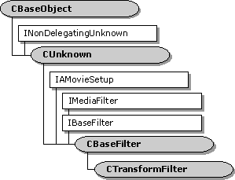

# CTransformFilter class

The `CTransformFilter` class is a base class for implementing transform filters. This class is designed for implementing a transform filter with one input pin and one output pin. It uses separate allocators for the input pin and the output pin. To create a filter that processes data in place, use the [**CTransInPlaceFilter**](ctransinplacefilter.md) class.

This filter uses the [**CTransformInputPin**](ctransforminputpin.md) class for its input pin, and the [**CTransformOutputPin**](ctransformoutputpin.md) class for its output pin. Typically, you do not need to override these pin classes. Most of the pin methods call corresponding methods on the `CTransformFilter` class, so you can override the filter methods if necessary. The filter creates both pins in the [**CTransformFilter::GetPin**](ctransformfilter-getpin.md) method. If you do override the pin classes, you must override **GetPin** to create your custom pins.

To use this class, derive a new class from `CTransformFilter` and implement the following methods:

-   [**CTransformFilter::CheckInputType**](ctransformfilter-checkinputtype.md)
-   [**CTransformFilter::CheckTransform**](ctransformfilter-checktransform.md)
-   [**CTransformFilter::DecideBufferSize**](ctransformfilter-decidebuffersize.md)
-   [**CTransformFilter::GetMediaType**](ctransformfilter-getmediatype.md)
-   [**CTransformFilter::Transform**](ctransformfilter-transform.md)

You might need to override other methods as well, depending on the requirements of your filter.

## Media Types

This filter's input pin does not propose any media types; it relies on the upstream filter to propose the media types for the connection. The reason for this design is that in most cases, the upstream filter can provide more information about the format. For example, with video formats, the upstream filter knows the video dimensions and the frame rate, whereas the transform filter has no way to determine this information. If you want to change this behavior, override the input pin's [**GetMediaType**](ctransformfilter-getmediatype.md) method. When the upstream filter proposes a media type, the input pin calls the filter's [**CheckInputType**](ctransformfilter-checkinputtype.md) method (pure virtual).

Until the input pin is connected, the output pin refuses all connections, and does not return any preferred media types. After the input pin is connected, the output pin returns a list of preferred types by calling the filter's [**GetMediaType**](ctransformfilter-getmediatype.md) method. It checks output types for the connection through the filter's [**CheckTransform**](ctransformfilter-checktransform.md) method. (Both methods are pure virtual.) Typically, the input type will partly determine the acceptable output types.

Depending on the filter, you might want to register some of the filter's supported media types, so that the [Filter Mapper](filter-mapper.md) object can locate your filter. For more information, see [How to Register DirectShow Filters](how-to-register-directshow-filters.md).

## Streaming

This class does not queue the output data. Each output sample is delivered inside the [**IMemInputPin::Receive**](/windows/desktop/api/Strmif/nf-strmif-imeminputpin-receive) method. The **Receive** method calls the filter's [**Transform**](ctransformfilter-transform.md) method (also pure virtual) to process the data.

For more information about using this class, see [Writing Transform Filters](writing-transform-filters.md).

| Protected Member Variables                                                | Description                                                                                             |
|---------------------------------------------------------------------------|---------------------------------------------------------------------------------------------------------|
| [**m\_bEOSDelivered**](ctransformfilter-m-beosdelivered.md)              | Flag that indicates whether the filter has sent an end-of-stream notification.                          |
| [**m\_bSampleSkipped**](ctransformfilter-m-bsampleskipped.md)            | Flag that indicates whether the most recent sample was dropped.                                         |
| [**m\_bQualityChanged**](ctransformfilter-m-bqualitychanged.md)          | Flag that indicates whether the quality has changed.                                                    |
| [**m\_csFilter**](ctransformfilter-m-csfilter.md)                        | Critical section that protects the filter state.                                                        |
| [**m\_csReceive**](ctransformfilter-m-csreceive.md)                      | Critical section that protects the streaming state.                                                     |
| [**m\_pInput**](ctransformfilter-m-pinput.md)                            | Pointer to the input pin.                                                                               |
| [**m\_pOutput**](ctransformfilter-m-poutput.md)                          | Pointer to the output pin.                                                                              |
| Public Methods                                                            | Description                                                                                             |
| [**CTransformFilter**](ctransformfilter-ctransformfilter.md)             | Constructor method.                                                                                     |
| [**~ CTransformFilter**](ctransformfilter--ctransformfilter.md)          | Destructor method.                                                                                      |
| [**GetPinCount**](ctransformfilter-getpincount.md)                       | Retrieves the number of pins on the filter. Virtual.                                                    |
| [**GetPin**](ctransformfilter-getpin.md)                                 | Retrieves a pin. Virtual.                                                                               |
| [**Transform**](ctransformfilter-transform.md)                           | Transforms an input sample to produce an output sample. Virtual.                                        |
| [**StartStreaming**](ctransformfilter-startstreaming.md)                 | Called when the filter switches to the paused state. Virtual.                                           |
| [**StopStreaming**](ctransformfilter-stopstreaming.md)                   | Called when the filter switches to the stopped state. Virtual.                                          |
| [**AlterQuality**](ctransformfilter-alterquality.md)                     | Notifies the filter that a quality change is requested. Virtual.                                        |
| [**SetMediaType**](ctransformfilter-setmediatype.md)                     | Called when the media type is set on one of the filter's pins. Virtual.                                 |
| [**CheckConnect**](ctransformfilter-checkconnect.md)                     | Determines whether a pin connection is suitable. Virtual.                                               |
| [**BreakConnect**](ctransformfilter-breakconnect.md)                     | Releases a pin from a connection. Virtual.                                                              |
| [**CompleteConnect**](ctransformfilter-completeconnect.md)               | Completes a pin connection. Virtual.                                                                    |
| [**Receive**](ctransformfilter-receive.md)                               | Receives a media sample, processes it, and delivers an output sample to the downstream filter. Virtual. |
| [**InitializeOutputSample**](ctransformfilter-initializeoutputsample.md) | Retrieves a new output sample and initializes it.                                                       |
| [**EndOfStream**](ctransformfilter-endofstream.md)                       | Notifies the filter that no additional data is expected from the input pin. Virtual.                    |
| [**BeginFlush**](ctransformfilter-beginflush.md)                         | Begins a flush operation. Virtual.                                                                      |
| [**EndFlush**](ctransformfilter-endflush.md)                             | Ends a flush operation. Virtual.                                                                        |
| [**NewSegment**](ctransformfilter-newsegment.md)                         | Notifies the filter that media samples received after this call are grouped as a segment. Virtual.      |
| Pure Virtual Methods                                                      | Description                                                                                             |
| [**CheckInputType**](ctransformfilter-checkinputtype.md)                 | Checks whether a specified media type is acceptable for input.                                          |
| [**CheckTransform**](ctransformfilter-checktransform.md)                 | Checks whether an input media type is compatible with an output media type.                             |
| [**DecideBufferSize**](ctransformfilter-decidebuffersize.md)             | Sets the output pin's buffer requirements.                                                              |
| [**GetMediaType**](ctransformfilter-getmediatype.md)                     | Retrieves a preferred media type for the output pin.                                                    |
| IMediaFilter Methods                                                      | Description                                                                                             |
| [**Stop**](ctransformfilter-stop.md)                                     | Stops the filter.                                                                                       |
| [**Pause**](ctransformfilter-pause.md)                                   | Pauses the filter.                                                                                      |
| IBaseFilter Methods                                                       | Description                                                                                             |
| [**FindPin**](ctransformfilter-findpin.md)                               | Retrieves the pin with the specified identifier.                                                        |

 

## Requirements

|                    |                                                                                                                                                                                            |
|--------------------|--------------------------------------------------------------------------------------------------------------------------------------------------------------------------------------------|
| Header   | <dl> <dt>Transfrm.h (include Streams.h)</dt> </dl>                                                                                  |
| Library  | <dl> <dt>Strmbase.lib (retail builds); </dt> <dt>Strmbasd.lib (debug builds)</dt> </dl> |

 

 

