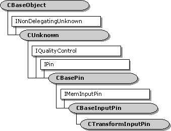

# CTransformInputPin class

The `CTransformInputPin` class implements an input pin that is used by the [**CTransformFilter**](ctransformfilter.md) class.

Typically, you do not need to derive from this class. Most of the methods in this class call corresponding methods on the **CTransformFilter** class, which you can override. If you derive from this class, you must override the filter's [**CTransformFilter::GetPin**](ctransformfilter-getpin.md) method to create instances of your derived class.

| Protected Member Variables                                           | Description                                                                            |
|----------------------------------------------------------------------|----------------------------------------------------------------------------------------|
| [**m\_pTransformFilter**](ctransforminputpin-m-ptransformfilter.md) | Pointer to the owning filter.                                                          |
| Public Methods                                                       | Description                                                                            |
| [**CTransformInputPin**](ctransforminputpin-ctransforminputpin.md)  | Constructor method.                                                                    |
| [**CheckConnect**](ctransforminputpin-checkconnect.md)              | Determines whether a pin connection is suitable.                                       |
| [**BreakConnect**](ctransforminputpin-breakconnect.md)              | Releases the pin from a connection.                                                    |
| [**CompleteConnect**](ctransforminputpin-completeconnect.md)        | Completes a connection to another pin.                                                 |
| [**CheckMediaType**](ctransforminputpin-checkmediatype.md)          | Determines if the pin accepts a specific media type.                                   |
| [**SetMediaType**](ctransforminputpin-setmediatype.md)              | Sets the media type for the connection.                                                |
| [**CheckStreaming**](ctransforminputpin-checkstreaming.md)          | Determines whether the pin can accept samples. Virtual.                                |
| [**CurrentMediaType**](ctransforminputpin-currentmediatype.md)      | Retrieves the media type for the current pin connection.                               |
| IPin Methods                                                         | Description                                                                            |
| [**QueryId**](ctransforminputpin-queryid.md)                        | Retrieves an identifier for the pin.                                                   |
| [**EndOfStream**](ctransforminputpin-endofstream.md)                | Notifies the pin that no additional data is expected.                                  |
| [**BeginFlush**](ctransforminputpin-beginflush.md)                  | Begins a flush operation.                                                              |
| [**EndFlush**](ctransforminputpin-endflush.md)                      | Ends a flush operation.                                                                |
| [**NewSegment**](ctransforminputpin-newsegment.md)                  | Notifies the pin that media samples received after this call are grouped as a segment. |
| IMemInputPin Methods                                                 | Description                                                                            |
| [**Receive**](ctransforminputpin-receive.md)                        | Receives the next media sample in the stream.                                          |

 

## Requirements

|                    |                                                                                                                                                                                            |
|--------------------|--------------------------------------------------------------------------------------------------------------------------------------------------------------------------------------------|
| Header   | <dl> <dt>Transfrm.h (include Streams.h)</dt> </dl>                                                                                  |
| Library  | <dl> <dt>Strmbase.lib (retail builds); </dt> <dt>Strmbasd.lib (debug builds)</dt> </dl> |

 

 

