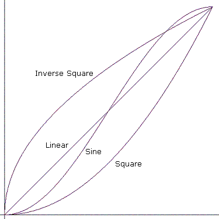
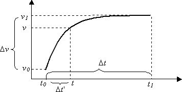

# Parameter Curves

Media parameters are able to follow a curve over time. Each curve is described by a mathematical formula and two end-points. Each end-point is defined by a reference time and the value of the curve at that time. The formula is used to calculate intermediate values between the points, and determines the shape of the curve. The possible curves are:

-   Jump
-   Linear
-   Square
-   Inverse square
-   Sine

"Jump" means jump directly to the end value. The other curves are shown in the following diagram.

Mathematically, the curves work as follows. Suppose that a curve begins at time *t*₀ with a value of *v*₀, and ends at time *t*₁ with a value of *v*₁. The two points that define the curve are (*t*₀, *v*₀) and (*t*₁, *v*₁).

-   Let Δ*t* be the total duration of the curve, *t*₁–*t*₀.
-   Let Δ*v* be the interval between the starting and ending values, *v*₁–*v*₀.
-   At any time *t* such that *t*₀ &lt;= *t* &lt;= *t*₁, let Δ*t*' = *t*–*t*₀.

The value of the parameter at time *t* is:

*v* = f( Δ*t*' / Δ*t* ) \* Δ*v* + *v*₀

where f(x) is a function determined by the curve type:

-   Linear: y = x
-   Square: y = x^2
-   Inverse square: y = sqrt(x)
-   Sine: y = \[ sin(πx – π/2) + 1 \] / 2

Observe that Δ*t*' &lt; Δ*t*, so the term Δ*t*'/Δ*t* ranges from 0 to 1. Therefore, f(x) also ranges from 0 to 1, and *v* always falls between *v*₀ and *v*₁. This is true whether *v*₀ &lt; *v*₁ or vice versa. In other words, the curve is bounded by the rectangle (*t*₀, *v*₀, *t*₁, *v*₁).

For the sine curve, the value of (πx – π/2) ranges from –π/2 to π/2, which means that sin(πx – π/2) ranges from –1 to 1. The result is then normalized so that f(x) falls into the range (0–1).

## Related topics

<dl> <dt>

[Media Parameters](media-parameters.md)
</dt> </dl>

 

 

