# Cascaded Shadow Maps

Cascaded shadow maps (CSMs) are the best way to combat one of the most prevalent errors with shadowing: perspective aliasing. This technical article, which assumes the reader is familiar with shadow mapping, tackles the topic of CSMs. Specifically, it:

-   explains the complexity of CSMs;
-   gives details on the possible variations of the CSM algorithms;
-   describes the two most common filtering techniques—percentage closer filtering (PCF) and filtering with variance shadow maps (VSMs);
-   identifies and addresses some of the common pitfalls associated with adding filtering to CSMs; and
-   shows how to map CSMs to Direct3D 10 through Direct3D 11 hardware.

The code used in this article can be found in the DirectX Software Development Kit (SDK) in the CascadedShadowMaps11 and VarianceShadows11 samples. This article will prove most useful after implementing the techniques covered in the technical article, [Common Techniques to Improve Shadow Depth Maps](https://msdn.microsoft.com/library/windows/desktop/ee416324), are implemented.

## Cascaded Shadow Maps and Perspective Aliasing

Perspective aliasing in a shadow map is one of the most difficult problems to overcome. In the technical article, Common Techniques to Improve Shadow Depth Maps, perspective aliasing is described and some approaches to mitigate the problem are identified. In practice, CSMs tend to be the best solution, and are commonly employed in modern games.

The basic concept of CSMs is easy to understand. Different areas of the camera frustum require shadow maps with different resolutions. Objects nearest the eye require a higher resolution than do more distant objects. In fact, when the eye moves very close to the geometry, the pixels nearest the eye can require so much resolution that even a 4096 × 4096 shadow map is insufficient.

The basic idea of CSMs is to partition the frustum into multiple frusta. A shadow map is rendered for each subfrustum; the pixel shader then samples from the map that most closely matches the required resolution (Figure 2).

**Figure 1. Shadow map coverage**


In Figure 1, quality is shown (left to right) from highest to lowest. The series of grids representing shadow maps with a view frustum (inverted cone in red) shows how pixel coverage is affected with different resolution shadow maps. Shadows are of the highest quality (white pixels) when there is a 1:1 ratio mapping pixels in light space to texels in the shadow map. Perspective aliasing occurs in the form of large, blocky texture maps (left image) when too many pixels map to the same shadow texel. When the shadow map is too large, it is under sampled. In this case, texels are skipped, shimmering artifacts are introduced, and performance is affected.

**Figure 2. CSM shadow quality**


Figure 2 shows cutouts from the highest quality section in each shadow map in Figure 1. The shadow map with the most closely placed pixels (at the apex) is nearest the eye. Technically, these are maps of the same size, with white and grey used to exemplify the success of the cascaded shadow map. White is ideal because it shows good coverage—a 1:1 ratio for eye-space pixels and shadow-map texels.

CSMs require the following steps per frame.

1.  Partition the frustum into subfrusta.
2.  Compute an orthographic projection for each subfrustum.
3.  Render a shadow map for each subfrustum.
4.  Render the scene.

    1.  Bind the shadow maps and render.
    2.  The vertex shader does the following:

        -   Computes texture coordinates for each light subfrustum (unless the needed texture coordinate is calculated in the pixel shader).
        -   Transforms and lights the vertex, and so on.

    3.  The pixel shader does the following:

        -   Determines the proper shadow map.
        -   Transforms the texture coordinates if necessary.
        -   Samples the cascade.
        -   Lights the pixel.

## Partitioning the Frustum

Partitioning the frustum is the act of creating subfrusta. One technique for splitting the frustum is to calculate intervals from zero percent to one hundred percent in the Z-direction. Each interval then represents a near plane and a far plane as a percentage of the Z-axis.

**Figure 3. View frustums partitioned arbitrarily**

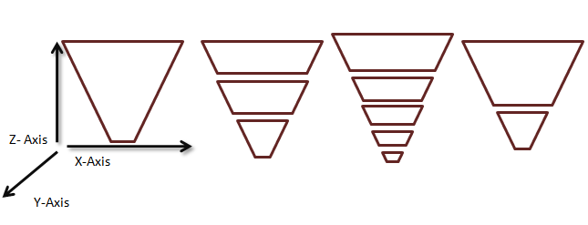

In practice, recalculating the frustum splits per frame causes shadow edges to shimmer. The generally accepted practice is to use a static set of cascade intervals per scenario. In this scenario, the interval along the Z-axis is used to describe a subfrustum that occurs when partitioning the frustum. Determining the correct size intervals for a given scene depends upon several factors.

### Orientation of the Scene Geometry

With respect to scene geometry, camera orientation affects cascade interval selection. For example, a camera very near the ground, such as a ground camera in a football game, has a different static set of cascade intervals than a camera in the sky.

Figure 4 shows some different cameras and their respective partitions. When the scene's Z-range is very large, more split planes are required. For example, when the eye is very near the ground plane, but distant objects are still visible, multiple cascades can be necessary. Dividing the frustum so that more splits are near the eye (where perspective aliasing is changing the fastest) is also valuable. When most of the geometry is clumped into a small section (such as an overhead view or a flight simulator) of the view frustum, fewer cascades are necessary.

**Figure 4. Different configurations require different frustum splits**

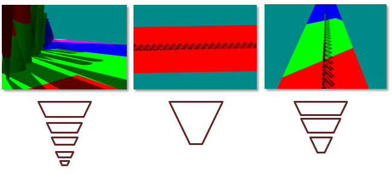

(Left) When geometry has a high dynamic range in Z, lots of cascades are required. (Center) When the geometry has low dynamic range in Z, there is little benefit from multiple frustums. (Right) Only three partitions are needed when the dynamic range is medium.

### Orientation of the Light and the Camera

Each cascade's projection matrix is fit tightly around its corresponding subfrustum. In configurations where the view camera and the light directions are orthogonal, the cascades can be fit tightly with little overlap. The overlap becomes larger as the light and the view camera move into parallel alignment (Figure 5). When the light and the view camera are nearly parallel, it is called a "dueling frusta," and is a very hard scenario for most shadowing algorithms. It is not uncommon to constrain the light and camera so that this scenario does not occur. CSMs, however, perform much better than many other algorithms in this scenario.

**Figure 5. Cascade overlap increases as light direction becomes parallel with camera direction**


Many CSM implementations use fixed-size frusta. The pixel shader can use the Z-depth to index into the array of cascades when the frustum is split in fixed-size intervals.

## Calculating a View-Frustum Bound

Once the frustum intervals are selected, the subfrusta are created using one of two: fit to scene and fit to cascade.

### Fit to Scene

All of the frusta can be created with the same near plane. This forces the cascades to overlap. The CascadedShadowMaps11 sample calls this technique fit to scene.

### Fit to Cascade

Alternatively, frusta can be created with the actual partition interval being used as near and far planes. This causes a tighter fit, but degenerates to fit to scene in the case of dueling frusta. The CascadedShadowMaps11 samples calls this technique fit to cascade.

These two methods are shown in Figure 6. Fit to cascade wastes less resolution. The problem with fit to cascade is that the orthographic projection grows and shrinks based on the orientation of the view frustum. The fit to scene technique pads the orthographic projection by the max size of the view frustum removing the artifacts that appear when the view-camera moves. [Common Techniques to Improve Shadow Depth Maps](https://msdn.microsoft.com/library/windows/desktop/ee416324) addresses the artifacts that appear when the light moves in the section "Moving the light in texel sized increments."

**Figure 6. Fit to scene vs. fit to cascade**


## Render the Shadow Map

The CascadedShadowMaps11 sample renders the shadow maps into one large buffer. This is because PCF on texture arrays is a Direct3D 10.1 feature. For every cascade, a viewport is created that covers the section of the depth buffer corresponding to that cascade. A null pixel shader is bound because only the depth is needed. Finally, the correct viewport and shadow matrix are set for each cascade as the depth maps are rendered one at a time into the main shadow buffer.

## Render the Scene

The buffer containing the shadows is now bound to the pixel shader. There are two methods for selecting the cascade implemented in the CascadedShadowMaps11 sample. These two methods are explained with shader code.

### Interval-Based Cascade Selection

**Figure 7. Interval-based cascade selection**

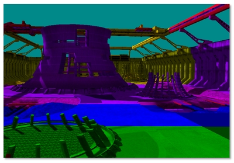

In interval-based selection (Figure 7), the vertex shader computes the position in world-space of the vertex.


```C++
Output.vDepth = mul( Input.vPosition, m_mWorldView ).z;
```


The pixel shader receives the interpolated depth.


```C++
fCurrentPixelDepth = Input.vDepth;
```


Interval-based cascade selection uses a vector comparison and a dot product to determine the correct cacade. The CASCADE\_COUNT\_FLAG specifies the number of cascades. The m\_fCascadeFrustumsEyeSpaceDepths\_data constrains the view frustum partitions. After the comparison, the fComparison contains a value of 1 where the current pixel is larger than the barrier, and a value of 0 when the current cascade is smaller. A dot product sums these values into an array index.


```C++
        float4 vCurrentPixelDepth = Input.vDepth;
        float4 fComparison = ( vCurrentPixelDepth > m_fCascadeFrustumsEyeSpaceDepths_data[0]);
        float fIndex = dot(
        float4( CASCADE_COUNT_FLAG > 0,
        CASCADE_COUNT_FLAG > 1,
        CASCADE_COUNT_FLAG > 2,
        CASCADE_COUNT_FLAG > 3)
        , fComparison );

        fIndex = min( fIndex, CASCADE_COUNT_FLAG );
        iCurrentCascadeIndex = (int)fIndex;
```


Once the cascade is selected, the texture coordinate must be transformed to the correct cascade.


```C++
vShadowTexCoord = mul( InterpolatedPosition, m_mShadow[iCascadeIndex] );
```


This texture coordinate is then used to sample the texture with the X-coordinate and the Y-coordinate. The Z-coordinate is used to do the final depth comparison.

### Map-Based Cascade Selection

Map-based selection (Figure 8) tests against the four sides of the cascades to find the tightest map that covers the specific pixel. Instead of calculating the position in world space, the vertex shader calculates the view-space position for every cascade. The pixel shader iterates over the cascades in order to scale and shift the texture coordinates so that they index the current cascade. The texture coordinate is then tested against the texture bounds. When the X and Y values of the texture coordinate fall inside a cascade, they are used to sample the texture. The Z-coordinate is used to do the final depth comparison.

**Figure 8. Map-based cascade selection**

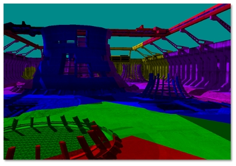

### Interval-Based Selection vs. Map-Based Selection

Interval-based selection is slightly faster than map-based selection because the cascade selection can be done directly. Map-based selection must intersect the texture coordinate with the cascade bounds.

Map-based selection uses the cascade more efficiently when shadow maps do not align perfectly (see Figure 8).

## Blend between Cascades

VSMs (discussed later in this article) and filtering techniques such as PCF can be used with low-resolution CSMs to produce soft shadows. Unfortunately, this results in a visible seam (Figure 9) between cascade layers because the resolution does not match. The solution is to create a band between shadow maps where the shadow test is performed for both cascades. The shader then linearly interpolates between the two values based on the pixel's location in the blend band. The samples CascadedShadowMaps11 and VarianceShadows11 provide a GUI slider that can be used to increase and decrease this blur band. The shader performs a dynamic branch so that the vast majority of pixels only read from the current cascade.

**Figure 9. Cascade seams**

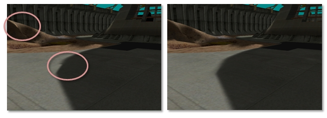

(Left) A visible seam can be seen where cascades overlap. (Right) When the cascades are blended between, no seam occurs.

## Filtering Shadow Maps

### PCF

Filtering ordinary shadow maps does not produce soft, blurred shadows. The filtering hardware blurs the depth values, and then compares those blurred values to the light space texel. The hard edge resulting from the pass/fail test still exists. Blurring shadow maps only serves to erroneously move the hard edge. PCF enables filtering on shadow maps. The general idea of PCF is to calculate a percentage of the pixel in shadow based on the number of subsamples that pass the depth test over the total number of subsamples.

Direct3D 10 and Direct3D 11 hardware can perform PCF. The input to a PCF sampler consists of the texture-coordinate and a comparison depth value. For simplicity, PCF is explained with a four-tap filter. The texture sampler reads the texture four times, similar to a standard filter. However, the returned result is a percentage of the pixels that passed the depth test. Figure 10 shows how a pixel that passes one of the four depth tests is 25 percent in shadow. The actual value returned is a linear interpolation based on the subtexel coordinates of the texture reads to produce a smooth gradient. Without this linear interpolation, the four-tap PCF would only be able to return five values: { 0.0, 0.25, 0.5, 0.75, 1.0 }.

**Figure 10. PCF filtered image, with 25 percent of the selected pixel covered**

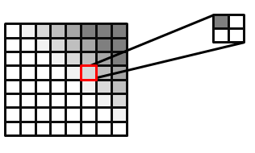

It is also possible to do PCF without hardware support or extend PCF to larger kernels. Some techniques even sample with a weighted kernel. To do this, create a kernel (such as a Gaussian) for an N × N grid. The weights must add up to 1. The texture is then sampled N2 times. Each sample is scaled by the corresponding weights in the kernel. The CascadedShadowMaps11 sample uses this approach.

### Depth Bias

Depth bias becomes even more important when large PCF kernels are used. It is only valid to compare a pixel's light-space depth against the pixel it maps to in the depth map. The depth map texel's neighbors refer to a different position. This depth is likely to be similar, but can be very different depending on the scene. Figure 11 highlights the artifacts that occur. A single depth is compared to three neighboring texels in the shadow map. One of the depth tests erroneously fails because its depth does not correlate to the computed light-space depth of the current geometry. The recommended solution to this problem is to use a larger offset. Too large of an offset, however, can result in Peter Panning. Calculating a tight near plane and far plane helps reduce the effects of using an offset.

**Figure 11. Erroneous self-shadowing**

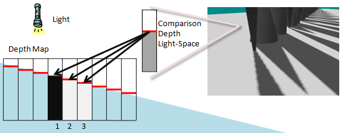

The erroneous self-shadowing results from comparing pixels in the light-space depth to the texels in the shadow map that do not correlate. The depth in light-space correlates to shadow texel 2 in the depth map. Texel 1 is greater than the light-space depth while 2 is equal and 3 is less. Texels 2 and 3 pass the depth test, while Texel 1 fails.

### Calculating a Per-Texel Depth Bias with DDX and DDY for Large PCFs

Calculating a per texel depth bias with **ddx** and **ddy** for large PCFs is a technique that calculates the correct depth bias—assuming the surface is planar—for the adjacent shadow map texel.

This technique fits the comparison depth to a plane using the derivative information. Because this technique is computationally complex, it should be used only when a GPU has compute cycles to spare. When very large kernels are used, this may be the only technique that works to remove self-shadowing artifacts without causing Peter Panning.

Figure 12 highlights the problem. The depth in light-space is known for the one texel that is being compared. The light-space depths that correspond to the neighboring texels in the depth map are unknown.

**Figure 12. Scene and depth map**


The rendered scene is shown at left, and the depth map with a sample texel block is shown at right. The eye-space texel maps to the pixel labeled D in the center of the block. This comparison is accurate. The correct depth in eye space correlating to the pixels that neighbor D is unknown. Mapping the neighboring texels back to eye space is possible only if we assume the pixel pertains to the same triangle as D.

The depth is known for the texel that correlates with the light-space position. The depth is unknown for the neighboring texels in the depth map.

At a high level, this technique uses the **ddx** and **ddy** HLSL operations to find the derivative of the light-space position. This is nontrivial because the derivative operations return the gradient of the light-space depth with respect to screen space. To convert this to a gradient of the light-space depth with respect to light space, a conversion matrix must be calculated.

### Explanation with Shader Code

The details of the rest of the algorithm are given as an explanation of the shader code that performs this operation. This code can be found in the CascadedShadowMaps11 sample. Figure 13 shows how the light-space texture coordinates map to the depth map and how the derivatives in X and Y can be used to create a transformation matrix.

**Figure 13. Screen-space to light-space matrix**

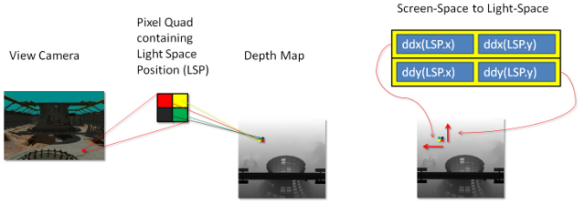

The derivatives of the light-space position in X and Y are used to create this matrix.

The first step is to calculate the derivative of the light-view-space position.


```C++
          float3 vShadowTexDDX = ddx (vShadowMapTextureCoordViewSpace);
          float3 vShadowTexDDY = ddy (vShadowMapTextureCoordViewSpace);
```


Direct3D 11 class GPUs calculate these derivatives by running 2 × 2 quad of pixels in parallel and subtracting the texture coordinates from the neighbor in X for **ddx** and from the neighbor in Y for **ddy**. These two derivatives make up the rows of a 2 × 2 matrix. In its current form, this matrix could be used to convert screen-space neighboring pixels to light-space slopes. However, the inverse of this matrix is needed. A matrix that transforms light-space neighboring pixels to screen-space slopes is needed.


```C++
          float2x2 matScreentoShadow = float2x2( vShadowTexDDX.xy, vShadowTexDDY.xy );
          float fInvDeterminant = 1.0f / fDeterminant;

          float2x2 matShadowToScreen = float2x2 (
          matScreentoShadow._22 * fInvDeterminant,
          matScreentoShadow._12 * -fInvDeterminant,
          matScreentoShadow._21 * -fInvDeterminant,
          matScreentoShadow._11 * fInvDeterminant );
```


**Figure 14. Light-space to screen-space**

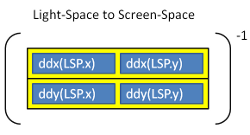

This matrix is then used to transform the two texels above and to the right of the current texel. These neighbors are represented as an offset from the current texel.


```C++
          float2 vRightShadowTexelLocation = float2( m_fTexelSize, 0.0f );
          float2 vUpShadowTexelLocation = float2( 0.0f, m_fTexelSize );
          float2 vRightTexelDepthRatio = mul( vRightShadowTexelLocation,
          matShadowToScreen );
          float2 vUpTexelDepthRatio = mul( vUpShadowTexelLocation,
          matShadowToScreen );
```


The ratio that the matrix creates is finally multiplied by the depth derivatives to calculate the depth offsets for the neighboring pixels.


```C++
            float fUpTexelDepthDelta =
            vUpTexelDepthRatio.x * vShadowTexDDX.z
            + vUpTexelDepthRatio.y * vShadowTexDDY.z;
            float fRightTexelDepthDelta =
            vRightTexelDepthRatio.x * vShadowTexDDX.z
            + vRightTexelDepthRatio.y * vShadowTexDDY.z;
```


These weights can now be used in a PCF loop to add an offset to the position.


```C++
    for( int x = m_iPCFBlurForLoopStart; x < m_iPCFBlurForLoopEnd; ++x ) 
    {
        for( int y = m_iPCFBlurForLoopStart; y < m_iPCFBlurForLoopEnd; ++y )
            {
            if ( USE_DERIVATIVES_FOR_DEPTH_OFFSET_FLAG )
            {
            depthcompare += fRightTexelDepthDelta * ( (float) x ) +
            fUpTexelDepthDelta * ( (float) y );
            }
            // Compare the transformed pixel depth to the depth read
            // from the map.
            fPercentLit += g_txShadow.SampleCmpLevelZero( g_samShadow,
            float2(
            vShadowTexCoord.x + ( ( (float) x ) * m_fNativeTexelSizeInX ) ,
            vShadowTexCoord.y + ( ( (float) y ) * m_fTexelSize )
            ),
            depthcompare
            );
            }
     }
```


## PCF and CSMs

PCF does not work on texture arrays in Direct3D 10. To use PCF, all of the cascades are stored in one large texture atlas.

### Derivative-Based Offset

Adding the derivative based offsets for CSMs presents some challenges. This is due to a derivative calculation within divergent flow control. The problem occurs because of a fundamental way that GPUs operate. Direct3D11 GPUs operate on 2 × 2 quads of pixels. To perform a derivative, GPUs generally subtract the current pixel's copy of a variable from the neighboring pixel's copy of that same variable. How this happens varies from GPU to GPU. The texture coordinates are determined by map-based or interval-based cascade selection. Some pixels in a pixel quad choose a different cascade than the rest of the pixels. This results in visible seams between shadow maps because the derivative-based offsets are now completely wrong. The solution is to perform the derivative on light-view space texture coordinates. These coordinates are the same for every cascade.

### Padding for PCF Kernels

PCF kernels index outside of a cascade partition if the shadow buffer is not padded. The solution is to pad the outer rim of the cascade by one-half the size of the PCF kernel. This must be implemented in the shader that selects the cascade and in the projection matrix that must render the cascade large enough that the border is preserved.

## Variance Shadow Maps

VSMs (see [Variance shadow maps](http://portal.acm.org/citation.cfm?doid=1111411.1111440) by Donnelly and Lauritzen for more information) enable direct shadow map filtering. When using VSMs, all of the power of the texture-filtering hardware can be used. Trilinear and anisotropic (Figure 15) filtering can be used. Additionally, VSMs can be blurred directly through convolution. VSMs do have some drawbacks; two channels of depth data must be stored (depth and depth squared). When shadows overlap, light-bleeding is common. They work well, however, with lower resolutions and can be combined with CSMs.

**Figure 15. Anisotropic filtering**

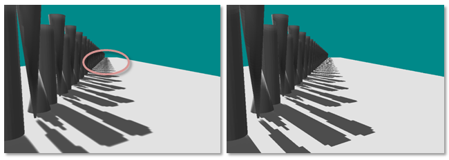

### Algorithm Details

VSMs work by rendering the depth and the depth squared to a two-channel shadow map. This two-channel shadow map can then be blurred and filtered just like a normal texture. The algorithm then uses Chebychev's Inequality in the pixel shader to estimate the fraction of pixel area that would pass the depth test.

The pixel shader fetches the depth and depth-squared values.


```C++
        float  fAvgZ  = mapDepth.x; // Filtered z
        float  fAvgZ2 = mapDepth.y; // Filtered z-squared
```


The depth comparison is performed.


```C++
        if ( fDepth <= fAvgZ )
        {
        fPercentLit = 1;
        }
```


If the depth comparison fails, the percentage of the pixel that is lit is estimated. Variance is calculated as average-of-squares minus square-of-average.


```C++
        float variance = ( fAvgZ2 ) − ( fAvgZ * fAvgZ );
        variance = min( 1.0f, max( 0.0f, variance + 0.00001f ) );
```


The fPercentLit value is estimated with Chebychev's Inequality.


```C++
        float mean           = fAvgZ;
        float d              = fDepth - mean;
        float fPercentLit    = variance / ( variance + d*d );
```


## Light Bleeding

The biggest drawback to VSMs is light bleeding (Figure 16). Light bleeding occurs when multiple shadow casters occlude each other along edges. VSMs shade the edges of shadows based on depth disparities. When shadows overlap each other, a depth disparity exists in the center of a region that should be shadowed. This is a problem with using the VSM algorithm.

**Figure 16. VSM light bleeding**

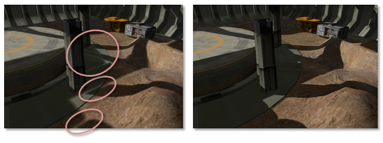

A partial solution to the problem is to raise the fPercentLit to a power. This has the effect of dampening the blur, which can cause artifacts where depth disparity is small. Sometimes there exists a magical value that alleviates the problem.


```C++
fPercentLit = pow( p_max, MAGIC_NUMBER );
```


An alternative to raising the percent lit to a power is to avoid configurations where shadows overlap. Even highly tuned shadow configurations have several constraints on light, camera, and geometry. Light bleeding is also lessened by using higher resolution textures.

Layered variance shadow maps (LVSMs) solve the problem at the expense of breaking the frustum into layers that are perpendicular to the light. The number of maps required would be quite large when CSMs are also being used.

Additionally, Andrew Lauritzen, co-author of the paper on VSMs, and author of a paper on LVSMs, discussed combining exponential shadow maps (ESMs) with VSMs to counteract light blending in a [Beyond3D Forum](http://forum.beyond3d.com/showthread.php?t=47427).

## VSMs with CSMs

The sample VarianceShadow11 combines VSMs and CSMs. The combination is fairly straightforward. The sample follows the same steps as the CascadedShadowMaps11 sample. Because PCF is not used, the shadows are blurred in a two-pass separable convolution. Not using PCF also enables the sample to use texture arrays instead of a texture atlas. PCF on texture arrays is a Direct3D 10.1 feature.

### Gradients with CSMs

Using gradients with CSMs can produce a seam along the border between two cascades as seen in Figure 17. The sample instruction uses derivatives between pixels to calculate information, such as the mipmap level, needed by the filter. This causes a problem in particular for mipmap selection or anisotropic filtering. When pixels in a quad take different branches in the shader, the derivatives calculated by the GPU hardware are invalid. This results in a jagged seam along the shadow map.

**Figure 17. Seams on cascade borders due to anisotropic filtering with divergent flow control**

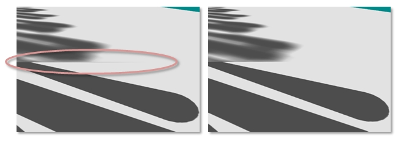

This problem is solved by computing the derivatives on the position in light-view space; the light-view space coordinate is not specific to the selected cascade. The computed derivatives can be scaled by the scale portion of the projection-texture matrix to the correct mipmap level.


```C++
        float3 vShadowTexCoordDDX = ddx( vShadowMapTextureCoordViewSpace );
        vShadowTexCoordDDX *= m_vCascadeScale[iCascade].xyz;
        float3 vShadowTexCoordDDY = ddy( vShadowMapTextureCoordViewSpace );
        vShadowTexCoordDDY *= m_vCascadeScale[iCascade].xyz;

        mapDepth += g_txShadow.SampleGrad( g_samShadow, vShadowTexCoord.xyz,
        vShadowTexCoordDDX, vShadowTexCoordDDY );
```


## VSMs Compared to Standard Shadows with PCF

Both VSMs and PCF attempt to approximate the fraction of pixel area that would pass the depth test. VSMs work with filtering hardware and can be blurred with separable kernels. Separable convolution kernels are considerably cheaper to implement than a full kernel. Additionally, VSMs compare one light-space depth against one value in the light-space depth map. This means that VSMs do not have the same offset problems as PCF. Technically, VSMs are sampling depth over a greater area, as well as performing a statistical analysis. This is less precise than PCF. In practice, VSMs do a very good job of blending, which results in less offset being necessary. As described above, the number one drawback to VSMs is light bleeding.

VSMs and PCF represent a trade-off between GPU compute power and GPU texture bandwidth. VSMs require more math to be performed to calculate the variance. PCF requires more texture memory bandwidth. Large PCF kernels can quickly become bottlenecked by texture bandwidth. With GPU computation power growing more rapidly than GPU bandwidth, VSMs are becoming the more practical of the two algorithms. VSMs also look better with lower resolution shadow maps due to blending and filtering.

## Summary

CSMs offer a solution to the perspective aliasing problem. There are several possible configurations to get the needed visual fidelity for a title. PCF and VSMs are widely used and should be combined with CSMs to reduce aliasing.

## References

Donnelly, W. and Lauritzen, A. [Variance shadow maps](http://portal.acm.org/citation.cfm?doid=1111411.1111440). In SI3D '06: Proceedings of the 2006 symposium on Interactive 3D graphics and games. 2006. pp. 161–165. New York, NY, USA: ACM Press.

Lauritzen, Andrew and McCool, Michael. [Layered variance shadow maps](http://portal.acm.org/citation.cfm?id=1375714.1375739&coll=GUIDE&dl=GUIDE&CFID=45360327&CFTOKEN=34578992). Proceedings of graphics interface 2008, May 28–30, 2008, Windsor, Ontario, Canada.

Engel, Woflgang F. Section 4. Cascaded Shadow Maps. ShaderX5 , Advanced Rendering Techniques, Wolfgang F. Engel, Ed. Charles River Media, Boston, Massachusetts. 2006. pp. 197–206.

 

 


