# Common Techniques to Improve Shadow Depth Maps

Shadow maps, first introduced in 1978, are a common technique for adding shadows to games. Three decades later, despite advances in hardware and software, shadowing artifacts—namely shimmering edges, perspective aliasing, and other precision issues—persist.

This technical article provides an overview of some common shadow depth map algorithms and common artifacts, and explains several techniques—ranging in difficulty from basic to intermediate—that can be used to increase the quality of standard shadow maps. Adding basic shadow maps to a title typically is straightforward, but understanding the nuances of shadow artifacts can be challenging. This technical article is written for the intermediate graphics developer who has implemented shadows, but does not fully understand why specific artifacts appear and is not sure how to work around them.

Selecting the correct techniques to mitigate specific artifacts is nontrivial. When shadow map shortcomings are addressed, the difference in quality can be impressive (Figure 1). Correctly implementing these techniques drastically improves standard shadows. The techniques explained in this article are implemented in the sample CascadedShadowMaps11 in the DirectX SDK.

**Figure 1. Shadows with severe artifacts (left), and shadows after implementing the techniques described in this article (right)**


## Shadow Depth Maps Review

The shadow depth map algorithm is a two-pass algorithm. The first pass generates a depth map in light space. In the second pass, this map is used to compare each pixel's depth in light space against its corresponding depth in the light space depth map.

**Figure 2. Key parts of a shadow scene**

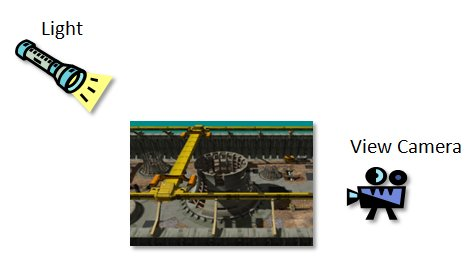

### Pass 1

The scene is shown in Figure 2. In the first pass (Figure 3), the geometry is rendered into a depth buffer from the point of view of the light. More specifically, the vertex shader transforms the geometry into light-view space.

The end result of this first pass is a depth buffer containing the scene's depth information from the point of view of the light. This now can be used in pass 2 to determine which pixels are occluded from the light.

**Figure 3. First pass of basic shadow mapping**

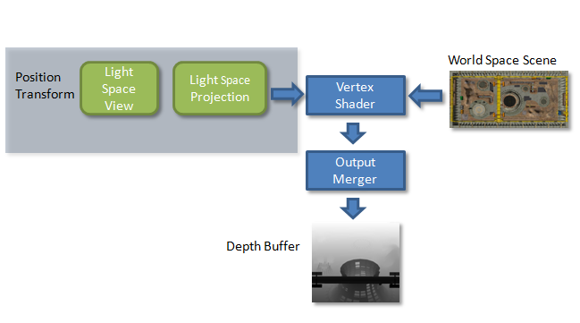

### Pass 2

In the second pass (Figure 4), the vertex shader transforms each vertex twice. Each vertex is transformed into the camera's view space and passed to the pixel shader as the position. Each vertex is also transformed by the light's view-projection-texture matrix and passed to the pixel shader as a texture coordinate. The view-projection-texture matrix is the same matrix used to render the scene in pass 1 with one additional transform. It's a transformation that scales and translates the points from view space (–1 to 1 in X and Y) to texture space (0 to 1 in X and 1 to 0 in Y).

The pixel shader receives the interpolated position and the interpolated texture coordinates. Everything needed to perform the depth test is now in this texture coordinate. The depth test can now be performed by indexing the depth buffer from the first pass with the X and Y texture coordinates and comparing the resulting depth value against the Z-texture coordinate.

**Figure 4. Second pass of basic shadow mapping**

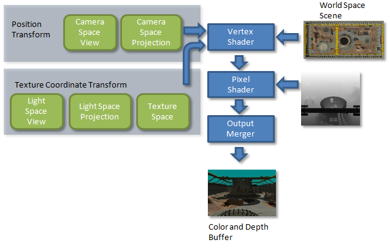

## Shadow Map Artifacts

The shadow depth map algorithm is the most widely used real-time shadowing algorithm, but still produces several artifacts requiring mitigation. The types of artifacts that can occur are summarized next.

### Perspective Aliasing

Perspective aliasing, a common artifact, is shown in Figure 5. It occurs when the mapping of pixels in view space to texels in the shadow map is not a one-to-one ratio. This is because pixels close to the near plane are closer together and require a higher shadow map resolution.

Figure 6 shows a shadow map and a view frustum. Near the eye, the pixels are closer together, and many pixels map to the same shadow texels. The pixels by the far plane are spread out, thereby reducing perspective aliasing.

**Figure 5. High-perspective aliasing (left) vs. low-perspective aliasing (right)**

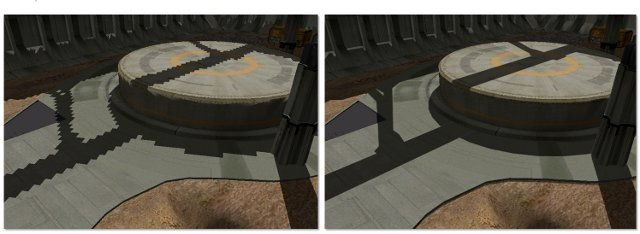

For the image at left, perspective aliasing is higher; too many eye-space pixels map to the same shadow-map texels. In the image at right, perspective aliasing is low because there is a 1:1 mapping between the eye-space pixels and shadow-map texels.

**Figure 6. View frustum with shadow map**

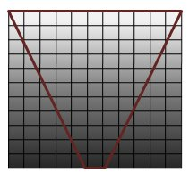

Light pixels in the far plane represent low-perspective aliasing, and dark pixels in the near plane represent high-perspective aliasing.

Shadow map resolution can also be too high. Although a higher resolution is less noticeable, it nevertheless can result in small objects, such as telephone wires, not casting shadows. Also, having too high of a resolution can cause severe performance issues because of texture access patterns.

Perspective shadow maps (PSMs) and light space perspective shadow maps (LSPSMs) attempt to address perspective aliasing by skewing the light's projection matrix in order to place more texels near the eye where they are needed. Unfortunately, neither technique is able to solve the perspective aliasing. The parameterization of the transform required to map eye-space pixels to texels in the shadow map cannot be bound by a linear skew. A logarithmic parameterization is required. PSMs put too much detail near the eye, causing distant shadows to be of low quality or to even disappear. LSPSMs do a better job of finding a middle ground between increasing resolution near the eye, and leaving enough detail for objects far away. Both techniques degenerate to orthographic shadows in some scene configurations. This degeneration can be counteracted by rendering a separate shadow map for each face of the view frustum, although this is expensive. Logarithmic perspective shadow maps (LogPSMs) also render a separate map per face of the view frustum. This technique uses nonlinear rasterization to place more texels near the eye. D3D10 and D3D11-class hardware do not support nonlinear rasterization. For more information about these techniques and algorithms, see the References section.

Cascaded shadow maps (CSMs) are the most popular technique for dealing with perspective aliasing. Although CSMs can be combined with PSMs and LSPSMs, it's unnecessary. Using CSMs to fix perspective aliasing errors is addressed in the companion article, [Cascaded Shadow Maps](https://msdn.microsoft.com/library/windows/desktop/ee416307).

### Projective Aliasing

Projective aliasing is harder to show than perspective aliasing. The distended shadows highlighted in Figure 7 demonstrate projective aliasing errors. Projective aliasing occurs when the mapping between texels in camera space to texels in light space is not a one-to-one ratio; this is because of the orientation of the geometry with respect to the light camera. Projective aliasing occurs as the tangent plane of the geometry becomes parallel to the light rays.

**Figure 7. High-projective aliasing vs. low-projective aliasing**

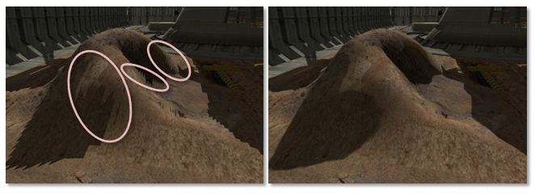

Techniques used to alleviate perspective aliasing errors also mitigate projective aliasing. Projective aliasing occurs when the surface normal is orthogonal to the light; these surfaces should be receiving less light based on diffuse lighting equations.

### Shadow Acne and Erroneous Self-Shadowing

Shadow acne (Figure 8), a term synonymous with erroneous self-shadowing, occurs when the shadow map quantizes the depth over an entire texel. When the shader compares an actual depth against this value, it is as likely to be self-shadowed as it is to be unshadowed.

Another reason for shadow acne is that the texel in light space is so close to the depth of the corresponding texel in the depth map that precision errors cause the depth test to erroneously fail. One reason for this precision difference is that the depth map was calculated by the fixed-function rasterization hardware, while the depth being compared was computed by the shader. Projective aliasing can also cause shadow acne.

**Figure 8. Shadow acne artifact**


As shown in the left image, some of pixels failed the depth test and created speckled artifacts and moiré patterns. In order to reduce erroneous self-shadowing, the bounds on the near plane and the far plane for the light space view frustum should be calculated as tightly as possible. The slope scale-based depth bias and other types of bias are other solutions used to mitigate shadow acne.

### Peter Panning

The term *Peter Panning* derives its name from a children's book character whose shadow became detached and who could fly. This artifact makes objects with missing shadows appear to be detached from and to float above the surface (Figure 9).

**Figure 9. Peter Panning artifact**

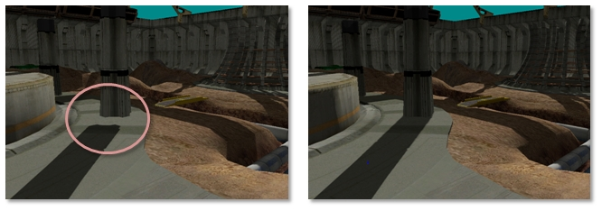

In the image at left, the shadow is detached from the object, creating a floating effect.

One technique for removing surface acne is to add some value to pixel position in light space; this is called adding a depth offset. Peter Panning results when the depth offset used is too large. In this case the depth offset causes the depth test to erroneously pass. Like shadow acne, Peter Panning is aggravated when there is insufficient precision in the depth buffer. Calculating tight near planes and far planes also helps avoid Peter Panning.

## Techniques to Improve Shadow Maps

Adding shadows to a title is a process. The first step is to get basic shadow maps working. The second is to ensure all basic calculations are done optimally: frusta fit as tightly as possible, near/far planes fit tightly, slope-scaled bias is used, and so on. Once basic shadows are enabled, and look as good as possible, the developer has a better idea of what algorithms are needed to get the shadows to sufficient fidelity. Basic tips that may be needed to get basic shadow maps looking at their best are given in this section.

### Slope-Scale Depth Bias

As previously mentioned, self-shadowing can lead to shadow acne. Adding too much bias can result in Peter Panning. Additionally, polygons with steep slopes (relative to the light) suffer more from projective aliasing than polygons with shallow slopes (relative to the light). Because of this, each depth map value may need a different offset depending on the polygon's slope relative to the light.

Direct3D 10 hardware has the ability to bias a polygon based on its slope with respect to the view direction. This has the effect of applying a large bias to a polygon that is viewed edge-on to the light direction, but not applying any bias to a polygon facing the light directly. Figure 10 illustrates how two neighboring pixels can alternate between shadowed and unshadowed when testing against the same unbiased slope.

**Figure 10. Slope scaled depth-bias compared to unbiased depth**

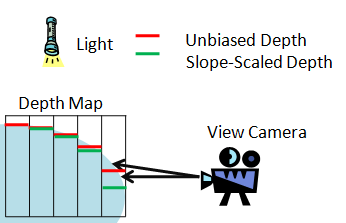

### Calculating a Tight Projection

Tightly fitting the light's projection to the view frustum increases the shadow map coverage. Figure 11 illustrates that using an arbitrary projection, or fitting the projection to the scene bounds, results in higher perspective aliasing.

**Figure 11. Arbitrary shadow frustum and shadow frustum fit to scene**

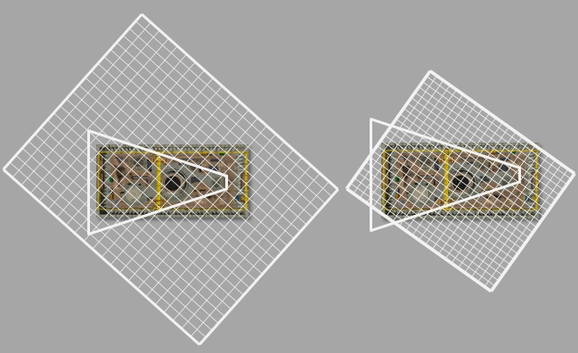

The view is from the point of view of the light. The trapezoid represents the view camera's frustum. The grid drawn over the image represents the shadow map. The image on the right shows that the same resolution shadow map creates more texel coverage when it is fit more tightly to the scene.

Figure 12 illustrates frustums that are correctly fit. To calculate the projection, the eight points that make up the view frustum are transformed into light space. Next, the minimum and maximum values in X and Y are found. These values make up the bounds for an orthographic projection.

**Figure 12. Shadow projection fit to view frustum**


It is also possible to clip the frustum to the scene AABB to get a tighter bound. This is not advised in all cases because this can change the size of the light camera's projection from frame to frame. Many techniques, such as those described in the section Moving the Light Texel-Sized Increments, give better results when the size of the light's projection remains constant in every frame.

### Calculating the Near Plane and Far Plane

The near plane and far plane are the final pieces required to calculate the projection matrix. The more closely together the planes are, the more precise the values in the depth buffer.

The depth buffer can be 16-bit, 24-bit, or 32-bit, with values between 0 and 1. Generally, depth buffers are fixed point, with the values close to the near plane grouped more closely together than the values close to the far plane. The degree of precision available to the depth buffer is determined by the ratio of the near plane to the far plane. Using the tightest possible near/far plane could allow use of a 16-bit depth buffer. A 16-bit depth buffer could reduce the use of memory while increasing processing speed.

### AABB-Based Near Plane and Far Plane

An easy and naive way to calculate the near plane and far plane is to transform the scene's bounding volume into light space. The smallest Z-coordinate value is the near plane and the largest Z-coordinate value is the far plane. For many configurations of the scene and light, this approach is sufficient. The worst case scenario, however, can result in a significant loss of precision in the depth buffer; Figure 13 shows such a scenario. Here the range of the near plane to the far plane is four times larger than necessary.

The view frustum in Figure 13 was purposely chosen to be small. A small view frustum is shown in a very large scene consisting of pillars extending out from the view camera. Using the Scene AABB for the near and far planes is not optimal. The CSM algorithm described in the [Cascaded Shadow Maps](https://msdn.microsoft.com/library/windows/desktop/ee416307) technical article must calculate near and far planes for very small frustums.

**Figure 13. Near and far planes based on Scene AABB**

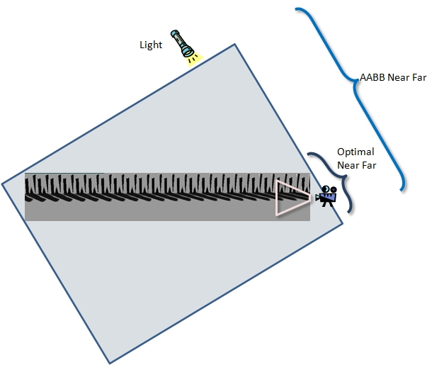

### Frustum-Based Near Plane and Far Plane

Another technique for calculating the near and far planes is to transform the frustum into light space and use the minimal and maximal values in Z as the near and the far planes, respectively. Figure 14 illustrates the two issues with this approach. First, the calculation is too conservative, as shown when the frustum extends beyond the scene's geometry. Second, the near plane could be too tight, causing shadow casters to be cropped.

**Figure 14. Near and far planes based solely on view frustum**


### Light Frustum Intersected with Scene to Calculate Near and Far Planes

The proper way to calculate the near and far planes is shown in Figure 15. Four of the planes of the orthographic light frustum were calculated using the minimum and maximum of the X and Y coordinates of the view frustum in light space. The last two planes of the orthogonal view frustum are the near and the far planes. To find these planes, the scene's bounds are clipped against the four known light frustum planes. The smallest and largest Z-values from the newly clipped boundary represent the near plane and far plane, respectively.

The code that performs this operation is located in the CascadedShadowMaps11 sample. The eight points that make up the world's AABB are transformed into light space. Transforming the points into light space simplifies the clipping tests. The four known planes of the light frustum can now be represented as lines. The scenes bounding volume in light space can be represented as six quadrilaterals. These 6 quadrilaterals can then be turned into 12 triangles for triangle-based clipping. The triangles are clipped against the known planes of the view frustum (these are horizontal and vertical lines in X and Y in light space). When an intersection point is found in X and Y, the 3D triangle is clipped at that point. The minimum and maximum Z-values of all the clipped triangles are the near plane and far plane. The CascadedShadowMaps11 sample shows how to perform this clipping in the **ComputeNearAndFar** function.

There are two more techniques that could be used to calculate the tightest possible near and far planes. These techniques are not shown in the CascadedShadowMaps sample.

-   Even tighter near and far planes could be calculated by intersecting a hierarchy of a scene or individual objects in a scene against the light frustum. This would be computationally more complex. While not illustrated in the CascadedShadowMaps11 sample, this could be a valid technique for some tiles.
-   The far plane could be calculated by taking the minimum of:

    -   The largest depth of the view frustum in light space.
    -   The largest depth of the intersection of the view frustum and the scene AABB.

This approach can be problematic when used with cascaded shadow maps where it is possible to index outside of a view frustum. In this case, the shadow map might be missing geometry.

**Figure 15. Near and far planes based on the intersection of the four calculated planes of the light frustum and the scene's bounding geometry**

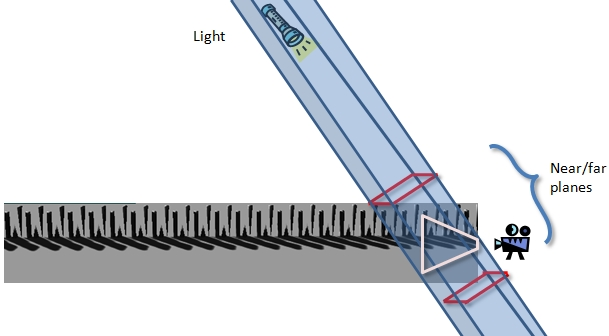

### Moving the Light in Texel-Sized Increments

A common artifact in shadow maps is the shimmering edge effect. As the camera moves, the pixels along the shadows' edges brighten and darken. This cannot be seen in still images, but it is very noticeable and distracting in real time. Figure 16 highlights this problem and Figure 17 shows how the shadow edges should look.

The shimmering edge error occurs because the light projection matrix is being recalculated every time the camera moves. This creates subtle differences in the generated shadow maps. All of the following factors can influence the matrix created to bound the scene.

-   Size of the view frustum
-   Orientation of the view frustum
-   Location of the light
-   Location of the camera

Every time this matrix changes, the shadows edges could change.

**Figure 16. Shimmering shadow edges**


The pixels along the border of the shadow come in and out of shadow as the camera moves from left to right.

**Figure 17. Shadows without shimmering edges**


The shadow edges stay constant as the camera moves from left to right.

For directional lights, the solution to this problem is to round the minimum/maximum value in X and Y (that make up the orthographic projection bounds) to pixel size increments. This can be done with a divide operation, a floor operation, and a multiply.


```C++
        vLightCameraOrthographicMin /= vWorldUnitsPerTexel;
        vLightCameraOrthographicMin = XMVectorFloor( vLightCameraOrthographicMin );
        vLightCameraOrthographicMin *= vWorldUnitsPerTexel;
        vLightCameraOrthographicMax /= vWorldUnitsPerTexel;
        vLightCameraOrthographicMax = XMVectorFloor( vLightCameraOrthographicMax );
        vLightCameraOrthographicMax *= vWorldUnitsPerTexel;
```


The vWorldUnitsPerTexel value is calculated by taking a bound of the view frustum, and dividing by the buffer size.


```C++
        FLOAT fWorldUnitsPerTexel = fCascadeBound /
        (float)m_CopyOfCascadeConfig.m_iBufferSize;
        vWorldUnitsPerTexel = XMVectorSet( fWorldUnitsPerTexel, fWorldUnitsPerTexel,                            0.0f, 0.0f );
```


Bounding the maximum size of the view frustum results in a looser fit for the orthographic projection.

It is important to note that the texture is 1 pixel larger in width and height when using this technique. This keeps shadow coordinates from indexing outside of the shadow map.

### Back Face and Front Face

Shadow maps should be rendered with standard back-face culling, a process that skips rasterization of objects that the viewer cannot see, and speeds up rendering of the scene. Another common option is to render shadow maps with front-face culling enabled, which means that objects facing the viewer are eliminated. The argument for this is that it helps with self-shadowing as the geometry making up the back of objects is slightly offset. There are two problems with this idea.

-   Any object with improper front-face or back-face geometry causes artifacts in the shadow map. However, having incorrect front-face or back-face geometry will cause other problems, so it may be safe to assume front-face and back-face geometry is done correctly. It may be impractical to create back faces for sprite-based geometry such as foliage.
-   Peter Panning and shadow gaps near the base of objects such as walls are more likely to occur because the shadow depth disparity is too small.

### Shadow Map–Friendly Geometry

Creating geometry that works well in shadow maps allows for more flexibility when combating artifacts like Peter Panning and shadow acne.

Hard edges are problematic for self-shadowing. The depth disparity near the tip of the edge is very small. Even a small offset can cause objects to lose their shadows (Figure 18).

**Figure 18. Sharp edges cause artifacts stemming from low-depth disparity with offsets**

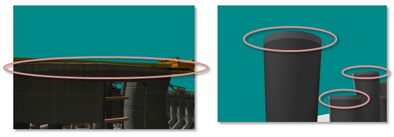

Narrow objects such as walls should have backs even if they are never visible. This will increase the depth disparity.

It's also important to make sure that the direction the geometry is facing is correct; that is, the outside of an object should be back facing and the inside of an object should be front facing. This is important for rendering with back-face culling enabled, as well as for combating the effects of depth bias.

## Summary

The techniques described in this article can be used to increase the quality of standard shadow maps. The next step is to look at techniques that can work well with standard shadow maps. CSMs are recommended as a superior technique to combat perspective aliasing. Percentage closer filtering or variance shadow maps can be used to soften shadow edges. See the [Cascaded Shadow Maps](https://msdn.microsoft.com/library/windows/desktop/ee416307) technical article for more information.

Donnelly, W., and Lauritzen, A. [Variance Shadow Maps](http://portal.acm.org/citation.cfm?doid=1111411.1111440). Symposium on Interactive 3D Graphics, Proceedings of the 2006 Symposium on Interactive 3D Graphics and Games. 2006, pp. 161–165.

Engel, Woflgang F. Section 4. Cascaded Shadow Maps. ShaderX5, *Advanced Rendering Techniques*, Wolfgang F. Engel, Ed. Charles River Media, Boston, Massachusetts. 2006. pp. 197–206.

Stamminger, Marc, and Drettakis, George. [Perspective Shadow Maps](http://portal.acm.org/citation.cfm?id=566616). International Conference on Computer Graphics and Interactive Techniques, *Proceedings of the 29th Annual Conference on Computer Graphics and Interactive Techniques*. 2002, pp 557–562.

Wimmer, M., Scherzer, D., and Purgathofer, W. [Light Space Perspective Shadow Maps](http://www.cg.tuwien.ac.at/research/vr/lispsm/shadows_egsr2004_revised.pdf). Eurographics Symposium on Rendering. 2004. Revised June 10, 2005. [Technische Universität Wien](http://www.cg.tuwien.ac.at/research/vr/lispsm/).

 

 


