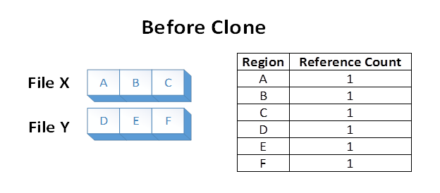
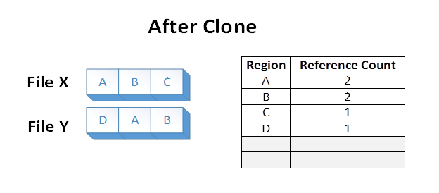

# Block Cloning

A *block clone* operation instructs the file system to copy a range of file bytes on behalf of an application. The destination file may be the same as, or different from, the source file.

A file system manages the mappings of [Clusters and Extents](clusters-and-extents.md), and may be able to perform the copy by altering the virtual cluster number (VCN) to logical cluster number (LCN) mappings as a low-cost metadata operation, rather than reading and writing the underlying file data. This allows the copy to complete faster and generates less I/O to the underlying storage. Moreover, multiple files may now share logical clusters after the block clone, saving capacity by not storing identical clusters multiple times on disk.

A block clone operation does not break the isolation provided between files. After a block clone completes, writes to the source file do not appear in the destination, or vice versa.

Block cloning is available only on the [ReFS file system](https://docs.microsoft.com/windows/desktop/w8cookbook/resilient-file-system--refs-) type beginning with Windows Server 2016.

## Block Cloning on ReFS

ReFS on Windows Server 2016 implements block cloning by remapping logical clusters (that is, physical locations on a volume) from the source region to the destination region. It then uses an allocate-on-write mechanism to ensure isolation between those regions. The source and destination regions may be in the same, or different, files.

This implementation requires that the starting and ending file offsets be aligned to cluster boundaries. In ReFS on Windows Server 2016, clusters are 4KB in size by default, but can optionally be set to 64KB. The cluster size is a volume-wide parameter set at format time.

## Restrictions and Remarks

-   The source and destination regions must begin and end at a cluster boundary.
-   The cloned region must be less than 4GB in length.
-   The destination region must not extend past the end of file. If the application wishes to extend the destination with cloned data, it must first call [**SetEndOfFile**](/windows/desktop/api/FileAPI/nf-fileapi-setendoffile).
-   If the source and destination regions are in the same file, they must not overlap. (The application may able to proceed by splitting up the block clone operation into multiple block clones that no longer overlap.)
-   The source and destination files must be on the same ReFS volume.
-   The source and destination files must have the same [**Integrity Streams**](file-attribute-constants.md) setting (that is, Integrity Streams must be enabled in both files, or disabled in both files).
-   If the source file is sparse, the destination file must also be sparse.
-   The block clone operation will break Shared Opportunistic Locks (also known as [Level 2 Opportunistic Locks](types-of-opportunistic-locks.md)).
-   The ReFS volume must have been formatted with Windows Server 2016, and if Windows Failover Clustering is in use, the Clustering Functional Level must have been Windows Server 2016 or later at format time.

## Example

Suppose we have two files, X and Y, where each file is composed of 3 distinct regions. Each file region is stored on a distinct region of the volume. The file system stores the knowledge that each of those volume regions is referenced in one file region:

Now suppose an application issues a block clone operation from File X, over file regions A and B, to File Y at the offset where E currently is. The following file system state would result:

The data in regions A and B were effectively duplicated from File X to File Y by altering the VCN to LCN mappings within the ReFS volume. The disk extents backing regions A and B were not read, nor were the disk extents backing the old regions E and F overwritten during the operation.

Files X and Y now share logical clusters on disk. This is reflected in the reference counts shown in the table. The sharing results in lower volume capacity consumption than if regions A and B were duplicated on the underlying volume.

Now, suppose the application overwrites region A in File X. ReFS makes a duplicate copy of A, which we’ll now call G. ReFS then maps G into File X, and applies the modification. This ensures that isolation between the files is preserved. Reference counts are updated appropriately:

After the modifying write, region B is still shared on disk. Note that if region A were larger than a cluster, only the modified cluster would have been duplicated, and the remaining portion would have remained shared.

## Related topics

<dl> <dt>

[**DUPLICATE\_EXTENTS\_DATA**](/windows/desktop/api/WinIoCtl/ns-winioctl-_duplicate_extents_data)
</dt> <dt>

[**FSCTL\_DUPLICATE\_EXTENTS\_TO\_FILE**](https://msdn.microsoft.com/en-us/library/Mt590823(v=VS.85).aspx)
</dt> </dl>

 

 

