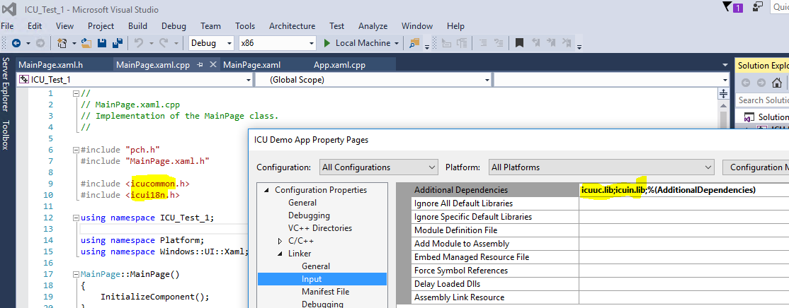

# International Components for Unicode (ICU)

International Components for Unicode (ICU) is a mature, widely used set of open-source globalization APIs. ICU utilizes Unicode’s vast Common Locale Data Repository (CLDR) as it’s data library, providing Globalization support for software applications. ICU is widely portable and gives applications the same results across on all platforms.

## Highlights of the Globalization API services provided by ICU

-   **Code Page Conversion**: Convert text data to or from Unicode and nearly any other character set or encoding. ICU's conversion tables are based on charset data collected by IBM over the course of many decades, and is the most complete available anywhere.
-   **Collation**: Compare strings according to the conventions and standards of a particular language, region or country. ICU's collation is based on the Unicode Collation Algorithm plus locale-specific comparison rules from CLDR.
-   **Formatting**: Format numbers, dates, times and currency amounts according the conventions of a chosen locale. This includes translating month and day names into the selected language, choosing appropriate abbreviations, ordering fields correctly, etc. This data also comes from the Common Locale Data Repository.
-   **Time Calculations**: Multiple types of calendars are provided beyond the traditional Gregorian. A thorough set of time zone calculation APIs are provided.
-   **Unicode Support**: ICU closely tracks the Unicode standard, providing easy access to all of the many Unicode character properties, Unicode Normalization, Case Folding and other fundamental operations as specified by the [Unicode Standard](http://www.unicode.org/).
-   **Regular Expression**: ICU's regular expressions fully support Unicode while providing very competitive performance.
-   **Bidi**: Support for handling text containing a mixture of left to right (English) and right to left (Arabic or Hebrew) data.

For more information, you can visit the ICU website: <http://site.icu-project.org/>

## Overview

In Windows 10 Creators Update, ICU was integrated into Windows, making the C APIs and data publicly accessible.

> \[!Important\]  
> The version of ICU in Windows only exposes the C APIs. It does not expose any of the C++ APIs. Unfortunately, it is impossible to ever expose the C++ APIs due to the lack of a stable ABI in C++.

 

For documentation on the ICU C APIs, please refer to the official ICU documentation page here: <http://icu-project.org/apiref/icu4c/index.html#Module>

## Getting Started

There are basically only three main steps to follow: (Windows 10 Creators Update or higher)

<dl> 1. Your application needs to target Windows 10 Creators Update or higher as the minimum supported version.  
2. Add in the headers:

``` syntax
#include <icucommon.h>
#include <icui18n.h>
```

  
Note: In Windows 10, version 1709 these two headers were combined into a single header for convenience as well as the change to use char16\_t in ICU.  
  
On Windows 10, version 1709 and above, you can include the header as follows:

``` syntax
#include <icu.h>
```

  
3. Link to the two libraries:

``` syntax
icuuc.lib
icuin.lib
```

  
</dl>

Then you can call whatever ICU C API you want. (No C++ APIs are exposed.)



> [!Note]  
>
> -   This is the configuration for “All Platforms”.
> -   For Win32 apps to use ICU, they need to call CoInitializeEx first. See the MSDN documentation here: <https://msdn.microsoft.com/en-us/library/windows/desktop/ms695279(v=vs.85).aspx>
> -   Not all data returned by ICU APIs will align with the Windows OS, as this alignment work is still in progress.

 

## ICU Example App

### Example code snippet

The following is an example illustrating the use of ICU APIs from within a C++ UWP application. (It is not intended to be a full stand-alone application, rather it is just an example of calling an ICU method.)

The following small example assumes that there are methods **ErrorMessage** and **OutputMessage** which will output the strings to the user in some manner.

``` syntax
// On Windows 10 Creators Update, we need to include the following two headers, whereas with the next major update to Windows 10 we can just include the single header <icu.h>.
#include <icucommon.h>
#include <icui18n.h>

void FormatDateTimeICU()
{
    UErrorCode status = U_ZERO_ERROR;

    // Create a ICU date formatter, using only the 'short date' style format.
    UDateFormat* dateFormatter = udat_open(UDAT_NONE, UDAT_SHORT, nullptr, nullptr, -1, nullptr, 0, &status);

    if (U_FAILURE(status))
    {
        ErrorMessage(L"Failed to create date formatter.");
        return;
    }

    // Get the current date and time.
    UDate currentDateTime = ucal_getNow();

    int32_t stringSize = 0;
    
    // Determine how large the formatted string from ICU would be.
    stringSize = udat_format(dateFormatter, currentDateTime, nullptr, 0, nullptr, &status);

    if (status == U_BUFFER_OVERFLOW_ERROR)
    {
        status = U_ZERO_ERROR;
        // Allocate space for the formatted string.
        auto dateString = std::make_unique<UChar[]>(stringSize + 1);

        // Format the date time into the string.
        udat_format(dateFormatter, currentDateTime, dateString.get(), stringSize + 1, nullptr, &status);

        if (U_FAILURE(status))
        {
            ErrorMessage(L"Failed to format the date time.");
            return;
        }

        // Output the formatted date time.
        OutputMessage(dateString.get());
    }
    else
    {
        ErrorMessage(L"An error occured while trying to determine the size of the formatted date time.");
        return;
    }

    // We need to close the ICU date formatter.
    udat_close(dateFormatter);
}
```

 

 


