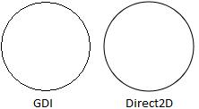

# Overview of the Windows Graphics Architecture

Windows provides several C++/COM APIs for graphics. These APIs are shown in the following diagram.

-   Graphics Device Interface (GDI) is the original graphics interface for Windows. GDI was first written for 16-bit Windows and then updated for 32-bit and 64-bit Windows.
-   GDI+ was introduced in Windows XP as a successor to GDI. The GDI+ library is accessed through a set of C++ classes that wrap flat C functions. The .NET Framework also provides a managed version of GDI+ in the **System.Drawing** namespace.
-   Direct3D supports 3-D graphics.
-   Direct2D is a modern API for 2-D graphics, the successor to both GDI and GDI+.
-   DirectWrite is a text layout and rasterization engine. You can use either GDI or Direct2D to draw the rasterized text.
-   DirectX Graphics Infrastructure (DXGI) performs low-level tasks, such as presenting frames for output. Most applications do not use DXGI directly. Rather, it serves as an intermediate layer between the graphics driver and Direct3D.

Direct2D and DirectWrite were introduced in Windows 7. They are also available for Windows Vista and Windows Server 2008 through a Platform Update. For more information, see [Platform Update for Windows Vista](http://msdn.microsoft.com/library/ee663867(VS.85).aspx).

Direct2D is the focus of this module. While both GDI and GDI+ continue to be supported in Windows, Direct2D and DirectWrite are recommended for new programs. In some cases, a mix of technologies might be more practical. For these situations, Direct2D and DirectWrite are designed to interoperate with GDI.

The next sections describe some of the benefits of Direct2D.

### Hardware Acceleration

The term *hardware acceleration* refers to graphics computations performed by the graphics processing unit (GPU), rather than the CPU. Modern GPUs are highly optimized for the types of computation used in rendering graphics. Generally, the more of this work that is moved from the CPU to the GPU, the better.

While GDI supports hardware accleration for certain operations, many GDI operations are bound to the CPU. Direct2D is layered on top of Direct3D, and takes full advantage of hardware acceleration provided by the GPU. If the GPU does not support the features needed for Direct2D, then Direct2D falls back to software rendering. Overall, Direct2D outperforms GDI and GDI+ in most situations.

### Transparency and Anti-aliasing

Direct2D supports fully hardware-accelerated alpha-blending (transparency).

GDI has limited support for alpha-blending. Most GDI functions do not support alpha blending, although GDI does support alpha blending during a bitblt operation. GDI+ supports transparency, but the alpha blending is performed by the CPU, so it does not benefit from hardware acceleration.

Hardware-accelerated alpha-blending also enables anti-aliasing. *Aliasing* is an artifact caused by sampling a continuous function. For example, when a curved line is converted to pixels, aliasing can cause a jagged appearance.\[3\] Any technique that reduces the artifacts caused by aliasing is considered a form of anti-aliasing. In graphics, anti-aliasing is done by blending edges with the background. For example, here is a circle drawn by GDI and the same circle drawn by Direct2D.

The next image shows a detail of each circle.

The circle drawn by GDI (left) consists of black pixels that approximate a curve. The circle drawn by Direct2D (right) uses blending to create a smoother curve.

GDI does not support anti-aliasing when it draws geometry (lines and curves). GDI can draw anti-aliased text using ClearType; but otherwise, GDI text is aliased as well. Aliasing is particularly noticeable for text, because the jagged lines disrupt the font design, making the text less readable. Although GDI+ supports anti-aliasing, it is applied by the CPU, so the performance is not as good as Direct2D.

### Vector Graphics

Direct2D supports *vector graphics*. In vector graphics, mathematical formulas are used to represent lines and curves. These formulas are not dependent on screen resolution, so they can be scaled to arbitrary dimensions. Vector graphics are particularly useful when an image must be scaled to support different monitor sizes or screen resolutions.

## Next

[The Desktop Window Manager](the-desktop-window-manager.md)

 

 

