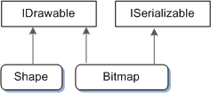

# What Is a COM Interface?

If you know C# or Java, interfaces should be a familiar concept. An *interface* defines a set of methods that an object can support, without dictating anything about the implementation. The interface marks a clear boundary between code that calls a method and the code that implements the method. In computer science terms, the caller is *decoupled* from the implementation.


In C++, the nearest equivalent to an interface is a pure virtual class—that is, a class that contains only pure virtual methods and no other members. Here is a hypothetical example of an interface:

``` syntax
// The following is not actual COM.

// Pseudo-C++:

interface IDrawable
{
    void Draw();
};
```

The idea of this example is that a set of objects in some graphics library are drawable. The `IDrawable` interface defines the operations that any drawable object must support. (By convention, interface names start with "I".) In this example, the `IDrawable` interface defines a single operation: `Draw`.

All interfaces are *abstract*, so a program could not create an instance of an `IDrawable` object as such. For example, the following code would not compile.

``` syntax
IDrawable draw;
draw.Draw();
```

Instead, the graphics library provides objects that *implement* the `IDrawable` interface. For example, the library might provide a shape object for drawing shapes and a bitmap object for drawing images. In C++, this is done by inheriting from a common abstract base class:

``` syntax
class Shape : public IDrawable
{
public:
    virtual void Draw();    // Override Draw and provide implementation.
};

class Bitmap : public IDrawable
{
public:
    virtual void Draw();    // Override Draw and provide implementation.
};
```

The `Shape` and `Bitmap` classes define two distinct types of drawable object. Each class inherits from `IDrawable` and provides its own implementation of the `Draw` method. Naturally, the two implementations might differ considerably. For example, the `Shape::Draw` method might rasterize a set of lines, while `Bitmap::Draw` would blit an array of pixels.

A program using this graphics library would manipulate `Shape` and `Bitmap` objects through `IDrawable` pointers, rather than using `Shape` or `Bitmap` pointers directly.

``` syntax
IDrawable *pDrawable = CreateTriangleShape();

if (pDrawable)
{
    pDrawable->Draw();
}
```

Here is an example that loops over an array of `IDrawable` pointers. The array might contain a heterogeneous assortment of shapes, bitmaps, and other graphics objects, as long as each object in the array inherits `IDrawable`.

``` syntax
void DrawSomeShapes(IDrawable **drawableArray, size_t count)
{
    for (size_t i = 0; i < count; i++)
    {
        drawableArray[i]->Draw();
    }
}
```

A key point about COM is that the calling code never sees the type of the derived class. In other words, you would never declare a variable of type `Shape` or `Bitmap` in your code. All operations on shapes and bitmaps are performed using `IDrawable` pointers. In this way, COM maintains a strict separation between interface and implementation. The implementation details of the `Shape` and `Bitmap` classes can change—for example, to fix bugs or add new capabilities—with no changes to the calling code.

In a C++ implementation, interfaces are declared using a class or structure.

> [!Note]  
> The code examples in this topic are meant to convey general concepts, not real-world practice. Defining new COM interfaces is beyond the scope of this series, but you would not define an interface directly in a header file. Instead, a COM interface is defined using a language called Interface Definition Language (IDL). The IDL file is processed by an IDL compiler, which generates a C++ header file.

 

``` syntax
class IDrawable
{
public:
    virtual void Draw() = 0;
};
```

When you work with COM, it is important to remember that interfaces are not objects. They are collections of methods that objects must implement. Several objects can implement the same interface, as shown with the `Shape` and `Bitmap` examples. Moreover, one object can implement several interfaces. For example, the graphics library might define an interface named `ISerializable` that supports saving and loading graphics objects. Now consider the following class declarations:

``` syntax
// An interface for serialization.
class ISerializable
{
public:
    virtual void Load(PCWSTR filename) = 0;    // Load from file.
    virtual void Save(PCWSTR filename) = 0;    // Save to file.
};

// Declarations of drawable object types.

class Shape : public IDrawable
{
    ...
};

class Bitmap : public IDrawable, public ISerializable
{
    ...
};
```

In this example, the `Bitmap` class implements `ISerializable`. The program could use this method to save or load the bitmap. However, the `Shape` class does not implement `ISerializable`, so it does not expose that functionality. The following diagram shows the inheritance relations in this example.



This section has examined the conceptual basis of interfaces, but so far we have not seen actual COM code. We'll start with the first thing that any COM application must do: Initialize the COM library.

## Next

[Initializing the COM Library](initializing-the-com-library.md)

 

 


