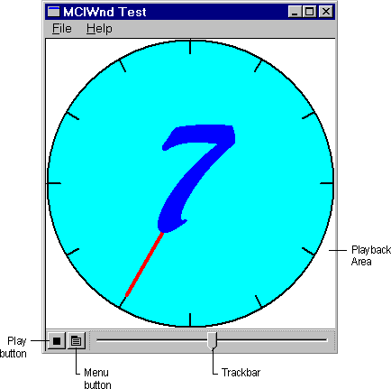

# MCIWnd Window User Interface

MCIWnd provides additional features to adjust the look of the MCIWnd window, customize the behavior of your application, and tune playback performance. The following features are included in the MCIWnd window:

-   A toolbar with **Play**, **Stop**, **Record** and **Menu** buttons
-   A trackbar that controls positioning within the playback content
-   A pop-up menu containing common commands
-   A playback area for video and other devices that display images

The following illustration shows the initial state of user-controlled video playback. The sample file used is CLOCK.AVI.

The MCIWnd window includes a playback area for video and other devices that display images during playback. MCIWnd omits the playback area from waveform-audio devices, MIDI sequencers, and other devices that do not write to the display. The following illustration shows the waveform-audio playback area.

The **Play** button is located in the lower-left corner of the MCIWnd window. It appears when the content is stopped. The user can play the content in the following ways:

-   To play the content from the current playback position, select the **Play** button.
-   To play the content full-screen from the current playback position, select the **Play** button while holding down the CTRL key.
-   To play the content backward from the current playback position, select the **Play** button while holding down the SHIFT key.

The **Menu** button, located next to the **Play** button, activates a menu that allows the user to open and close audio-video interleaved (AVI) files, and to adjust the image size, playback speed, and volume. (The user can also activate the menu by clicking the right mouse button whenever the cursor is in the client area of the window.) The menu also includes commands to change the configuration of the current device, to copy the playback content to the clipboard, and to issue MCI commands.

The trackbar to the right of the **Menu** button represents the duration of the playback (or recorded) content. The slider on the trackbar represents the current playback position within the content. When the slider is positioned at the left end of the trackbar, the current playback position is the beginning of the content. The user can move to different locations in the content by dragging the slider along the trackbar. The **Stop** button is located in the lower-left corner of the MCIWnd window. It appears when the content is played. The following illustration shows video playback in progress.

The MCIWnd controls can also include a **Record** button for devices that can record. The **Record** button is marked with a red circle and appears only when the device is capable of recording.

> [!Note]  
> The playback window must be aligned on a four-pixel boundary for the best video playback performance. Typically, Windows aligns the window automatically when it is created. If a user moves or stretches the window from its initial position, video playback speed might be reduced by half.

 

 

 

