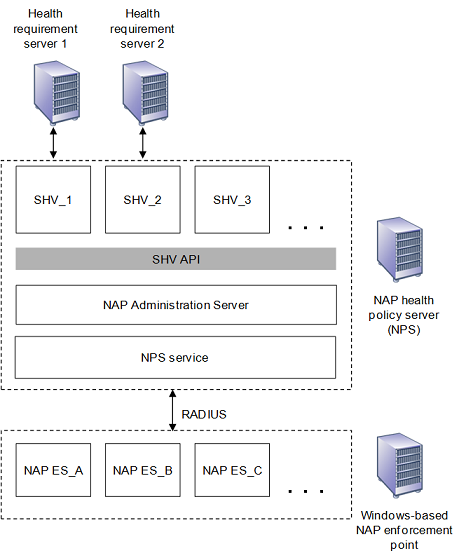
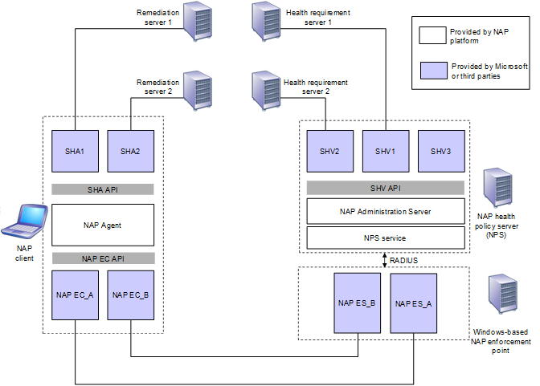

# NAP Server-side Architecture

> [!Note]  
> The Network Access Protection platform is not available starting with Windows 10

 

The NAP server-side platform architecture uses computers running Windows Server 2008. The following figure shows the architecture of the server-side support for the NAP platform, consisting of Windows-based NAP enforcement points and a NAP health policy server.

A Windows-based NAP enforcement point has a layer of NAP Enforcement Server (ES) components. Each NAP ES is defined for a different type of network access or communication. For example, there is a NAP ES for remote access VPN connections and a NAP ES for DHCP configuration. The NAP ES is typically matched to a specific type of NAP-capable client. For example, the DHCP NAP ES is designed to work with a DHCP-based NAP Enforcement Client (EC). Third-party software vendors or Microsoft can provide additional NAP ESs for the NAP platform. A NAP ES obtains the System Statement of Health (SSoH) from its corresponding NAP EC and sends it to an NAP health policy server as a Remote Authentication Dial-in User Service (RADIUS) vendor-specific attribute (VSA) of [RADIUS Access-Request message](http://go.microsoft.com/fwlink/p/?linkid=101218)

As shown in server-side architecture figure, the NAP health policy server has the following components:

-   Network Policy Server (NPS) Service

    Receives the RADIUS Access-Request message, extracts the SSoH, and passes it to the NAP Administration Server component. The NPS service is provided with Windows Server 2008.

-   NAP Administration Server

    Facilitates communication between the NPS service and the System Health Validators (SHVs). The NAP Administration Server component is provided with the NAP platform.

-   A layer of SHV components

    Each SHV is defined for one or multiple types of system health information and can be matched to an SHA. For example, there could be an SHV for an antivirus program. An SHV could be matched to one or multiple health requirement servers. For example, an SHV for checking antivirus signatures is matched to the server that contains the latest signature file. SHVs do not have to have a corresponding health requirement server. An SHV can just instruct NAP-capable clients to check local system settings to ensure that a host-based firewall is enabled. Windows Server 2008 includes the Windows Security Health Validator (WSHV). Additional SHVs are provided by third-party software vendors or by Microsoft as add-ons to the NAP platform.

-   SHV API

    Provides a set of function calls that allow SHVs to register with the NAP Administration Server component, receive Statements of Health (SoHs) from the NAP Administration Server component, and send Statement of Health Responses (SoHRs) to the NAP Administration Server component. The SHV API is provided with the NAP platform. See the following NAP interfaces: [**INapSystemHealthValidator**](inapsystemhealthvalidator.md) and [**INapSystemHealthValidationRequest**](inapsystemhealthvalidationrequest.md).

As previously described, the more common configuration for NAP server-side infrastructure consists of NAP enforcement points providing network access or communication of a specific type and separate NPS health policy servers providing system health validation and remediation. It is possible to install the NPS service as a NAP health policy server on individual Windows-based NAP enforcement points. However, in this configuration, each NAP enforcement point must then be separately configured with network access and health policies. The recommended configuration is to use separate NAP health policy servers.

The overall NAP architecture consists of the following sets of components:

-   The three NAP client components (an SHA layer, the NAP Agent, and a NAP EC layer).
-   The four NAP server-side components (an SHV layer, the NAP Administration Server, the NPS service, and a NAP ES layer on Windows-based NAP enforcement points).
-   Health requirement severs, which are computers that can provide current system health requirements for NAP health policy servers.
-   Remediation servers, which are computers that contain health update resources that NAP clients can access to remediate their noncompliant state.

The following figure shows the relationships between the components of the NAP platform.

Notice the matching of the following sets of components:

-   NAP ECs and NAP ESs are typically matched.

    For example, the DHCP NAP EC on the NAP client is matched to the DHCP NAP ES on the DHCP server.

-   SHA and remediation servers can be matched.

    For example, an antivirus SHA on the client is matched to an antivirus signature remediation server.

-   SHVs and health requirement servers can be matched.

    For example, an antivirus SHV on the NAP health policy server can be matched to an antivirus health requirement server.

Third-party software vendors can extend the NAP platform in the following ways:

-   Create a new method by which the health of a NAP client is evaluated.

    Third-party software vendors must create an SHA for the NAP client, an SHV for the NAP health policy server, and, if needed, health requirement and remediation servers. If the health requirement or remediation servers already exist, such as an antivirus signature distribution server, then only the corresponding SHA and SHV components need to be created. In some cases, health requirement or remediation servers are not needed.

-   Create a new method for enforcing health requirements for network access or communication.

    Third-party software vendors must create a NAP EC on the NAP client. If the enforcement method uses a Windows-based service, third-party software vendors must create a corresponding NAP ES that communicates with a NAP health policy server using the RADIUS protocol or by using the NPS service installed on the NAP enforcement point as a RADIUS proxy.

The following sections describe the components of the NAP server-side architecture in further detail.

## NAP Enforcement Server

A NAP Enforcement Server (ES) allows some level of network access or communication, can pass a NAP client's health status to the network health policy server for evaluation, and, based on the response, can provide the enforcement of limited network access.

The NAP ESs included with Windows Server 2008 are the following:

-   An IPsec NAP ES for IPsec-protected communications.

    For IPsec-protected communication, the Health Registration Authority (HRA), a computer running Windows Server 2008 and Internet Information Services (IIS) that obtains health certificates from a certification authority (CA) for compliant computers, passes the NAP client's health status information to the NAP health policy server.

-   A DHCP NAP ES for DHCP-based IP address configuration.

    The DHCP NAP ES is functionality in the DHCP Server service that uses industry standard DHCP messages to communicate with the DHCP NAP EC on a NAP client. DHCP enforcement for limited network access is done through DHCP options.

-   A Terminal Services (TS) Gateway NAP ES for TS Gateway server-based connections.

For remote access VPN and 802.1X-authenticated connections, functionality in the NPS service uses PEAP-TLV messages between NAP clients and the NAP health policy server. VPN enforcement is done through IP packet filters that are applied to the VPN connection. 802.1X enforcement is done at the 802.1X network access device by applying IP packet filters to the connection or by assigning the connection a VLAN ID corresponding to the restricted network.

## NAP Administration Server

The NAP Administration Server component provides the following services:

-   Obtains the SSoHs from the NAP ES through the NPS service.
-   Distributes the SoHs in the SSoHs to the appropriate System Health Validators (SHV).
-   Collects SoHRs from the SHVs and passes them to NPS service for evaluation.

## NPS Service

RADIUS is a widely deployed protocol enabling centralized authentication, authorization, and accounting for network access that is described in Requests for Comments (RFCs) 2865 and 2866. Originally developed for dial-up remote access, RADIUS is now supported by wireless access points, authenticating Ethernet switches, VPN servers, Digital Subscriber Line (DSL) access servers, and other network access servers.

NPS is the implementation of a RADIUS server and proxy in Windows Server 2008. NPS replaces the Internet Authentication Service (IAS) in Windows Server 2003. For the NAP platform, the NPS service includes the NAP Administrator Server component, support for the SHV API and installable SHVs, and options for configuring health policies.

Based on the SoHRs from the SHVs and the configured health policies, the NPS service creates a System Statement of Health Response (SSoHR), which indicates whether the NAP client is compliant or noncompliant and includes the set of SoHRs from the SHVs.

## System Health Validator (SHV)

An SHV receives a SoH from the NAP Administration Server and compares the system health status information with the required system health state. For example, if the SoH is from an antivirus SHA and contains the version number of the last virus signature file, the corresponding antivirus SHV can check with the antivirus health requirement server for the latest version number to validate the NAP client's SoH.

The SHV returns an SoHR to the NAP Administration Server. The SoHR can contain information about how the corresponding SHA on the NAP client can meet current system health requirements. For example, the SoHR sent by the antivirus SHV could instruct the antivirus SHA on the NAP client to request the latest version of the antivirus signature file from a specific antivirus signature server by name or IP address.

 

 

