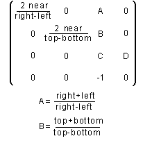

# glFrustum function

The **glFrustum** function multiplies the current matrix by a perspective matrix.

## Syntax


```C++
void WINAPI glFrustum(
   GLdouble left,
   GLdouble right,
   GLdouble bottom,
   GLdouble top,
   GLdouble zNear,
   GLdouble zFar
);
```


## Parameters

<dl> <dt>

*left* 
</dt> <dd>

The coordinate for the left-vertical clipping plane.

</dd> <dt>

*right* 
</dt> <dd>

The coordinate for the right-vertical clipping plane.

</dd> <dt>

*bottom* 
</dt> <dd>

The coordinate for the bottom-horizontal clipping plane.

</dd> <dt>

*top* 
</dt> <dd>

The coordinate for the bottom-horizontal clipping plane.

</dd> <dt>

*zNear* 
</dt> <dd>

The distances to the near-depth clipping plane. Must be positive.

</dd> <dt>

*zFar* 
</dt> <dd>

The distances to the far-depth clipping planes. Must be positive.

</dd> </dl>

## Return value

This function does not return a value.

## Error codes

The following error codes can be retrieved by the [**glGetError**](glgeterror.md) function.


| Name                                                                                                  | Meaning                                                                                                                               |
|-------------------------------------------------------------------------------------------------------|---------------------------------------------------------------------------------------------------------------------------------------|
| <dl> <dt>**GL\_INVALID\_ENUM**</dt> </dl>      | *zNear* or *zFar* was not postitive.<br/>                                                                                       |
| <dl> <dt>**GL\_INVALID\_OPERATION**</dt> </dl> | The function was called between a call to [**glBegin**](glbegin.md) and the corresponding call to [**glEnd**](glend.md).<br/> |


## Error codes

The following error codes can be retrieved by the [**glGetError**](glgeterror.md) function.


| Name                                                                                                  | Meaning                                                                                                                               |
|-------------------------------------------------------------------------------------------------------|---------------------------------------------------------------------------------------------------------------------------------------|
| <dl> <dt>**GL\_INVALID\_ENUM**</dt> </dl>      | *zNear* or *zFar* was not postitive.<br/>                                                                                       |
| <dl> <dt>**GL\_INVALID\_OPERATION**</dt> </dl> | The function was called between a call to [**glBegin**](glbegin.md) and the corresponding call to [**glEnd**](glend.md).<br/> |


## Remarks

The **glFrustum** function describes a perspective matrix that produces a perspective projection. The (*left*, *bottom*, *zNear*) and (*right*, *top*, *zNear*) parameters specify the points on the near clipping plane that are mapped to the lower-left and upper-right corners of the window, respectively, assuming that the eye is located at (0,0,0). The *zFar* parameter specifies the location of the far clipping plane. Both *zNear* and *zFar* must be positive. The corresponding matrix is shown in the following image.



The **glFrustum** function multiplies the current matrix by this matrix, with the result replacing the current matrix. That is, if M is the current matrix and F is the frustum perspective matrix, then **glFrustum** replaces M with M   F.

Use [**glPushMatrix**](glpushmatrix.md) and [**glPopMatrix**](glpopmatrix.md) to save and restore the current matrix stack.

Depth-buffer precision is affected by the values specified for *zNear* and *zFar*. The greater the ratio of *zFar* to *zNear* is, the less effective the depth buffer will be at distinguishing between surfaces that are near each other. If


roughly *log*2 (*r*) bits of depth buffer precision are lost. Because *r* approaches infinity as *zNear* approaches zero, you should never set *zNear* to zero.

The following functions retrieve information about **glFrustum**:

[**glGet**](glgetbooleanv--glgetdoublev--glgetfloatv--glgetintegerv.md) with argument GL\_MATRIX\_MODE

**glGet** with argument GL\_MODELVIEW\_MATRIX

**glGet** with argument GL\_PROJECTION\_MATRIX

**glGet** with argument GL\_TEXTURE\_MATRIX

## Requirements


|                                     |                                                                                         |
|-------------------------------------|-----------------------------------------------------------------------------------------|
| Minimum supported client<br/> | Windows 2000 Professional \[desktop apps only\]<br/>                              |
| Minimum supported server<br/> | Windows 2000 Server \[desktop apps only\]<br/>                                    |
| Header<br/>                   | <dl> <dt>Gl.h</dt> </dl>         |
| Library<br/>                  | <dl> <dt>Opengl32.lib</dt> </dl> |
| DLL<br/>                      | <dl> <dt>Opengl32.dll</dt> </dl> |


## See also

<dl> <dt>

[**glBegin**](glbegin.md)
</dt> <dt>

[**glEnd**](glend.md)
</dt> <dt>

[**glGet**](glgetbooleanv--glgetdoublev--glgetfloatv--glgetintegerv.md)
</dt> <dt>

[**glMatrixMode**](glmatrixmode.md)
</dt> <dt>

[**glMultMatrix**](glmultmatrix.md)
</dt> <dt>

[**glOrtho**](glortho.md)
</dt> <dt>

[**glPopMatrix**](glpopmatrix.md)
</dt> <dt>

[**glPushMatrix**](glpushmatrix.md)
</dt> <dt>

[**glViewport**](glviewport.md)
</dt> </dl>

 

 


