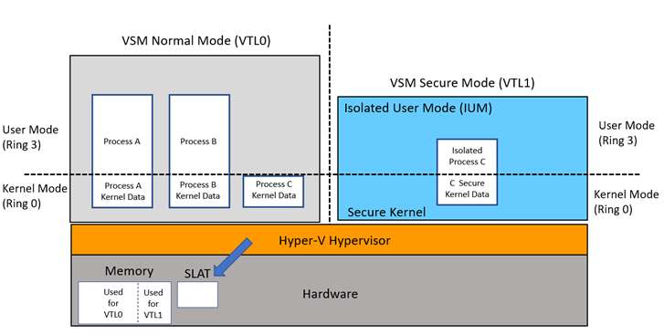
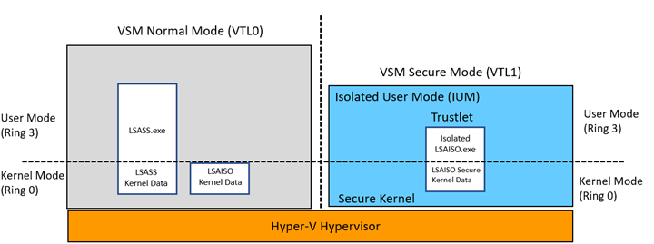

# Isolated User Mode (IUM) Processes

Windows 10 introduced a new security feature named Virtual Secure Mode (VSM). VSM leverages the Hyper-V Hypervisor and Second Level Address Translation (SLAT) to create a set of modes called Virtual Trust Levels (VTLs). This new software architecture creates a security boundary to prevent processes running in one VTL from accessing the memory of another VTL. The benefit of this isolation includes additional mitigation from kernel exploits while protecting assets such as password hashes and Kerberos keys.

Diagram 1 depicts the traditional model of Kernel mode and User mode code running in CPU ring 0 and ring 3, respectively. In this new model, the code running in the traditional model executes in VTL0 and it cannot access the higher privileged VTL1, where the Secure Kernel and Isolated User Mode (IUM) execute code. The VTLs are hierarchal meaning any code running in VTL1 is more privileged than code running in VTL0.

The VTL isolation is created by the Hyper-V Hypervisor which assigns memory at boot time using Second Level Address Translation (SLAT). It continues this dynamically as the system runs, protecting memory the Secure Kernel specifies needing protection from VTL0 because it will be used to contain secrets. As separate blocks of memory are allocated for the two VTLs, a secure runtime environment is created for VTL1 by assigning exclusive memory blocks to VTL1 and VTL0 with the appropriate access permissions.

**Diagram 1 - IUM Architecture**



## Trustlets

Trustlets, short for trusted processes, are programs running as IUM processes in VSM Secure Mode. They complete system calls by marshalling them over to the Windows kernel running in VTL0 ring 0. VSM creates a small execution environment including the small Secure Kernel executing in VTL1 which is isolated from the kernel and drivers running in VTL0. The clear security benefit is isolation of trustlet user mode pages in VTL1 from drivers running in the VTL0 kernel. Even if kernel mode of VTL0 is compromised by malware, it will not have access to the IUM process pages. Trustlets are also referred to as secure processes or IUM processes.

With VSM enabled, the Local Security Authority (LSASS) environment runs as a trustlet. LSASS manages the local system policy, user authentication, and auditing while handling sensitive security data such as password hashes and Kerberos keys. To leverage the security benefits of VSM, a trustlet named LSAISO.exe (LSA Isolated) runs in VTL1 and communicates with LSASS.exe running in VTL0 through a RPC channel. The LSASIO secrets are encrypted before sending them over to LSASS running in VSM Normal Mode and the pages of LSAISO are protected from malicious code running in VTL0.

**Diagram 2 – LSASS Trustlet Design**



## Isolated User Mode (IUM) Implications

It is not possible to attach to a IUM process, inhibiting the ability to debug VTL1 code. This includes post mortem debugging of memory dumps and attaching the Debugging Tools for live debugging. It also includes attempts by privileged accounts or kernel drivers to load a DLL into an IUM process, to inject a thread, or deliver a user-mode APC. Such attempts may result in destabilization of the entire system. Windows APIs that would compromise the security of a Trustlet may fail in unexpected ways. For example, loading a DLL into a Trustlet will make it available in VTL0 but not VTL1. QueueUserApc may silently fail if the target thread is in a Trustlet. Other APIs, such as CreateThread, VirtualAlloc, and Read/WriteProcessMemory will also not work as expected when used against Trustlets.

Use the sample code below to prevent calling any functions which attempt to attach or inject code into a IUM process. This includes kernel drivers that queue APCs for execution of code in a trustlet.

## Remarks

If the return status of IsSecureProcess is success, examine the SecureProcess \_Out\_ parameter to determine if the process is an IUM process. IUM processes are marked by the system to be “Secure Processes”. A Boolean result of TRUE means the target process is of type IUM.


```C++
NTSTATUS
IsSecureProcess(
   _In_ HANDLE ProcessHandle,
   _Out_ BOOLEAN *SecureProcess
   )
{
   NTSTATUS status;

       // definition included in ntddk.h  
   PROCESS_EXTENDED_BASIC_INFORMATION extendedInfo = {0};
 
   PAGED_CODE(); 
  
   extendedInfo.Size = sizeof(extendedInfo);

   // Query for the process information  
   status = ZwQueryInformationProcess(
                  ProcessHandle, ProcessBasicInformation, &amp;extendedInfo,
                  sizeof(extendedInfo), NULL);

   if (NT_SUCCESS(status)) {
      *SecureProcess = (BOOLEAN)(extendedInfo.IsSecureProcess != 0);
   }
 
          return status;
}
```


The WDK for Windows 10, “Windows Driver Kit - Windows 10.0.15063.0”, contains the required definition of the PROCESS\_EXTENDED\_BASIC\_INFORMATION structure. The updated version of the structure is defined in ntddk.h with the new IsSecureProcess field.


```C++
typedef struct _PROCESS_EXTENDED_BASIC_INFORMATION {
    SIZE_T Size;    // Ignored as input, written with structure size on output
    PROCESS_BASIC_INFORMATION BasicInfo;
    union {
        ULONG Flags;
        struct {
            ULONG IsProtectedProcess : 1;
            ULONG IsWow64Process : 1;
            ULONG IsProcessDeleting : 1;
            ULONG IsCrossSessionCreate : 1;
            ULONG IsFrozen : 1;
            ULONG IsBackground : 1;
            ULONG IsStronglyNamed : 1;
            ULONG IsSecureProcess : 1;
            ULONG IsSubsystemProcess : 1;
            ULONG SpareBits : 23;
        } DUMMYSTRUCTNAME;
    } DUMMYUNIONNAME;
} PROCESS_EXTENDED_BASIC_INFORMATION, *PPROCESS_EXTENDED_BASIC_INFORMATION;
```


 

 


