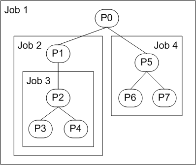
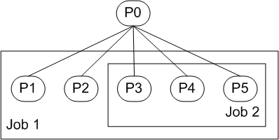

# Nested Jobs

An application can use nested jobs to manage subsets of processes. Nested jobs also enable an application that uses jobs to host other applications that also use jobs.

**Windows 7, Windows Server 2008 R2, Windows XP with SP3, Windows Server 2008, Windows Vista and Windows Server 2003:** A process can be associated with only a single job. Nested jobs were introduced in Windows 8 and Windows Server 2012.

This topic provides an overview of job nesting and behavior of nested jobs:

-   [Nested Job Hierarchies](#nested-job-hierarchies)
-   [Creating a Nested Job Hierarchy](#creating-a-nested-job-hierarchy)
-   [Job Limits and Notifications for Nested Jobs](#job-limits-and-notifications-for-nested-jobs)
-   [Resource Accounting for Nested Jobs](#resource-accounting-for-nested-jobs)
-   [Termination of Nested Jobs](#termination-of-nested-jobs)

For general information about jobs and job objects, see [Job Objects](job-objects.md).

## Nested Job Hierarchies

Nested jobs have a parent-child relationship in which each child job contains a subset of the processes in its parent job. If a process that is already in a job is added to another job, the jobs are nested by default if the system can form a valid job hierarchy and neither job sets UI limits ([**SetInformationJobObject**](https://msdn.microsoft.com/en-us/library/ms686216(v=VS.85).aspx) with **JobObjectBasicUIRestrictions**).

Figure 1 shows a job hierarchy that contains a tree of processes labeled P0 through P7. Job 1 is the *parent job* of Job 2 and Job 4, and it is an *ancestor* of Job 3. Job 2 is the *immediate parent* of Job 3; Job 3 is the *immediate child* of Job 2. Jobs 1, 2, and 3 form a *job chain* in which Jobs 1 and 2 are the *parent job chain* of Job 3. The end job in a job chain is the *immediate job* of the processes in that job. In Figure 1, Job 3 is the immediate job of processes P2, P3, and P4.

Nested jobs can also be used to manage groups of peer processes. In the job hierarchy shown in Figure 2, Job 1 is the parent job of Job 2. Note that a job hierarchy might contain only part of a process tree. In Figure 2, P0 is not in the hierarchy, but its child processes P1 through P5 are.

## Creating a Nested Job Hierarchy

Processes in a job hierarchy are either explicitly associated with a job object using the [**AssignProcessToJobObject**](https://msdn.microsoft.com/en-us/library/ms681949(v=VS.85).aspx) function or implicitly associated during process creation, same as for standalone jobs. The order in which jobs are created and processes are assigned determines whether a hierarchy can be created.

To build a job hierarchy using explicit association, all job objects must be created using [**CreateJobObject**](/windows/desktop/api/WinBase/nf-winbase-createjobobjecta), then [**AssignProcessToJobObject**](https://msdn.microsoft.com/en-us/library/ms681949(v=VS.85).aspx) must be called multiple times for each process to associate the process with each job it should belong to. To ensure that the job hierarchy is valid, first assign all processes to the job at the root of the hierarchy, then assign a subset of processes to the immediate child job object, and so on. If processes are assigned to jobs in this order, a child job will always have a subset of processes in its parent job while the hierarchy is being created, which is required for nesting. If processes are assigned to jobs in random order, at some point a child job will have processes that are not in its parent job. This is not allowed by nesting and it will cause **AssignProcessToJobObject** to fail.

When processes are implicitly associated with a job during process creation, a child process is associated with every job in the job chain of its parent process. If the immediate job object allows breakaway, the child process breaks away from the immediate job object and from each job in the parent job chain, moving up the hierarchy until it reaches a job that does not permit breakaway. If the immediate job object does not allow breakaway, the child process does not break away even if jobs in its parent job chain allow it.

## Job Limits and Notifications for Nested Jobs

For certain resource limits, the limit set for jobs in a parent job chain determine the *effective limit* that is enforced for a child job. The effective limit for child job can be more restrictive than the limit of its parent, but it cannot be less restrictive. For example, if a child job's priority class is ABOVE\_NORMAL\_PRIORITY\_CLASS and its parent job's priority class is NORMAL\_PRIORITY\_CLASS, the effective limit for processes in the child job is NORMAL\_PRIORITY\_CLASS. However, if the child job's priority class is BELOW\_NORMAL\_PRIORITY\_CLASS, the effective limit for processes in the child job is BELOW\_NORMAL\_PRIORITY\_CLASS. Effective limits are enforced for priority class, affinity, commit charge, per-process execution time limit, scheduling class limit, and working set minimum and maximum. For more information about specific resource limits, see [**SetInformationJobObject.**](https://msdn.microsoft.com/en-us/library/ms686216(v=VS.85).aspx)

When certain events occur, such as new process creation or resource limit violation, a message is sent to the I/O completion port associated with a job. A job can also register to receive notifications when certain limits are exceeded. For a non-nested job, the message is sent to the I/O completion port associated with the job. For a nested job, the message is sent to every I/O completion port associated with any job in the parent job chain of the job that triggered the message. A child job does not need to have an associated I/O completion port for messages it triggers to be sent to the I/O completion ports of parent jobs higher in the job chain. For more information about specific messages, see [**JOBOBJECT\_ASSOCIATE\_COMPLETION\_PORT**](/windows/desktop/api/WinNT/ns-winnt-_jobobject_associate_completion_port).

## Resource Accounting for Nested Jobs

Resource accounting information for a nested job describes the usage of every process associated with that job, including processes in child jobs. Each job in a job chain therefore represents the aggregated resources used by its own processes and the processes of every child job below it in the job chain.

## Termination of Nested Jobs

When a job in a job hierarchy is terminated, the system terminates processes in that job and all of its child jobs, starting with the child job at the bottom of the hierarchy. Outstanding resources used by each terminated process are charged to the parent job.

The job handle must have the JOB\_OBJECT\_TERMINATE access right, same as for standalone jobs.

 

 

