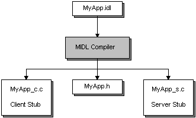

# Developing the Interface

An RPC interface describes the remote functions that the server program implements. The interface ensures that the client and server communicate using the same rules when the client invokes a remote procedure that the server offers. An interface consists of an interface name, some attributes, optional type or constant definitions, and a set of procedure declarations. Each procedure declaration must contain a procedure name, return type, and parameter list.

Interfaces are defined in the Microsoft Interface Definition Language (MIDL). If you are familiar with C or C++, MIDL interface definitions will seem fairly straightforward. MIDL resembles C and C++ in many ways.

When developing an RPC application, a text editor is used to define the interface and store it in a text file with an .idl extension. For more information, see [The IDL and ACF Files](the-idl-and-acf-files.md). The MIDL compiler generates a header file that your program includes in the client and server source files. The MIDL compiler also generates two C source files. You compile and link one of these to your client program, and the other to your server program. These two C source files are the client and server stubs. For an overview of the client and server stubs, see [How RPC Works](how-rpc-works.md). For an overview on the MIDL compiler, see [Compiling a MIDL File](https://www.bing.com/search?q=Compiling a MIDL File).

By default, the client and server stub have the same name, which can cause problems if the client links with the server stub, or vice-versa. Using the MIDL [**/prefix**](https://msdn.microsoft.com/library/windows/desktop/aa367360) option prevents this common error from occurring.

The following illustration shows the process of creating an interface.

It is possible that you will also need to specify an application configuration file (ACF) for input to the MIDL compiler as well. For more information on application configuration files, see [The IDL and ACF Files](the-idl-and-acf-files.md).

In addition to the MIDL compiler, you will typically need to use the Uuidgen utility to generate a Universal Unique Identifier (UUID, interchangeable with the term GUID). This section presents information on both of these tools, divided into the following topics:

-   [Generating Interface UUIDs](generating-interface-uuids.md)
-   [Using MIDL](using-midl.md)

 

 

