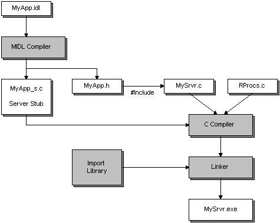

# Developing the Server

When you create a server program for a distributed application, you must use the header file and server stub that the MIDL compiler generates. For details, see [Developing the Interface](developing-the-interface.md). Include the header file in your server C program file. Compile the server stub with the C source files that compose your application. Link the resulting object files together with the import library. This process is illustrated in the following diagram.

As you can see from the example in the illustration, a MIDL file called MyApp.idl was used to define the interface. The MIDL compiler used MyApp.idl to produce MyApp\_s.c and MyApp.h. It also produces a C source file for the client stub, but that is not relevant to this particular discussion. The C source file for the server program (in this case, Mysrvr.c) must include the file Myapp.h. It will also need to include the files Rpc.h and Rpcndr.h.

The server application was developed in two files, Mysrvr.c and Rprocs.c. The file Mysrvr.c contains the functions necessary for getting the server program up and running. The remote procedures that the server program offers are contained in the file Rprocs.c.

The files Mysrvr.c and Rprocs.c were compiled together with Myapp\_s.c to produce object files. The object files were then linked with the RPC run-time library, and any other libraries that they might need. The result is an executable server program named Mysrvr.exe.

If you do not compile your IDL file in Open Software Foundation (OSF) compatibility mode ([**/osf**](https://msdn.microsoft.com/library/windows/desktop/aa367357)), your server program must provide a function for allocating memory and a function for deallocating it. For Windows 2000 and later versions of Windows, the recommended mode is [**/Oicf**](https://msdn.microsoft.com/library/windows/desktop/aa367352). For details, see [How Memory Is Allocated and Deallocated](how-memory-is-allocated-and-deallocated.md), and [Pointers and Memory Allocation](pointers-and-memory-allocation.md).

 

 

