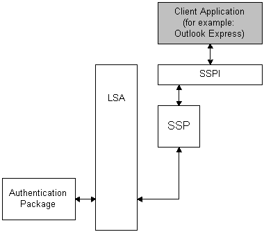

# Noninteractive Authentication

Noninteractive authentication can only be used after an [interactive authentication](interactive-authentication.md) has taken place. During noninteractive authentication, the user does not input [*logon data*](https://www.bing.com/search?q=*logon data*), instead, previously established [*credentials*](https://www.bing.com/search?q=*credentials*) are used.

Noninteractive authentication is performed when an application uses the [*Security Support Provider Interface*](https://www.bing.com/search?q=*Security Support Provider Interface*) (SSPI) and a security package to establish a secure network connection. Noninteractive authentication is the mechanism at work when a user connects to multiple machines on a network without having to re-enter logon information for each machine. For example, if an application needs to open a secure folder on a remote machine and the application user is already interactively logged on to a domain account, the application does not require the user to supply logon data again. Instead, the application can request a noninteractive authentication by using SSPI to pass the previously established security information to a security package. The security package then uses LSA functions to check the [*credentials*](https://www.bing.com/search?q=*credentials*). The following diagram illustrates this procedure.

In the preceding diagram, the client application initiates a call to SSPI to request an authenticated network connection. SSPI passes the client's request to a security package for processing. The security package authenticates the user by calling the [*Local Security Authority*](https://www.bing.com/search?q=*Local Security Authority*) (LSA) and specifying an [*authentication package*](https://www.bing.com/search?q=*authentication package*) and providing the user's existing credentials.

The authentication result is passed from the [*authentication package*](https://www.bing.com/search?q=*authentication package*), through the LSA, to the [*security package*](https://www.bing.com/search?q=*security package*), and finally to SSPI. SSPI notifies the client application about the outcome of the request.

For more information about SSPI, see [Security Support Provider Interface](sspi.md).

 

 

