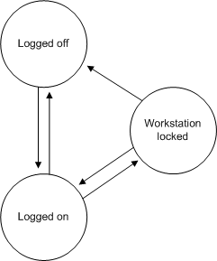

# Winlogon States

[*Winlogon*](security.w_gly#-security-winlogon-gly) maintains the workstation state that is used by the [*GINA*](security.g_gly#-security-gina-gly) to determine what authentication actions are required.

At any point in time, Winlogon is in one of three states:

-   [Logged-Off State](#logged-off-state)
-   [Logged-On State](#logged-on-state)
-   [Workstation-Locked State](#workstation-locked-state)

These three states are shown in the following illustration.

## Logged-Off State

When Winlogon is in the logged-off state, users are prompted to identify themselves and provide authentication information. If a user provides correct user account information and no restrictions prevent it, the user is logged on and a shell program (such as Windows Explorer) is executed in the application desktop. Winlogon changes to the logged-on state.

## Logged-On State

When Winlogon is in the logged-on state, users can interact with the shell, activate additional applications, and do their work. From the logged-on state, users can either stop all work and log off, or lock their workstations (leaving all work in place). If the user decides to log off, Winlogon will terminate all processes associated with that [*logon session*](security.l_gly#-security-logon-session-gly) and the workstation will be available for another user. If, instead, the user decides to lock the workstation, Winlogon changes to the workstation-locked state.

## Workstation-Locked State

When Winlogon is in the workstation-locked state, a secure desktop is displayed until the user unlocks the workstation by providing the same identification and authentication information as the user who originally logged on, or until an administrator forces a logoff. If the workstation is unlocked, the application desktop is displayed, and work can resume. If, however, an administrator unlocks the workstation (by providing the identification and authentication information of an administrator account), the processes of the logged-on user are terminated, and Winlogon changes to the logged-off state.

A number of different actions can be performed in each of the Winlogon states. A GINA DLL may implement actions that are not part of the standard Windows operating system. For example, a high security system could automatically lock a workstation every 10 minutes and force users to reauthenticate themselves.

For information about creating desktops and registering a [*secure attention sequence*](security.s_gly#-security-secure-attention-sequence-gly) (SAS), see [Initializing Winlogon](initializing-winlogon.md). For information about time-out operations, see [Supported Dialog Box Service Time-out Operations](supported-dialog-box-service-time-out-operations.md). For information about sending messages to the GINA while a dialog box is displayed, see [Sending Messages to the GINA](sending-messages-to-the-gina.md). For information about support functions, see [Winlogon Support Functions](authentication-functions.md#winlogon-support-functions).

 

 

