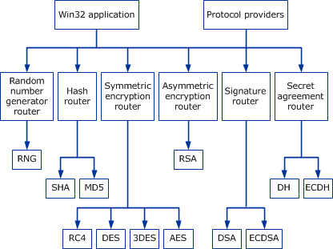

# Cryptographic Primitives

The CNG API provides a set of functions that perform basic cryptographic operations such as creating hashes or encrypting and decrypting data. For more information about these functions, see [CNG Cryptographic Primitive Functions](cng-cryptographic-primitive-functions.md).

CNG implements numerous cryptographic algorithms. Each algorithm or class of algorithms exposes its own primitive API. Multiple implementations of a given algorithm can be installed at the same time; however, only one implementation will be the default at any given time.

Each algorithm class in CNG is represented by a primitive router. Applications using the CNG primitive functions will link to the router binary file—Bcrypt.dll in user mode, or Ksecdd.sys in kernel mode—before calling the functions. Various router routines manage all of the algorithm primitives. These routers track each algorithm implementation installed on the system and route each function call to the appropriate primitive provider module.

CNG provides primitives for the following classes of algorithms.

| Algorithm class                                                                                                                                                  | Description                                                                                                  |
|------------------------------------------------------------------------------------------------------------------------------------------------------------------|--------------------------------------------------------------------------------------------------------------|
| Random number generator  | Pluggable random number generation (RNG).                                                          |
| Hashing                                                                  | Algorithms used for hashing, such as SHA1 and SHA2.                                                |
| Symmetric encryption              | Algorithms used for symmetric encryption, such as AES, 3DES, and RC4.                              |
| Asymmetric encryption          | Asymmetric (public key) algorithms that support encryption, such as RSA.                           |
| Signature                                                          | Signature algorithms such as DSA and ECDSA. This class can also be used with RSA.                  |
| Secret agreement                              | Secret agreement algorithms such as Diffie-Hellman (DH) and elliptic curve Diffie-Hellman (ECDH).  |

 

The following illustration shows the design and function of the CNG cryptographic primitives.

The header file Bcrypt.h defines the **MS\_PRIMITIVE\_PROVIDER** constant as "Microsoft Primitive Provider". To use the Microsoft Primitive Provider, pass this value to [**BCryptOpenAlgorithmProvider**](bcryptopenalgorithmprovider-func.md).

 

 

