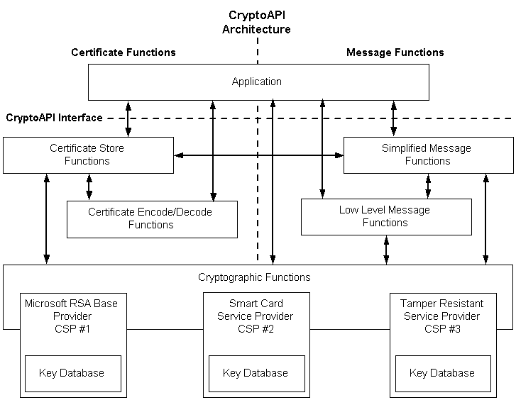

# CryptoAPI System Architecture

The CryptoAPI system architecture is composed of five major functional areas:

-   [Base Cryptographic Functions](#base-cryptographic-functions)
-   [Certificate Encode/Decode Functions](#certificate-encodedecode-functions)
-   [Certificate Store Functions](#certificate-store-functions)
-   [Simplified Message Functions](#simplified-message-functions)
-   [Low-level Message Functions](#low-level-message-functions)

## Base Cryptographic Functions

-   *Context functions* used to connect to a CSP. These functions enable applications to choose a specific CSP by name or to choose a specific CSP that can provide a needed class of functionality.
-   [*Key generation functions*](https://msdn.microsoft.com/f17042c3-ba1a-408f-af55-5f171b0dee33) used to generate and store [*cryptographic keys*](https://msdn.microsoft.com/db46def4-bfdc-4801-a57d-d568e94a2dbb). Full support is included for changing [*chaining modes*](https://msdn.microsoft.com/db46def4-bfdc-4801-a57d-d568e94a2dbb), [*initialization vectors*](https://msdn.microsoft.com/af511aed-88f5-4b12-ad44-317925297f70), and other encryption features. For more information, see [Key Generation and Exchange Functions](cryptography-functions.md).
-   *Key exchange functions* used to exchange or transmit keys. For more information, see [Cryptographic Key Storage and Exchange](cryptographic-key-storage-and-exchange.md) and [Key Generation and Exchange Functions](cryptography-functions.md).

## Certificate Encode/Decode Functions

-   Functions used to encrypt or decrypt data. Support is also included for [*hashing*](https://msdn.microsoft.com/4165b820-30fc-477e-a690-81109f161323) data. For more information, see [Data Encryption and Decryption Functions](cryptography-functions.md) and [Data Encryption and Decryption](data-encryption-and-decryption.md).

## Certificate Store Functions

-   Functions used to manage collections of digital certificates. For more information, see [Digital Certificates](digital-certificates.md) and [Certificate Store Functions](cryptography-functions.md).

## Simplified Message Functions

-   Functions used to encrypt and decrypt messages and data.
-   Functions used to sign messages and data.
-   Functions used to verify the authenticity of signatures on received messages and related data.

For more information, see [Simplified Messages](simplified-messages.md) and [Simplified Message Functions](cryptography-functions.md).

## Low-level Message Functions

-   Functions used to perform all of the tasks performed by the simplified message functions. The low-level message functions provide more flexibility than the simplified message functions but require more function calls. For more information, see [Low-level Messages](low-level-messages.md) and [Low-level Message Functions](cryptography-functions.md).

Each of the functional areas has a key word in its function name that indicates its functional area.

| Functional area              | Function name convention |
|------------------------------|--------------------------|
| Base cryptographic functions | Crypt                    |
| Encoding/decoding functions  | Crypt                    |
| Certificate store functions  | Store                    |
| Simplified message functions | Message                  |
| Low-level message functions  | Msg                      |

 

Applications use functions in all of these areas. These functions, taken together, make up CryptoAPI. The [*base cryptographic functions*](https://msdn.microsoft.com/2e570727-7da0-4e17-bf5d-6fe0e6aef65b) use the CSPs for the necessary cryptographic algorithms and for the generation and secure storage of [cryptographic keys](cryptographic-keys.md).

Two different kinds of cryptographic keys are used: [*session keys*](https://msdn.microsoft.com/3e9d7672-2314-45c8-8178-5a0afcfd0c50), which are used for a single encryption/decryption, and [*public/private key pairs*](https://msdn.microsoft.com/2fe6cfd3-8a2e-4dbe-9fb8-332633daa97a), which are used on a more permanent basis.

> [!Note]  
> Although an application can communicate directly with any of the five functional areas, it cannot communicate directly with a CSP. All application-to-CSP communications occur through the [*base cryptographic functions*](https://msdn.microsoft.com/2e570727-7da0-4e17-bf5d-6fe0e6aef65b). Base cryptographic functions have a parameter that specifies which CSP to use. This parameter can be set to **NULL** to select a default CSP.

 

 

 

