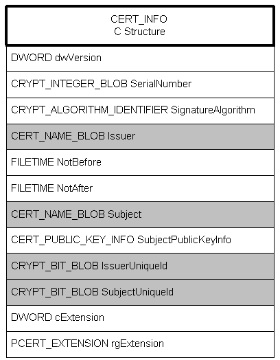
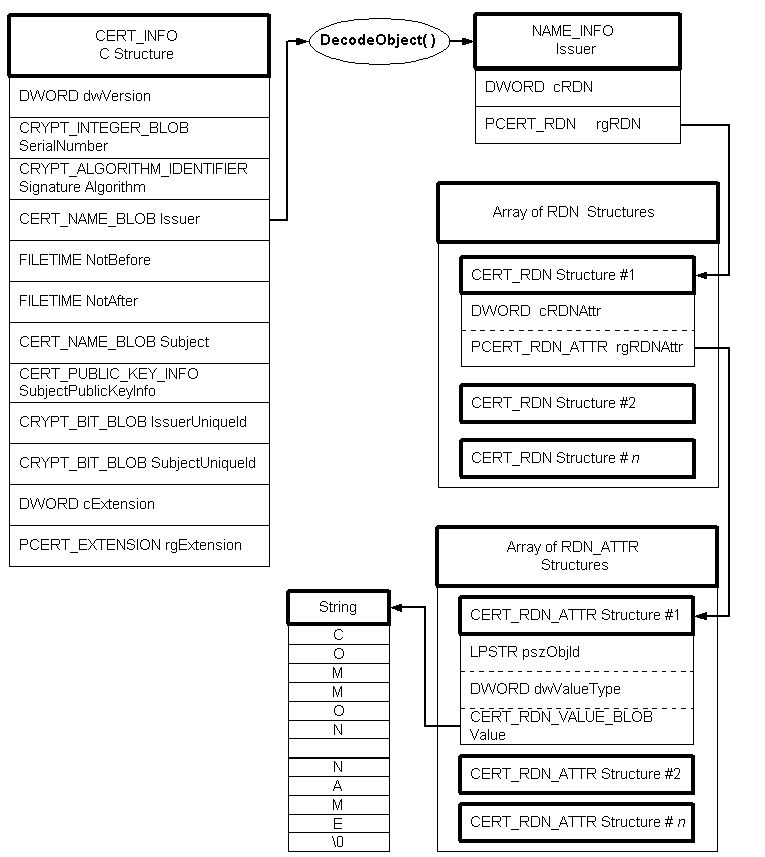

# Encoding and Decoding a Certificate Context

[*CryptoAPI*](security.c_gly#-security-cryptoapi-gly) supports the encoding and decoding of [*certificates*](security.c_gly#-security-certificate-gly). CryptoAPI includes an extensive, flexible system of functions and C structures that allow encoding and decoding in various ways. CryptoAPI supports standard [*X.509*](security.x_gly#-security-x-509-gly) certificate structure and standard [*Abstract Syntax Notation One*](security.a_gly#-security-abstract-syntax-notation-one-gly) (ASN.1) encoding to provide interoperability with other systems.

For an overview of encoded data, see [Encoded and Decoded Data](encoded-and-decoded-data.md).

## Certificate Contexts

A [*certificate context*](security.c_gly#-security-certificate-context-gly), [**CERT\_CONTEXT**](cert-context.md), is a C structure that contains an encoded member, a handle to a [*certificate store*](security.c_gly#-security-certificate-store-gly), a pointer to the original encoded [*certificate BLOB*](security.c_gly#-security-certificate-blob-gly), and a pointer to a [**CERT\_INFO**](cert-info.md) C structure.

The [**CERT\_INFO**](cert-info.md) structure is the heart of the certificate. It contains, in direct form and in encoded form, all the basic information in the certificate. The following illustration shows the **CERT\_INFO** structure with all of its encoded members shown as shaded.

The **IssuerUniqueID** and **SubjectUniqueID** members are part of the [*X.509*](security.x_gly#-security-x-509-gly) version 2 certificate implementation but are seldom used. Certificate extensions in version 3 replace the functionality of these members.

If the information contained in the encoded (shaded) members **Issuer** and **Subject** is needed, those members must be decoded. Use [**CryptDecodeObject**](cryptdecodeobject.md) to decode these members. The following illustration shows the process of decoding one of these members.

In the illustrated case, the [**CryptDecodeObject**](cryptdecodeobject.md) function creates a [**CERT\_NAME\_INFO**](cert-name-info.md) structure, an array of [**CERT\_RDN**](cert-rdn.md) structures, a corresponding array of [**CERT\_RDN\_ATTR**](cert-rdn-attr.md) structures, and a string that contains the name. Members of the **CERT\_RDN\_ATTR** structure determine the contents of the string. For example, if the **pszObjId** member is 2.5.4.3, the string contains a common name. If it is 2.5.4.10, the string would contain an organization name. For a list of these [*object identifiers*](security.o_gly#-security-object-identifier-gly) (OIDs), see **CERT\_RDN\_ATTR**.

The **dwValueType** member contains information about the type of string. If it is CERT\_RDN\_PRINTABLE\_STRING, the value member contains a byte-width, zero-terminated character string. If it is CERT\_RDN\_UNICODE\_STRING, the string is a double-width (word-sized) character string.

For a detailed process for encoding and decoding certificates, see [Encoding a CERT\_INFO Structure](encoding-a-cert-info-structure.md) and [Decoding a CERT\_INFO Structure](decoding-a-cert-info-structure.md).

 

 

