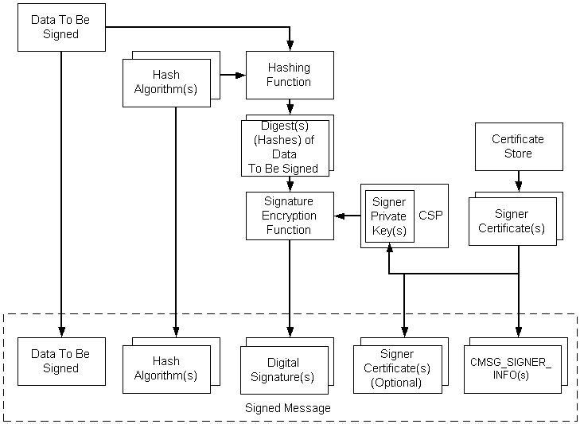

# Encoding Signed Data

[*Signed data*](https://www.bing.com/search?q=*Signed data*) consists of content of any type and encrypted message [*hashes*](https://www.bing.com/search?q=*hashes*) of the content by zero or more signers. The resulting hash can confirm that the original message has not been modified since signing and that particular persons or entities signed the data.

The following illustration depicts the procedure for encoding a signed message. The list following the illustration describes the steps.

A message may have multiple signers, hashing algorithms, and certificates. While the illustration shows only certificates, [*CRLs*](https://www.bing.com/search?q=*CRLs*), and [*CTLs*](https://www.bing.com/search?q=*CTLs*) can use the same process. They would fit into the illustration wherever certificates are shown.

The general process for encoding [*signed data*](https://www.bing.com/search?q=*signed data*) is as follows.

**To encode signed data**

1.  The data is created (if necessary), and a pointer to it is retrieved.
2.  A [*certificate store*](https://www.bing.com/search?q=*certificate store*) is opened that contains the signer's certificate.
3.  The private key for the certificate is retrieved. There are two properties that must be set on the certificate before using it. One is used to tie a certificate to a particular CSP and, within that CSP, to a particular private [*key container*](https://www.bing.com/search?q=*key container*). The other is used to indicate which hashing algorithm is to be used when a [*hash*](https://www.bing.com/search?q=*hash*) operation is called. These need only be set once.
4.  A certificate's property determines the hash algorithm.
5.  A hash of the data is created by sending the data through the hashing function.
6.  The signature is created by encrypting the hash using the private key, obtained through a property on the certificate.
7.  The following data is included in the finished, signed message:
    -   The original data to be signed
    -   The hash algorithms
    -   The signatures
    -   The signer info structures, which includes the signer identifier (certificate issuer and serial number)
    -   The signer's certificates (optional)

This procedure illustrates a simple case. More complex cases involve authenticated attributes included in the message. When the content type is anything but a **BYTE** string, or there is at least one authenticated attribute along with any data type, there are two standard authenticated attributes required: the content (data) type, and the hash of the content. Under these circumstances, the [*CryptoAPI*](https://www.bing.com/search?q=*CryptoAPI*) automatically provides these two required attributes. The low-level message functions hash the authenticated attributes, encrypt the hash with the private key, and provide this as the signature.

Use the low-level message functions to accomplish the tasks just listed, by using the following procedure.

**To encode a signed message**

1.  Create or retrieve the content.
2.  Get a cryptographic provider.
3.  Get the signer certificates.
4.  Initialize the [**CMSG\_SIGNER\_ENCODE\_INFO**](/windows/desktop/api/Wincrypt/ns-wincrypt-_cmsg_signer_encode_info) structure.
5.  Initialize the [**CMSG\_SIGNED\_ENCODE\_INFO**](/windows/desktop/api/Wincrypt/ns-wincrypt-_cmsg_signed_encode_info) structure.
6.  Call [**CryptMsgCalculateEncodedLength**](/windows/desktop/api/Wincrypt/nf-wincrypt-cryptmsgcalculateencodedlength) to get the size of the encoded message BLOB. Allocate memory for it.
7.  Call [**CryptMsgOpenToEncode**](/windows/desktop/api/Wincrypt/nf-wincrypt-cryptmsgopentoencode), passing in CMSG\_SIGNED for *dwMsgType* and a pointer to [**CMSG\_SIGNED\_ENCODE\_INFO**](/windows/desktop/api/Wincrypt/ns-wincrypt-_cmsg_signed_encode_info) for *pvMsgEncodeInfo* to get a handle to the opened message.
8.  Call [**CryptMsgUpdate**](/windows/desktop/api/Wincrypt/nf-wincrypt-cryptmsgupdate), passing in the handle retrieved in step 7, and a pointer to the data that is to be signed and encoded. This function can be called as many times as necessary to complete the encoding process.
9.  Call [**CryptMsgGetParam**](/windows/desktop/api/Wincrypt/nf-wincrypt-cryptmsggetparam), passing in the handle retrieved in step 7 and the appropriate parameter types to access the desired, encoded data. For example, pass in CMSG\_CONTENT\_PARAM to get a pointer to the entire [*PKCS \#7*](https://msdn.microsoft.com/windows/desktop/2fe6cfd3-8a2e-4dbe-9fb8-332633daa97a) message.

    If the result of this encoding is to be used as the [*inner data*](https://www.bing.com/search?q=*inner data*) for another encoded message, such as an enveloped message, the CMSG\_BARE\_CONTENT\_PARAM parameter must be passed. For an example showing this, see [Alternate Code for Encoding an Enveloped Message](alternate-code-for-encoding-an-enveloped-message.md).

10. Close the message by calling [**CryptMsgClose**](/windows/desktop/api/Wincrypt/nf-wincrypt-cryptmsgclose).

The result of this procedure is an encoded message that contains the original data, the encrypted hash of that data (signature), and the signer information. There is also a pointer to the desired, encoded BLOB.

For C coding details, see [Example C Program: Signing, Encoding, Decoding, and Verifying a Message](example-c-program-signing-encoding-decoding-and-verifying-a-message.md).

 

 

