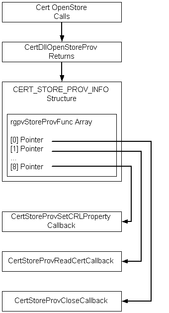
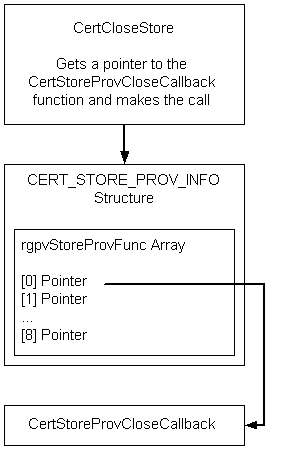

# Extending CertOpenStore Functionality

The [*certificate store*](security.c_gly#-security-certificate-store-gly) is central to all certificate management operations. The functionality of the [**CertOpenStore**](certopenstore.md) function can be extended through the use of an installable (or registered) certificate-store-provider function. For an overview of how to install or register functions for use with the CryptoAPI, see [OID Overview](oid-overview.md).

> [!Note]  
> Custom certificate stores are not automatically migrated when performing automated deployments. To migrate custom certificate stores, you must create a manifest for migrating the custom stores and use the Windows User State Migration Tool (USMT). The USMT is available for download from the Microsoft Download Center at <http://go.microsoft.com/fwlink/p/?linkid=115109>.

 

[**CertOpenStore**](certopenstore.md) opens an empty store in memory and calls the store provider function (if it is registered or installed) by using the [*object identifier*](security.o_gly#-security-object-identifier-gly) (OID) that was passed in the *lpszStoreProvider* parameter. For a list of the predefined provider types that are supplied with the CryptoAPI, see **CertOpenStore**.

The store provider function copies its certificates and [*certificate revocation lists*](security.c_gly#-security-certificate-revocation-list-gly) (CRLs) to the in-memory store specified by the *hCertStore* handle passed to it. The new store provider function can use any of the CryptoAPI certificate store functions, such as, [**CertAddCertificateContextToStore**](certaddcertificatecontexttostore.md) or [**CertAddSerializedElementToStore**](certaddserializedelementtostore.md), to add its certificates and CRLs to the in-memory store. In addition, the store-provider function optionally returns values for all of the data members of the [**CERT\_STORE\_PROV\_INFO**](cert-store-prov-info.md) structure. The function only needs to update this structure if it supports additional callback functions. For example, if the store was to be a read-only store, the support of other callback functions probably would not be needed. For details and prototypes of the possible callback functions, see [Certificate Store Provider Callback Functions](cryptography-functions.md#callback-functions).

The per user TrustedPeople store is restricted to predefined physical stores. You cannot extend the per user TrustedPeople store. However, you can extend the local machine TrustedPeople store.

**Windows XP and Windows Server 2003:** The per user TrustedPeople store is not restricted to predefined physical stores.

One of the data members of the [**CERT\_STORE\_PROV\_INFO**](cert-store-prov-info.md) structure is the *rgpvStoreProvFunc* array. If the store provider function needs to support one or more of the callback functions, it must provide pointers for this array. These pointers must point to the callback functions that are to be used for other certificate-store activities (such as closing the store). The following illustration shows the flow of this process.



As shown in the following illustration, after the store has been opened, other CryptoAPI functions (such as [**CertCloseStore**](certclosestore.md)) use the array of pointers to access the callback functions that perform the intended task. The definition of the [**CERT\_STORE\_PROV\_INFO**](cert-store-prov-info.md) structure and the prototypes of the default callback functions that are supplied with the CryptoAPI are shown in [Certificate Store Provider Callback Functions](cryptography-functions.md#callback-functions).



The store APIs allow a store provider to maintain the certificates, CRLs, and [*certificate trust lists*](security.c_gly#-security-certificate-trust-list-gly) (CTLs) outside the cache of the store (for example, an external database of certificates, such as provided by the Microsoft Certificate Server Database).

[**CertOpenStore**](certopenstore.md) dispatches through the *pszStoreProvider* parameter to the appropriate [**CertDllOpenStoreProv**](certdllopenstoreprov.md) installable provider function. The provider returns information in the *pStoreProvInfo* parameter that points to a [**CERT\_STORE\_PROV\_INFO**](cert-store-prov-info.md) structure. The **CERT\_STORE\_PROV\_INFO** structure contains a **dwStoreProvFlags** member. The CERT\_STORE\_PROV\_EXTERNAL\_FLAG flag was added to allow the provider to indicate that the certificates, CRLs, and CTLs are external to the cache of the store.

[**CertDllOpenStoreProv**](certdllopenstoreprov.md) returns an array of callback functions. A provider can implement the following callback functions:

-   CERT\_STORE\_PROV\_CLOSE\_FUNC
-   CERT\_STORE\_PROV\_READ\_CERT\_FUNC
-   CERT\_STORE\_PROV\_WRITE\_CERT\_FUNC
-   CERT\_STORE\_PROV\_DELETE\_CERT\_FUNC
-   CERT\_STORE\_PROV\_SET\_CERT\_PROPERTY\_FUNC
-   CERT\_STORE\_PROV\_READ\_CRL\_FUNC
-   CERT\_STORE\_PROV\_WRITE\_CRL\_FUNC
-   CERT\_STORE\_PROV\_DELETE\_CRL\_FUNC
-   CERT\_STORE\_PROV\_SET\_CRL\_PROPERTY\_FUNC
-   CERT\_STORE\_PROV\_READ\_CTL\_FUNC
-   CERT\_STORE\_PROV\_WRITE\_CTL\_FUNC
-   CERT\_STORE\_PROV\_DELETE\_CTL\_FUNC
-   CERT\_STORE\_PROV\_SET\_CTL\_PROPERTY\_FUNC

On calls to the WRITE\_CERT, WRITE\_CRL, and WRITE\_CTL callback functions when the CERT\_STORE\_PROV\_WRITE\_ADD\_FLAG is set, the upper 16 bits of the *dwFlags* parameter contains the *dwAddDisposition* value. To support external stores, a provider can implement the following callback functions:

-   CERT\_STORE\_PROV\_FIND\_CERT\_FUNC
-   CERT\_STORE\_PROV\_FREE\_FIND\_CERT\_FUNC
-   CERT\_STORE\_PROV\_GET\_CERT\_PROPERTY\_FUNC
-   CERT\_STORE\_PROV\_FIND\_CRL\_FUNC
-   CERT\_STORE\_PROV\_FREE\_FIND\_CRL\_FUNC
-   CERT\_STORE\_PROV\_GET\_CRL\_PROPERTY\_FUNC
-   CERT\_STORE\_PROV\_FIND\_CTL\_FUNC
-   CERT\_STORE\_PROV\_FREE\_FIND\_CTL\_FUNC
-   CERT\_STORE\_PROV\_GET\_CTL\_PROPERTY\_FUNC

The certificate callback functions have the following signatures:

``` syntax
typedef struct _CERT_STORE_PROV_FIND_INFO {
    DWORD               cbSize;
    DWORD               dwMsgAndCertEncodingType;
    DWORD               dwFindFlags;
    DWORD               dwFindType;
    const void          *pvFindPara;
} CERT_STORE_PROV_FIND_INFO, *PCERT_STORE_PROV_FIND_INFO;
typedef const CERT_STORE_PROV_FIND_INFO CCERT_STORE_PROV_FIND_INFO,
    *PCCERT_STORE_PROV_FIND_INFO;

typedef BOOL (WINAPI *PFN_CERT_STORE_PROV_FIND_CERT)(
        IN HCERTSTOREPROV hStoreProv,
        IN PCCERT_STORE_PROV_FIND_INFO pFindInfo,
        IN PCCERT_CONTEXT pPrevCertContext,
        IN DWORD dwFlags,
        IN OUT void **ppvStoreProvFindInfo,
        OUT PCCERT_CONTEXT *ppProvCertContext
        );

typedef BOOL (WINAPI *PFN_CERT_STORE_PROV_FREE_FIND_CERT)(
        IN HCERTSTOREPROV hStoreProv,
        IN PCCERT_CONTEXT pCertContext,
        IN void *pvStoreProvFindInfo,
        IN DWORD dwFlags
        );

typedef BOOL (WINAPI *PFN_CERT_STORE_PROV_GET_CERT_PROPERTY)(
        IN HCERTSTOREPROV hStoreProv,
        IN PCCERT_CONTEXT pCertContext,
        IN DWORD dwPropId,
        IN DWORD dwFlags,
        OUT void *pvData,
        IN OUT DWORD *pcbData
        );
```

The signatures for the CRL and CTL callback functions are identical to the above with the pointer to the [**CERT\_CONTEXT**](cert-context.md) replaced with a pointer to a [**CRL\_CONTEXT**](crl-context.md) or [**CTL\_CONTEXT**](ctl-context.md).

The FIND\_CERT callback is called when the store APIs enumerate, find, or add certificates. *pPrevCertContext* and *ppvStoreProvFindInfo* are set to **NULL** to initiate a new FIND. The returned *ppvStoreProvFindInfo* is passed back on the next find at which time it may be freed by the provider. The provider may set all, some, or none of the certificate properties. The provider has the option to defer until the GET\_CERT\_PROPERTY callback is called. It is recommended for providers to set as many properties as possible to allow copying to another store.

The following certificate find types are supported in [**CertFindCertificateInStore**](certfindcertificateinstore.md):

-   CERT\_FIND\_ANY
-   CERT\_FIND\_SHA1\_HASH
-   CERT\_FIND\_MD5\_HASH
-   CERT\_FIND\_PROPERTY
-   CERT\_FIND\_PUBLIC\_KEY
-   CERT\_FIND\_SUBJECT\_NAME
-   CERT\_FIND\_SUBJECT\_ATTR
-   CERT\_FIND\_ISSUER\_NAME
-   CERT\_FIND\_ISSUER\_ATTR
-   CERT\_FIND\_SUBJECT\_STR\_A
-   CERT\_FIND\_SUBJECT\_STR\_W
-   CERT\_FIND\_ISSUER\_STR\_A
-   CERT\_FIND\_ISSUER\_STR\_W
-   CERT\_FIND\_KEY\_SPEC
-   CERT\_FIND\_ENHKEY\_USAGE

The FIND\_CERT callback is called for each of the above find types. The parameters passed to [**CertFindCertificateInStore**](certfindcertificateinstore.md) are copied directly to the CERT\_STORE\_PROV\_FIND\_INFO structure before the FIND\_CERT callback is called. For details about the field values for the different find types of the CERT\_STORE\_PROV\_FIND\_INFO structure, see **CertFindCertificateInStore**.

The following certificate find types support the [**CertGetSubjectCertificateFromStore**](certgetsubjectcertificatefromstore.md) and [**CertGetIssuerCertificateFromStore**](certgetissuercertificatefromstore.md) APIs and help determine whether the certificate already exists in the store before adding:

-   CERT\_FIND\_SUBJECT\_CERT
-   CERT\_FIND\_ISSUER\_OF
-   CERT\_FIND\_EXISTING

For CERT\_FIND\_SUBJECT\_CERT, the *pvFindPara* parameter points to a [**CERT\_INFO**](cert-info.md) structure that contains the Issuer and SerialNumber of the subject. For CERT\_FIND\_ISSUER\_OF, *pvFindPara* points to a [**CERT\_CONTEXT**](cert-context.md) structure, of the subject. For CERT\_FIND\_EXISTING, *pvFindPara* points to a **CERT\_CONTEXT** of the certificate to check for its existence in the store.

The FREE\_FIND\_CERT callback is called when the certificate returned by the FIND\_CERT callback was not released by being used in a subsequent next FIND\_CERT, thus having its [*reference count*](security.r_gly#-security-reference-count-gly) decremented to zero, or by being released by a call to [**CertCloseStore**](certclosestore.md). Before the CLOSE callback is called, all certificates returned by the FIND\_CERT callback should be released to the provider by being passed to a call to the FIND\_CERT callback or a call to the FREE\_FIND\_CERT callback. The same applies to the CRL and CTL callbacks.

The GET\_CERT\_PROPERTY callback is called by [**CertGetCertificateContextProperty**](certgetcertificatecontextproperty.md) if it cannot find the specified property for the *pCertContext* parameter. The same is true for GET\_CRL\_PROPERTY and GET\_CTL\_PROPERTY.

The FIND\_CRL callback is called when the store APIs enumerate or get CRLs and before adding a CRL. The following CRL find types will be defined:

For CRL\_FIND\_ISSUED\_BY, *pvFindPara* is a pointer to a [**CERT\_CONTEXT**](cert-context.md) of the CRL issuer. For CRL\_FIND\_EXISTING, *pvFindPara* is a pointer to a [**CRL\_CONTEXT**](crl-context.md) of the CRL to determine whether it already exists in the store.

The FIND\_CTL callback is called when the store APIs enumerate or find CTLs. The following CTL find types are supported in [**CertFindCTLInStore**](certfindctlinstore.md):

-   CTL\_FIND\_ANY
-   CTL\_FIND\_SHA1\_HASH
-   CTL\_FIND\_MD5\_HASH
-   CTL\_FIND\_USAGE
-   CTL\_FIND\_SUBJECT
-   CTL\_FIND\_EXISTING

The FIND\_CTL callback is called for each of the above find types. The parameters passed to [**CertFindCTLInStore**](certfindctlinstore.md) are copied directly to the CERT\_STORE\_PROV\_FIND\_INFO structure before the FIND\_CTL callback is called. For details about the field values for the different find types of the CERT\_STORE\_PROV\_FIND\_INFO structure, see **CertFindCTLInStore**.

The CTL\_FIND\_EXISTING CTL find type helps determine whether the CTL already exists in the store before doing a CTL add.

For CTL\_FIND\_EXISTING, *pvFindPara* is a pointer to the [**CTL\_CONTEXT**](ctl-context.md) structure of the CTL to determine whether it already exists in the store.

 

 


