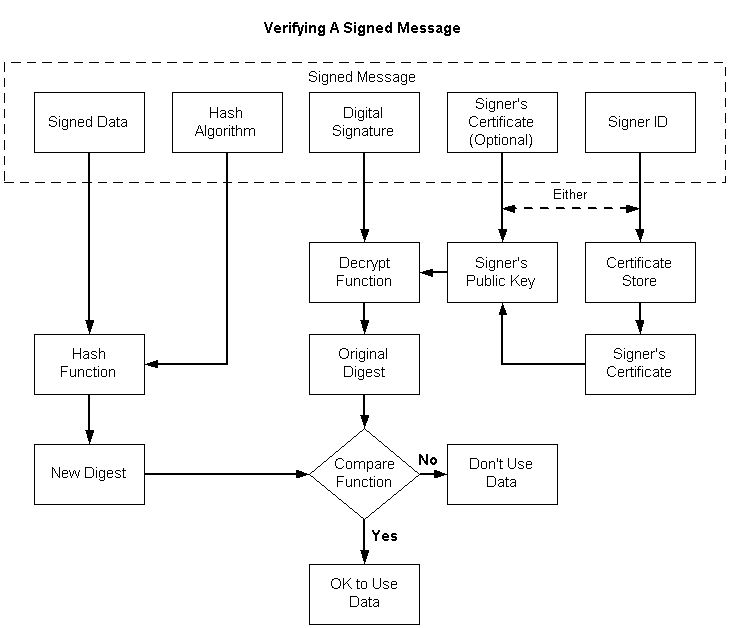

# Verifying a Signed Message

These steps verify the signature of signed data. The following illustration depicts the individual tasks that must be accomplished, as shown in the list that follows it.

**To verify the signature of a signed message**

1.  Get a pointer to the signed message.
2.  Open a [*certificate store*](https://msdn.microsoft.com/en-us/library/ms721572(v=VS.85).aspx).
3.  Using the signer ID contained in the message, get the sender's certificate and get a handle to its [*public key*](https://msdn.microsoft.com/en-us/library/ms721603(v=VS.85).aspx).

    As an alternative to steps 2 and 3, you can use the certificate contained in the message to retrieve the signer's public key.

4.  Using the signer's public key, decrypt the digital signature, producing the original digest of the data in the message.
5.  Using the hash algorithm contained in the message, [*hash*](https://msdn.microsoft.com/en-us/library/ms721586(v=VS.85).aspx) the data contained in the message, yielding a new digest.
6.  Compare the digest retrieved from the message with the new digest just created.
7.  If the two digests match, the signature is verified. This means that the [*private key*](https://msdn.microsoft.com/en-us/library/ms721603(v=VS.85).aspx) that was used to sign the data matches the public key just used to decrypt the signature, and that the data has not changed since the data was signed.

    If the two digests do not match, the signature is not verified, and either the private/public keys do not match, or the data has been changed since the data was signed, or both.

A single function, [**CryptVerifyMessageSignature**](/windows/desktop/api/Wincrypt/nf-wincrypt-cryptverifymessagesignature), can be used to verify a signature, as shown in the following procedure.

**To verify a signed message**

1.  Get a pointer to the signed message.
2.  Get the size of the signed message.
3.  Get a handle on a cryptographic provider.
4.  Initialize the [**CRYPT\_VERIFY\_MESSAGE\_PARA**](/windows/desktop/api/Wincrypt/ns-wincrypt-_crypt_verify_message_para) structure.
5.  Call [**CryptVerifyMessageSignature**](/windows/desktop/api/Wincrypt/nf-wincrypt-cryptverifymessagesignature) to verify the signature.

Code that implements this procedure is included in [Example C Program: Signing a Message and Verifying a Message Signature](example-c-program-signing-a-message-and-verifying-a-message-signature.md).

 

 

